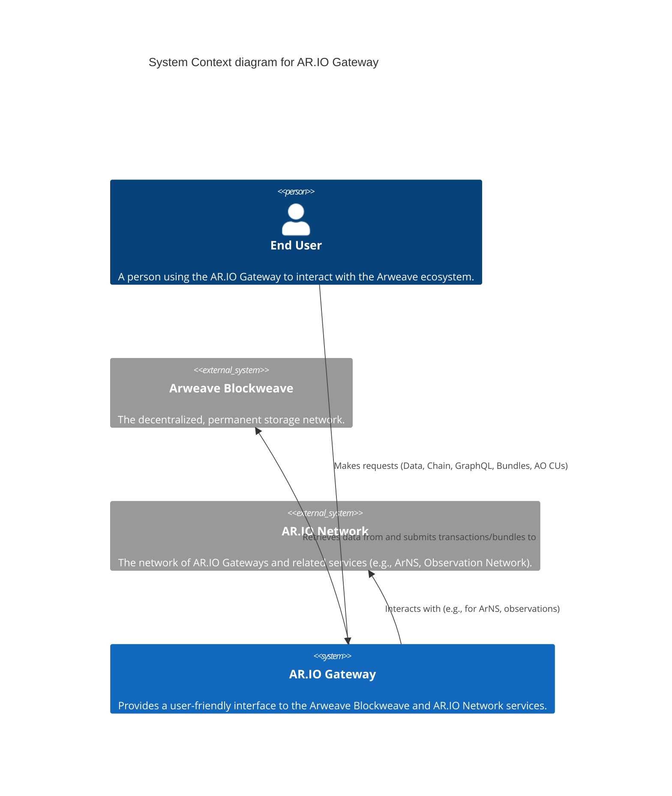

```mermaid
C4Context
  title System Context diagram for AR.IO Gateway

  Person(end_user, "End User", "A person using the AR.IO Gateway to interact with the Arweave ecosystem.")
  System_Ext(arweave_blockweave, "Arweave Blockweave", "The decentralized, permanent storage network.")
  System_Ext(ario_network, "AR.IO Network", "The network of AR.IO Gateways and related services (e.g., ArNS, Observation Network).")

  System(ario_gateway, "AR.IO Gateway", "Provides a user-friendly interface to the Arweave Blockweave and AR.IO Network services.")

  Rel(end_user, ario_gateway, "Makes requests (Data, Chain, GraphQL, Bundles, AO CUs)")
  Rel(ario_gateway, arweave_blockweave, "Retrieves data from and submits transactions/bundles to")
  Rel(ario_gateway, ario_network, "Interacts with (e.g., for ArNS, observations)")
```
