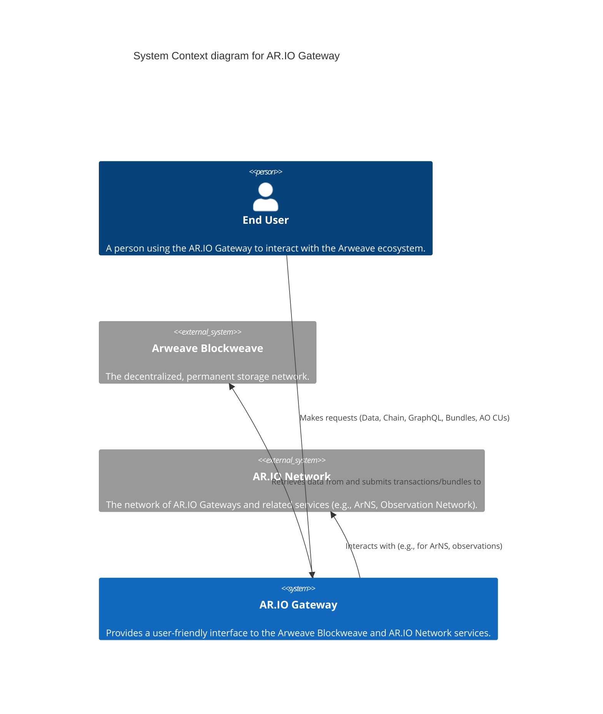

# AR.IO Gateway - C4 Architecture Overview

This document provides an architectural overview of the AR.IO Gateway using the C4 model.

## Level 1: System Context

The System Context diagram illustrates how the AR.IO Gateway fits into its operating environment. It shows the gateway as a central system interacting with end-users, the Arweave Blockweave (for data storage and retrieval), and the broader AR.IO Network (for services like ArNS and network observation).



## Level 2: Containers

The Container diagram zooms into the AR.IO Gateway, breaking it down into its major deployable/runnable units (containers). It highlights key services like the "Envoy Service" for request handling, the "Core Service" for main application logic, the "Observer Service" for network monitoring, the "Bundler Service" for data bundling, and the "AO Compute Unit" for Arweave Object processes. It also shows the primary data stores: "Index Database", "Chunk Storage", and "Header Storage".

```mermaid
C4Container
  title Container diagram for AR.IO Gateway

  Person(end_user, "End User", "A person using the AR.IO Gateway to interact with the Arweave ecosystem.")
  System_Ext(arweave_blockweave, "Arweave Blockweave", "The decentralized, permanent storage network.")
  System_Ext(ario_network, "AR.IO Network", "The network of AR.IO Gateways and related services (e.g., ArNS, Observation Network).")

  System_Boundary(c1, "AR.IO Gateway") {
    Container(envoy_service, "Envoy Service", "Proxy", "Handles incoming requests and routes them.")
    Container(core_service, "Core Service", "Main Application Logic", "Handles core gateway functionality, data retrieval, and interactions with Arweave and AR.IO Network.")
    Container(observer_service, "Observer Service", "Monitors AR.IO Network", "Observes the AR.IO Network and reports findings.")
    Container(bundler_service, "Bundler Service", "Sidecar for bundling data", "Responsible for creating and submitting data bundles to Arweave.")
    Container(ao_cu, "AO Compute Unit (CU)", "Sidecar for AO processes", "Executes Arweave Object (AO) processes.")
    
    ContainerDb(index_db, "Index Database", "Stores chain/bundle indexes", "Stores metadata and indexes for efficient data lookup.")
    ContainerDb(chunk_storage, "Chunk Storage", "Stores data chunks", "Stores actual data chunks retrieved from Arweave.")
    ContainerDb(header_storage, "Header Storage", "Stores block/transaction headers", "Stores block and transaction header information.")
  }

  Rel(end_user, envoy_service, "Makes requests")
  
  Rel(envoy_service, core_service, "Routes requests to")
  Rel(envoy_service, ao_cu, "Routes AO requests to")
  Rel(envoy_service, arweave_blockweave, "Proxies some requests to", "e.g., specific chain data")

  Rel(core_service, index_db, "Uses for index lookups")
  Rel(core_service, chunk_storage, "Uses for data chunk storage/retrieval")
  Rel(core_service, header_storage, "Uses for header storage/retrieval")
  
  Rel(core_service, arweave_blockweave, "Interacts with")
  Rel(core_service, ario_network, "Interacts with")
  Rel(core_service, bundler_service, "Delegates bundling to")
  Rel(core_service, ao_cu, "Interacts with for AO operations")

  Rel(observer_service, ario_network, "Monitors")
  # Assuming Observer Service might have its own local DB for reports, not explicitly requested but common.
  # ContainerDb(observer_db, "Observer Local DB", "Stores observation reports")
  # Rel(observer_service, observer_db, "Stores reports in")

  Rel(bundler_service, core_service, "Receives data from")
  Rel(bundler_service, arweave_blockweave, "Submits bundles to")
  
  Rel(ao_cu, core_service, "Receives tasks from / sends results to")
  Rel(ao_cu, bundler_service, "May interact with for bundling AO results")
  Rel(ao_cu, arweave_blockweave, "Interacts with", "e.g., for state checkpoints, reading messages")

```

## Level 3: Components (Core Service)

This Component diagram provides a detailed look inside the "Core Service" container. It showcases the various components responsible for specific functionalities, such as the "Request Handler" (API interface), "GraphQL Resolver", "Data Fetching Logic", "Indexing Service" (with its sub-components for block, transaction, and bundle processing), "ArNS Resolver", "Storage Interface" (for database abstraction), "Arweave Client", "Bundle Utilities", "AO Utilities", "Webhook Emitter", and a "Name Cache Component". The diagram maps out the interactions between these components and their connections to other containers and external systems.

```mermaid
C4Component
  title Component diagram for AR.IO Gateway - Core Service

  Container_Boundary(c1, "AR.IO Gateway") {
    Container(envoy_service, "Envoy Service", "Proxy", "Handles incoming requests and routes them.")
    Container(bundler_service, "Bundler Service", "Sidecar for bundling data", "Responsible for creating and submitting data bundles to Arweave.")
    Container(ao_cu, "AO Compute Unit (CU)", "Sidecar for AO processes", "Executes Arweave Object (AO) processes.")

    ContainerDb(index_db, "Index Database", "Stores chain/bundle indexes")
    ContainerDb(chunk_storage, "Chunk Storage", "Stores data chunks")
    ContainerDb(header_storage, "Header Storage", "Stores block/transaction headers")

    Container_Boundary(core_service_boundary, "Core Service") {
      Component(request_handler, "Request Handler", "API Interface", "Receives requests from Envoy Service and delegates to appropriate components.")
      Component(graphql_resolver, "GraphQL Resolver", "GraphQL API Logic", "Handles GraphQL queries.")
      Component(data_fetching_logic, "Data Fetching Logic", "Data Retrieval", "Fetches data from various sources (Arweave, local storage).")
      Component(arns_resolver, "ArNS Resolver", "Arweave Name System Logic", "Resolves ArNS names.")
      Component(storage_interface, "Storage Interface", "Database Abstraction", "Provides a common interface to Index DB, Chunk Storage, Header Storage.")
      Component(arweave_client, "Arweave Client", "Arweave Communication", "Manages direct communication with the Arweave Blockweave.")
      Component(bundle_utils, "Bundle Utilities", "Bundling Functions", "Provides functions for creating/managing data bundles.")
      Component(ao_utils, "AO Utilities", "AO Interaction Functions", "Provides functions for interacting with AO processes.")
      Component(webhook_emitter, "Webhook Emitter", "Event Emitter", "Emits webhooks based on internal events.")

      Container_Boundary(indexing_service_boundary, "Indexing Service") {
        Component(block_importer, "Block Importer", "Data Indexer", "Imports and indexes Arweave blocks.")
        Component(tx_importer, "Transaction Importer", "Data Indexer", "Imports and indexes Arweave transactions.")
        Component(bundle_processor, "Bundle Processor/Unbundler", "Data Indexer", "Processes and unbundles Arweave data bundles.")
      }
      Component(name_cache, "Name Cache Component", "Local Cache", "Caches ArNS resolutions.")
    }
  }

  System_Ext(arweave_blockweave, "Arweave Blockweave", "The decentralized, permanent storage network.")
  System_Ext(ario_network, "AR.IO Network", "The network of AR.IO Gateways and related services.")

  ' External to Core Service, but within Gateway
  Rel(envoy_service, request_handler, "Sends requests to", "HTTP")

  ' Request Handler interactions
  Rel(request_handler, graphql_resolver, "Delegates GraphQL queries to")
  Rel(request_handler, data_fetching_logic, "Delegates data requests to")
  Rel(request_handler, arns_resolver, "Delegates ArNS requests to")
  Rel(request_handler, bundle_utils, "Uses for bundle operations")
  Rel(request_handler, ao_utils, "Uses for AO operations")

  ' GraphQL Resolver interactions
  Rel(graphql_resolver, storage_interface, "Uses for Index DB access")

  ' Data Fetching Logic interactions
  Rel(data_fetching_logic, storage_interface, "Uses for Chunk/Header Storage access")
  Rel(data_fetching_logic, arweave_client, "Uses to fetch data from Arweave")

  ' Indexing Service interactions
  Rel(block_importer, arweave_client, "Gets block data from")
  Rel(block_importer, storage_interface, "Writes to Index DB via")
  Rel(tx_importer, arweave_client, "Gets transaction data from")
  Rel(tx_importer, storage_interface, "Writes to Index DB via")
  Rel(bundle_processor, arweave_client, "Gets bundle data from")
  Rel(bundle_processor, storage_interface, "Writes to Index DB via")
  
  Rel(block_importer, webhook_emitter, "Triggers events for")
  Rel(tx_importer, webhook_emitter, "Triggers events for")
  Rel(bundle_processor, webhook_emitter, "Triggers events for")


  ' ArNS Resolver interactions
  Rel(arns_resolver, ario_network, "Resolves names via")
  Rel(arns_resolver, name_cache, "Uses for caching")
  Rel(name_cache, storage_interface, "Optionally persists to Storage Interface (if needed)")


  ' Storage Interface direct interactions with DBs (conceptual, actual DBs are outside Core)
  Rel(storage_interface, index_db, "Manages access to", "R/W")
  Rel(storage_interface, chunk_storage, "Manages access to", "R/W")
  Rel(storage_interface, header_storage, "Manages access to", "R/W")

  ' Arweave Client interaction
  Rel(arweave_client, arweave_blockweave, "Communicates with", "HTTP API")

  ' Bundle Utilities interaction
  Rel(bundle_utils, bundler_service, "Delegates bundling to / Interacts with")

  ' AO Utilities interaction
  Rel(ao_utils, ao_cu, "Delegates AO tasks to / Interacts with")
  
  ' Webhook Emitter (assuming it might interact with external systems or store webhook configs)
  ' For now, it's mainly triggered internally. If it called external webhook URLs, that would be an external system.

  ' Clarify relationships for Indexing Service as a whole to its sub-components
  Rel(request_handler, block_importer, "May trigger indexing tasks for") ' e.g. admin endpoint to re-index
  Rel(request_handler, tx_importer, "May trigger indexing tasks for")
  Rel(request_handler, bundle_processor, "May trigger indexing tasks for")

```
