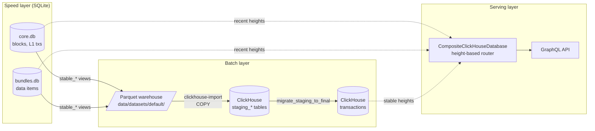
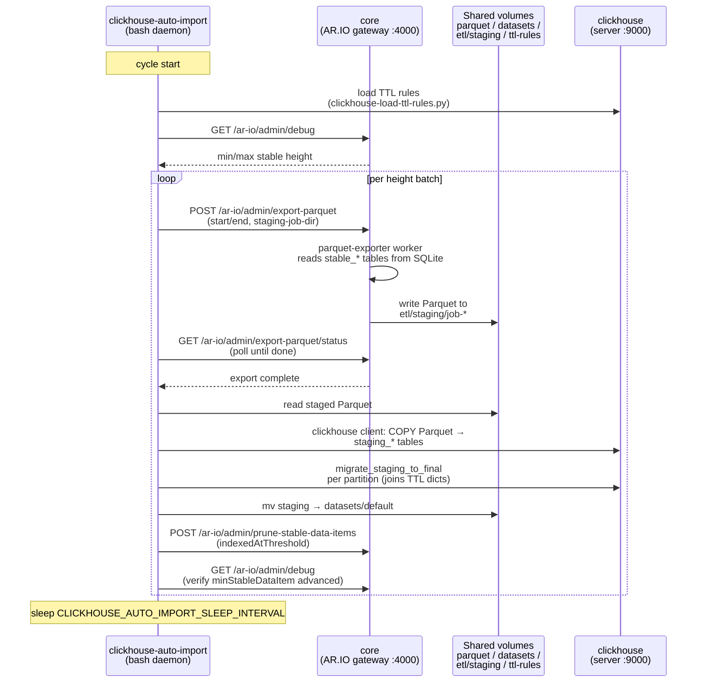
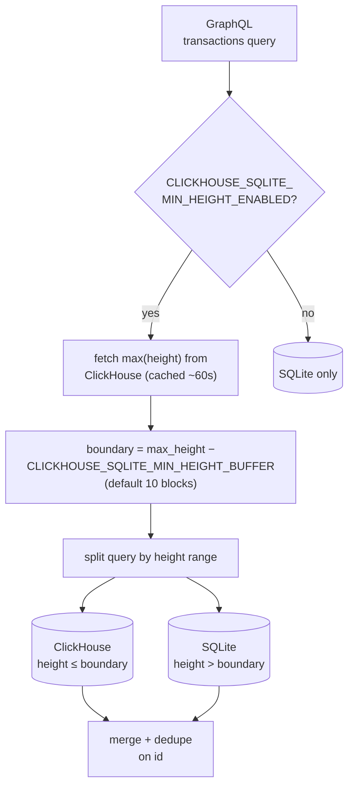
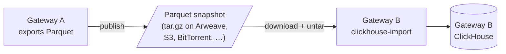

# ClickHouse Pipeline Architecture

This document describes how data flows from SQLite through Parquet into
ClickHouse, and how GraphQL queries are routed between the two backends.
It's a developer reference — for the rationale behind the design, see
[MADR 001: ClickHouse as a Supplemental GraphQL Backend](madr/001-clickhouse-gql.md).
For operator setup and TTL rules, see
[Parquet and ClickHouse Usage](parquet-and-clickhouse-usage.md).

## Overview

The gateway runs a "speed layer + batch layer" split. SQLite is the
primary store: every block, L1 transaction, and unbundled data item
lands there first. A Parquet export pipeline periodically snapshots the
**stable** portion of SQLite (confirmed past the reorg window) into
height-partitioned Parquet files, and a ClickHouse import loads those
files into a compressed, columnar `transactions` table tuned for
analytical GraphQL queries. GraphQL requests are split across the two
backends by block height.

### Why Parquet as an intermediate format?

Going SQLite → ClickHouse directly would be more efficient as a pure
ingest path — Parquet adds an extra serialize/deserialize step and
consumes disk for the intermediate files. The pipeline keeps Parquet
in the middle on purpose, because the Parquet output is valuable in
its own right:

- **Data-lake workloads.** The Parquet files are directly queryable
  by DuckDB, Spark, and any other Parquet-aware tool — no ClickHouse
  required. The optional Iceberg metadata
  (`scripts/generate-iceberg-metadata`) exists for exactly this
  audience.
- **Shared bootstrapping.** A gateway's Parquet warehouse is
  portable. Operators can publish their exports (e.g. the ArDrive
  snapshot linked from the operator guide) so other gateways can skip
  the multi-hour indexing process on startup. See
  [Dataset sharing](#dataset-sharing) below.

In other words, the Parquet step isn't just a staging area for
ClickHouse — it's a first-class deliverable. ClickHouse consumes the
same files a downstream analytics user would.

## Pipeline stages

### 1. Primary ingest (SQLite)

All chain and bundle data lands in SQLite first, regardless of whether
ClickHouse is enabled. This is the only layer that handles unstable
data (chain reorgs, in-flight unbundling).

- Chain data (blocks, L1 transactions) — written to `core.db` by
  `BlockImporter` (`src/workers/block-importer.ts`).
- Data items — written to `bundles.db` by `DataItemIndexer`
  (`src/workers/data-item-indexer.ts`) after ANS-104 unbundling.
- The DB worker thread (`StandaloneSqlite`) isolates SQLite from the
  main event loop; see `src/system.ts` for wiring.

Only the `stable_*` views/tables (past the reorg threshold) are
eligible for export. Unstable rows are never exported — this is what
makes the downstream pipeline's eventual consistency safe.

### 2. Parquet export

Exports are pull-driven via the admin API, with the bash wrapper
`scripts/parquet-export` orchestrating the admin API calls end-to-end.

- Route: `POST /ar-io/admin/export-parquet` at
  `src/routes/ar-io.ts`. Status is polled via
  `GET /ar-io/admin/export-parquet/status`.
- Worker: `src/workers/parquet-exporter.ts` runs the export in a Node
  worker thread. It reads from the stable tables
  (`core.stable_blocks`, `core.stable_transactions`,
  `core.stable_transaction_tags`, `bundles.stable_data_items`,
  `bundles.stable_data_item_tags`) and writes Parquet files partitioned
  by height to `{outputDir}/{table}/data/height={start}-{end}/`.
- Partition strategy: configurable `heightPartitionSize` (default
  1000 blocks). Processing one partition at a time bounds memory usage
  regardless of total export size.
- **No crash recovery.** The worker clears intermediate state after
  each partition. A failed export must be restarted from its starting
  height; there is no checkpoint or `--resume` flag.
- Optional Iceberg metadata: `scripts/generate-iceberg-metadata` emits
  minimal Avro-formatted Iceberg metadata for DuckDB readers after an
  export completes. This is not part of the ClickHouse path.

### 3. ClickHouse import

Imports are driven by `scripts/clickhouse-import`, a bash script that
COPYs Parquet into staging tables and then migrates partitions into
the final `transactions` table.

- Pipeline: ensure schema present → load TTL rules (if
  `CLICKHOUSE_TTL_RULES_PATH` is set) → COPY Parquet into `staging_*`
  tables → call `migrate_staging_to_final` per partition → cleanup.
- `migrate_staging_to_final` (defined in `scripts/clickhouse-import`)
  runs a single `INSERT INTO transactions SELECT ... FROM
  staging_transactions WHERE partition = ?` that joins against the TTL
  dictionaries to compute `expires_at` in the same write.
- The granularity is **per height partition**. Partitions are
  independently idempotent — re-importing a partition results in
  duplicate rows that `ReplacingMergeTree` collapses on background
  merge.
- TTL rules pipeline: see
  [the operator guide](parquet-and-clickhouse-usage.md#tag-based-ttl-rules)
  for the full loader → source tables → dictionaries →
  `migrate_staging_to_final` flow.

### 4. Auto-import daemon

`scripts/clickhouse-auto-import` is a long-running bash daemon that
wraps the export+import loop. It runs inside the
`ar-io-clickhouse-auto-import` container when the `clickhouse` docker
compose profile is active.

- Loop body: reload TTL rules → advance the export window (based on
  the last height already in ClickHouse) → call `parquet-export` →
  call `clickhouse-import` for the new Parquet → sleep.
- Sleep interval: `CLICKHOUSE_AUTO_IMPORT_SLEEP_INTERVAL` (default
  3600s).
- TTL rules are reloaded at the top of every cycle, so edits to
  `clickhouse-ttl-rules.yaml` take effect on the next cycle.

#### Container interactions

Three containers coordinate during each cycle: `core` (the AR.IO
gateway), `clickhouse-auto-import` (the daemon), and `clickhouse` (the
server). They communicate via the gateway's admin HTTP API, the
ClickHouse native protocol, and a set of bind-mounted volumes shared
between `core` and `clickhouse-auto-import` (see `docker-compose.yaml`
under the `clickhouse` profile).

Notes:

- `core` owns the only writer to SQLite — the daemon never reads SQLite
  directly. All data egress from SQLite goes through the
  `parquet-exporter` worker triggered by the admin API.
- The staging directory (`data/etl/staging/job-*`) is the handoff
  point. Parquet lives there until ClickHouse import succeeds; on
  failure the staging files are preserved for inspection, on success
  they're moved into `data/datasets/default` so they're retained as
  part of the shareable Parquet warehouse.
- The auto-import container mounts SQLite read-only but currently uses
  it only for operator tooling — the export path itself is admin-API
  driven.

### 5. Final-table lifecycle

The final `transactions` table is a `ReplacingMergeTree(inserted_at)`
partitioned by `intDiv(height, 100000)`, with projections and bloom
filters tuned for the GraphQL query mix (see
[schema layout](parquet-and-clickhouse-usage.md#schema-layout)).

- Deduplication happens on background merges. There are **no manual
  `OPTIMIZE TABLE` triggers** — the system relies on ClickHouse's
  background merge scheduler. Queries tolerate transient duplicates
  via `SELECT ... FINAL` or query-time deduplication.
- Expired rows (where `expires_at` has elapsed) are removed by the
  table's TTL clause on background merge.
- Schema evolution uses idempotent `ALTER TABLE` statements in
  `src/database/clickhouse/schema.sql` and `ttl-schema.sql`. These run
  on every import, making upgrades a no-op once applied.

## GraphQL routing

When `CLICKHOUSE_URL` is set, `src/system.ts` wraps the SQLite
GraphQL queryable with `CompositeClickHouseDatabase`
(`src/database/composite-clickhouse.ts`). The composite splits each
GraphQL transactions query into a ClickHouse half and a SQLite half
by block height, then merges and deduplicates the results.

Two config values tune the split:

- `CLICKHOUSE_SQLITE_MIN_HEIGHT_BUFFER` (default 10) — how far below
  the ClickHouse max height the cutover sits. Guards against
  partially-loaded recent partitions.
- `CLICKHOUSE_MAX_HEIGHT_CACHE_TTL_SECONDS` (default 60) — how long
  the ClickHouse max-height lookup is cached. Avoids a round-trip on
  every GraphQL query.

SQLite remains the sole backend for point lookups that aren't
partitioned by height (e.g. data retrieval, chunk fetches) and for
administrative APIs — only GraphQL splits.

## Dataset sharing

One of the reasons for standardizing on Parquet as the handoff format
is that a gateway's Parquet warehouse is portable. An operator can
bootstrap a new gateway by downloading someone else's Parquet export
(e.g. the ArDrive snapshot referenced in the operator guide) instead
of rebuilding the index from scratch. The importing gateway's
`clickhouse-import` treats pre-built Parquet files identically to
files its own exporter just produced.

This also means Parquet outputs can be consumed by non-gateway tools
(DuckDB, Spark) directly, independent of the ClickHouse path — the
Iceberg metadata is for that use case.

## Consistency model

The pipeline is **eventually consistent** by design:

- Only stable SQLite rows are exported, so the ClickHouse side never
  sees reorged data.
- Exports and imports are pull-based; there is a lag between a row
  becoming stable in SQLite and appearing in ClickHouse (bounded by
  the auto-import sleep interval).
- `ReplacingMergeTree` handles row-level duplicates from partition
  re-imports by collapsing on background merge.
- Query-time deduplication in `CompositeClickHouseDatabase` handles
  rows that appear in both backends during the transitional window
  near the height boundary.

There is no transactional guarantee across the SQLite→ClickHouse
boundary. Operators needing a point-in-time-consistent view of the
full dataset should query a Parquet snapshot directly (via DuckDB or
Spark), not the live ClickHouse instance.

## Failure modes

- **Parquet export fails mid-run.** No resume. Restart from the
  original starting height. Partial Parquet output is under the
  staging job directory and can be discarded.
- **ClickHouse import fails on a partition.** Re-run the import;
  duplicate rows are collapsed on merge. The staging tables are
  cleared between runs.
- **TTL rules file is missing or malformed.** Loader logs a warning
  and continues; previously-loaded rules remain active. See
  [Behavior → Fail-open](parquet-and-clickhouse-usage.md#behavior).
- **Schema drift between versions.** Handled by idempotent `ALTER
  TABLE` statements that run on every import. Existing deployments
  may need the one-time `owner_projection` rebuild documented in
  [In-place upgrade](parquet-and-clickhouse-usage.md#in-place-upgrade).
- **Background merges fall behind.** No automatic mitigation. Operators
  can run `OPTIMIZE TABLE transactions PARTITION ... FINAL` manually
  if duplicate counts grow, but this is heavy — prefer waiting for
  background merges under normal load.

## Key code references

| Component | Path |
|-----------|------|
| SQLite DI wiring | `src/system.ts` |
| Block importer | `src/workers/block-importer.ts` |
| Data item indexer | `src/workers/data-item-indexer.ts` |
| Parquet export worker | `src/workers/parquet-exporter.ts` |
| Parquet export admin route | `src/routes/ar-io.ts` |
| Parquet export CLI | `scripts/parquet-export` |
| ClickHouse import | `scripts/clickhouse-import` |
| ClickHouse auto-import daemon | `scripts/clickhouse-auto-import` |
| TTL rules loader | `scripts/clickhouse-load-ttl-rules.py` |
| ClickHouse schema | `src/database/clickhouse/schema.sql` |
| ClickHouse TTL schema | `src/database/clickhouse/ttl-schema.sql` |
| GraphQL routing | `src/database/composite-clickhouse.ts` |
| Iceberg metadata (optional) | `scripts/generate-iceberg-metadata` |
