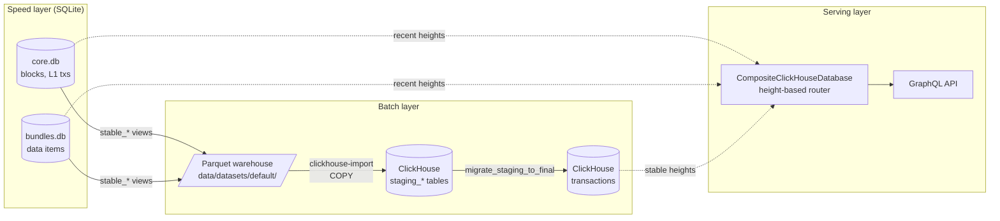
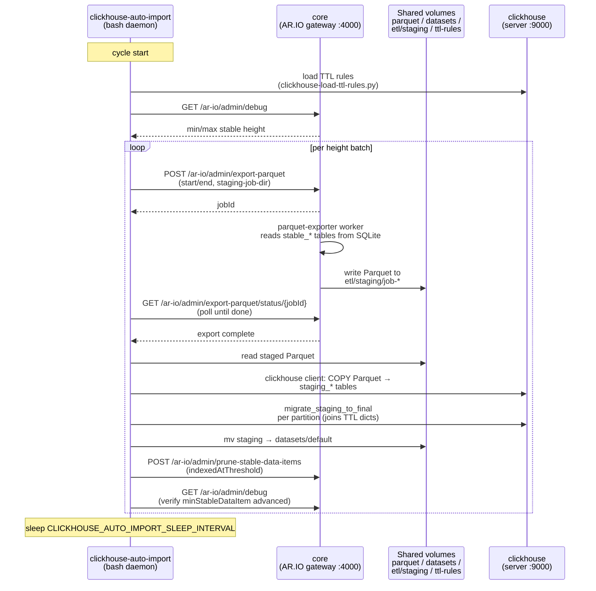
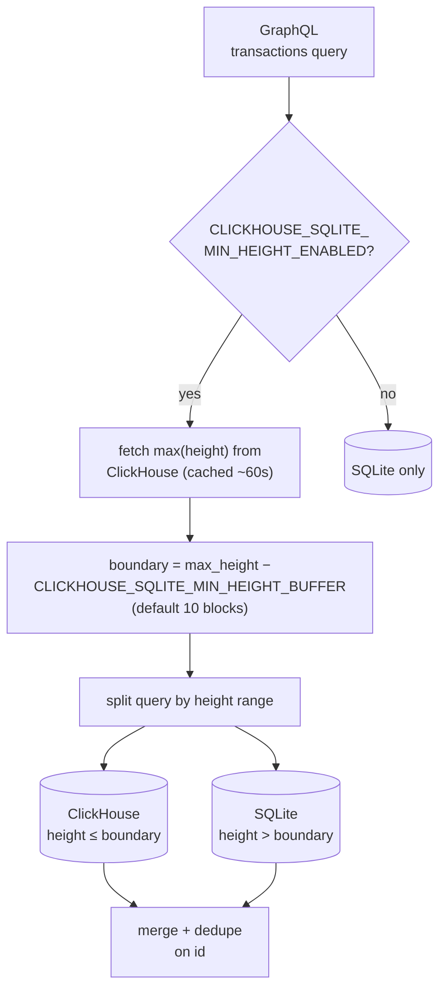
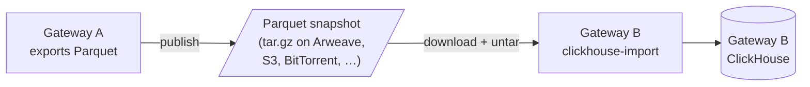

# ClickHouse Pipeline Architecture

This document describes how data flows from SQLite through Parquet into
ClickHouse, and how GraphQL queries are routed between the two backends.
It's a developer reference — for the rationale behind the design, see
[MADR 001: ClickHouse as a Supplemental GraphQL Backend](madr/001-clickhouse-gql.md).
For operator setup and TTL rules, see
[Parquet and ClickHouse Usage](parquet-and-clickhouse-usage.md).

## Overview

The gateway runs a "speed layer + batch layer" split. SQLite is the
primary store: every block, L1 transaction, and unbundled data item
lands there first. A Parquet export pipeline periodically snapshots the
**stable** portion of SQLite (confirmed past the reorg window) into
height-partitioned Parquet files, and a ClickHouse import loads those
files into a compressed, columnar `transactions` table tuned for
analytical GraphQL queries. GraphQL requests are split across the two
backends by block height.



### Why Parquet as an intermediate format?

Going SQLite → ClickHouse directly would be more efficient as a pure
ingest path — Parquet adds an extra serialize/deserialize step and
consumes disk for the intermediate files. The pipeline keeps Parquet
in the middle on purpose, because the Parquet output is valuable in
its own right:

- **Data-lake workloads.** The Parquet files are directly queryable
  by DuckDB, Spark, and any other Parquet-aware tool — no ClickHouse
  required. The optional Iceberg metadata
  (`scripts/generate-iceberg-metadata`) exists for exactly this
  audience.
- **Shared bootstrapping.** A gateway's Parquet warehouse is
  portable. Operators can publish their exports (e.g. the ArDrive
  snapshot linked from the operator guide) so other gateways can skip
  the multi-hour indexing process on startup. See
  [Dataset sharing](#dataset-sharing) below.

In other words, the Parquet step isn't just a staging area for
ClickHouse — it's a first-class deliverable. ClickHouse consumes the
same files a downstream analytics user would.

## Pipeline stages

### 1. Primary ingest (SQLite)

All chain and bundle data lands in SQLite first, regardless of whether
ClickHouse is enabled. This is the only layer that handles unstable
data (chain reorgs, in-flight unbundling).

- Chain data (blocks, L1 transactions) — written to `core.db` by
  `BlockImporter` (`src/workers/block-importer.ts`).
- Data items — written to `bundles.db` by `DataItemIndexer`
  (`src/workers/data-item-indexer.ts`) after ANS-104 unbundling.
- The DB worker thread (`StandaloneSqlite`) isolates SQLite from the
  main event loop; see `src/system.ts` for wiring.

Only the `stable_*` views/tables (past the reorg threshold) are
eligible for export. Unstable rows are never exported — this is what
makes the downstream pipeline's eventual consistency safe.

### 2. Parquet export

Exports are pull-driven via the admin API, with the bash wrapper
`scripts/parquet-export` orchestrating the admin API calls end-to-end.

- Route: `POST /ar-io/admin/export-parquet` at
  `src/routes/ar-io.ts`. The response includes a `jobId`; clients should
  poll `GET /ar-io/admin/export-parquet/status/:jobId` to track their
  own export. The shared `GET /ar-io/admin/export-parquet/status`
  endpoint still exists for legacy pollers but reflects the
  most-recently-updated job and can be overwritten by any other caller.
- Worker: `src/workers/parquet-exporter.ts` runs the export in a Node
  worker thread. It reads from the stable tables
  (`core.stable_blocks`, `core.stable_transactions`,
  `core.stable_transaction_tags`, `bundles.stable_data_items`,
  `bundles.stable_data_item_tags`) and writes Parquet files partitioned
  by height to `{outputDir}/{table}/data/height={start}-{end}/`.
- Partition strategy: configurable `heightPartitionSize` (default
  1000 blocks). Processing one partition at a time bounds memory usage
  regardless of total export size.
- **No crash recovery.** The worker clears intermediate state after
  each partition. A failed export must be restarted from its starting
  height; there is no checkpoint or `--resume` flag.
- Optional Iceberg metadata: `scripts/generate-iceberg-metadata` emits
  minimal Avro-formatted Iceberg metadata for DuckDB readers after an
  export completes. This is not part of the ClickHouse path.

### 3. ClickHouse import

Imports are driven by `scripts/clickhouse-import`, a bash script that
COPYs Parquet into staging tables and then migrates partitions into
the final `transactions` table.

- Pipeline: ensure schema present → load TTL rules (if
  `CLICKHOUSE_TTL_RULES_PATH` is set) → COPY Parquet into `staging_*`
  tables → call `migrate_staging_to_final` per partition → cleanup.
- `migrate_staging_to_final` (defined in `scripts/clickhouse-import`)
  runs a single `INSERT INTO transactions SELECT ... FROM
  staging_transactions WHERE partition = ?` that joins against the TTL
  dictionaries to compute `expires_at` in the same write.
- The granularity is **per height partition**. Partitions are
  independently idempotent — re-importing a partition results in
  duplicate rows that `ReplacingMergeTree` collapses on background
  merge.
- TTL rules pipeline: see
  [the operator guide](parquet-and-clickhouse-usage.md#tag-based-ttl-rules)
  for the full loader → source tables → dictionaries →
  `migrate_staging_to_final` flow.

### 4. Auto-import daemon

`scripts/clickhouse-auto-import` is a long-running bash daemon that
wraps the export+import loop. It runs inside the
`ar-io-clickhouse-auto-import` container when the `clickhouse` docker
compose profile is active.

- Loop body: reload TTL rules → advance the export window (based on
  the last height already in ClickHouse) → call `parquet-export` →
  call `clickhouse-import` for the new Parquet → sleep.
- Sleep interval: `CLICKHOUSE_AUTO_IMPORT_SLEEP_INTERVAL` (default
  3600s).
- TTL rules are reloaded at the top of every cycle, so edits to
  `clickhouse-ttl-rules.yaml` take effect on the next cycle.

#### Container interactions

Three containers coordinate during each cycle: `core` (the AR.IO
gateway), `clickhouse-auto-import` (the daemon), and `clickhouse` (the
server). They communicate via the gateway's admin HTTP API, the
ClickHouse native protocol, and a set of bind-mounted volumes shared
between `core` and `clickhouse-auto-import` (see `docker-compose.yaml`
under the `clickhouse` profile).



Notes:

- `core` owns the only writer to SQLite — the daemon never reads SQLite
  directly. All data egress from SQLite goes through the
  `parquet-exporter` worker triggered by the admin API.
- The staging directory (`data/etl/staging/job-*`) is the handoff
  point. Parquet lives there until ClickHouse import succeeds; on
  failure the staging files are preserved for inspection, on success
  they're moved into `data/datasets/default` so they're retained as
  part of the shareable Parquet warehouse.
- The auto-import container mounts SQLite read-only but currently uses
  it only for operator tooling — the export path itself is admin-API
  driven.

#### Cycle latency tuning

Each batch is dominated by the parquet-export status-poll loop (default
`POLL_INTERVAL=5` in `scripts/parquet-export`), not by actual export or
ClickHouse import work. On a busy gateway each batch typically takes
~7–10 s of wall-clock, of which roughly 5 s is the single
post-kickoff sleep before the script notices the export finished.

A full cycle walks every batch from `minStableDataItem` up to
`maxStableDataItem` — at the default `CLICKHOUSE_AUTO_IMPORT_HEIGHT_INTERVAL=100`
that can be tens of thousands of batches. Two levers materially shorten
the cycle:

1. **Raise `CLICKHOUSE_AUTO_IMPORT_HEIGHT_INTERVAL`** (env on the
   `clickhouse-auto-import` container). Bigger batches amortize the
   fixed per-batch overhead across more heights. Going from 100 → 1000
   typically cuts cycle time by ~5–10× because the per-batch poll +
   HTTP overhead dominates over the linear-in-rows export cost.
2. **Lower `POLL_INTERVAL`** in `scripts/parquet-export` (currently
   only settable by editing the script in the auto-import image —
   either a bind-mount override or an upstream image change). Dropping
   from 5 s to 1 s removes most of the per-batch dead time.

**Mixed partition sizes are safe to introduce.** ClickHouse's
`ReplacingMergeTree` collapses duplicate rows across overlapping
partitions. The dataset directory accumulates differently-named
partition dirs (e.g. `height=776500-776599/` alongside
`height=776000-776999/`); nothing in the pipeline enforces uniform
partition width, and the Iceberg metadata generator (when enabled)
treats partition dirs as opaque. Expect a one-time disk-space increase
on the first cycle after the bump as the new wider partitions are
written alongside the existing narrow ones. Old partitions can be
deleted manually once the wider ones cover the same range.

### 5. Final-table lifecycle

The final `transactions` table is a `ReplacingMergeTree(inserted_at)`
partitioned by `intDiv(height, 100000)`, with projections and bloom
filters tuned for the GraphQL query mix (see
[schema layout](parquet-and-clickhouse-usage.md#schema-layout)).

- Deduplication happens on background merges. There are **no manual
  `OPTIMIZE TABLE` triggers** — the system relies on ClickHouse's
  background merge scheduler. Queries tolerate transient duplicates
  via `SELECT ... FINAL` or query-time deduplication.
- Expired rows (where `expires_at` has elapsed) are removed by the
  table's TTL clause on background merge.
- Schema evolution uses idempotent `ALTER TABLE` statements in
  `src/database/clickhouse/schema.sql` and `ttl-schema.sql`. These run
  on every import, making upgrades a no-op once applied.

## Streaming pipeline (unstable head)

The Parquet pipeline above only sees data after it stabilizes
(~18 confirmations) and after the next auto-import cycle runs.
That's a gap of up to ~1 hour between index time and ClickHouse
visibility, during which recent rows are queryable only from
SQLite. The streaming pipeline closes that gap by mirroring the
SQLite unstable head into a separate pair of ClickHouse tables in
near-real time.

The streaming and Parquet paths are independent and run side-by-side:

```text
                    block-importer / data-item-indexer
                              │
                              │ event bus
              ┌───────────────┴────────────────┐
              │                                │
              ▼                                ▼
       SQLite new_*                    ClickHouseStreamer
       (source of truth)                       │
              │                                │ batched INSERT
              │ (existing flush)               ▼
              ▼                        CH new_blocks +
       SQLite stable_*                 CH new_transactions
              │                          (4h TTL window)
              │ (parquet-export)                ╲
              ▼                                  ╲ stabilization
       Parquet warehouse                          ╲ handoff
              │                                    ╲
              │ (clickhouse-import)                 ▼
              ▼                              CH transactions
       CH transactions ←───────── stable rows live here
                                       (TTL drops the
                                        unstable copy)
```

**Status:** opt-in via `CLICKHOUSE_STREAMING_ENABLED` (default
off). When disabled the gateway behaves exactly as before — the
streamer isn't constructed and the GraphQL composite layer runs
its 2-leg (CH stable + SQLite) path. See [envs.md](envs.md) for
the full env-var surface.

### Streamer

`src/workers/clickhouse-streamer.ts` subscribes to indexing
lifecycle events on the central event bus and bulk-inserts rows
into `new_blocks` / `new_transactions`:

- `BLOCK_INDEXED` → one `new_blocks` row plus a synchronously
  stored block-context entry the streamer uses to denormalize the
  three block fields onto each tx row that follows.
- `BLOCK_TX_INDEXED` → one `new_transactions` row with
  `is_data_item = false`. The block context comes from the
  matching `BLOCK_INDEXED` that fires immediately before on the
  same event-loop tick (see `block-importer.ts`).
- `ANS104_DATA_ITEM_INDEXED` → one `new_transactions` row with
  `is_data_item = true`, inheriting `block_transaction_index` from
  its parent L1 transaction (looked up in an in-memory cache the
  streamer maintains from prior `BLOCK_TX_INDEXED` events).
- `CHAIN_REORG` → bounded `ALTER TABLE new_blocks DELETE WHERE
  height > forkHeight`. Orphaned `new_transactions` rows are
  filtered at query time by the `(height, block_indep_hash)` join
  and age out via TTL.

Buffering is size-triggered (`CLICKHOUSE_STREAMER_BATCH_SIZE`,
default 500) or time-triggered (`CLICKHOUSE_STREAMER_FLUSH_INTERVAL_MS`,
default 1000ms). A single-flight flush serializes overlapping
triggers. The buffer is bounded
(`CLICKHOUSE_STREAMER_QUEUE_MAX_SIZE`, default 10000); on overflow
the streamer drops oldest rows with a warning — those rows still
land via the stable Parquet pipeline once they stabilize.

### Failure model

Streaming is best-effort. ClickHouse availability is **not**
required for indexing to make progress:

- ClickHouse unreachable / errors: the streamer logs and continues.
  Rows for that flush are dropped; they will appear in
  `transactions` when the stable Parquet pipeline lands them.
- Indexer crash mid-flush: the in-memory buffer is lost. SQLite is
  still the source of truth; the stable pipeline catches up.
- Reorg-DELETE failure: the in-memory block-context map is still
  evicted, and the orphan-filter join keeps query results correct.
  The unstable head retains the stale rows until the next
  successful prune or TTL expiry.
- Schema validation failure at startup: the streamer fails closed
  with a clear error pointing at `scripts/clickhouse-import`. This
  surfaces missing tables as a startup error rather than as
  column-mismatch errors on the first INSERT.

Cold-start gap: data items unbundled from L1 transactions whose
`BLOCK_TX_INDEXED` event fired before the streamer started are
skipped (logged at debug level, exposed as a metric). They land
via the stable pipeline within the unstable window. The brief
visibility gap on restart is intentional — a synchronous SQLite
fallback per data item would add latency disproportionate to the
upside.

### Stabilization handoff

Once a row crosses ~18 confirmations and the next auto-import
fires, the existing Parquet export pipeline lands it in
`transactions`. During the overlap (until TTL drops the unstable
copy) the same `id` exists in both tables; the GraphQL composite
layer's precedence-aware merge picks the stable side per call.

Default TTL is 240 minutes (`CLICKHOUSE_NEW_TX_TTL_MINUTES`),
comfortably past 18 confirmations × ~2 min/block plus a 1h
auto-import cycle so a stalled chain or delayed import doesn't
expire rows before they stabilize. ClickHouse TTL fires on
background merge, not on access — the row may linger past its
expiry by a merge cycle, but the merge picks stable so it doesn't
affect query results.

### Reorgs

`block-importer.ts` emits `CHAIN_REORG` from both detection sites
(fork detection + height-gap detection) carrying
`{ forkHeight: previousHeight - 1 }`. The streamer issues
`ALTER TABLE new_blocks DELETE WHERE height > forkHeight` —
bounded to a handful of rows since the unstable window is narrow.

Orphan transactions in `new_transactions` retain their old
denormalized `block_indep_hash`; the GraphQL query's tuple-IN
join against `new_blocks` filters them out, and TTL drops them
once their window closes. There's no DELETE on
`new_transactions`, no tombstones, no CollapsingMergeTree —
`new_blocks` is the truth anchor and the join keeps results
clean.

#### Mutation-latency race window

`ALTER TABLE … DELETE` is an asynchronous ClickHouse mutation —
the statement returns once the mutation is enqueued, not once
the rows are physically gone. Between submission and execution
there's a window where the pre-fork row `(forkHeight+1, oldHash)`
is still readable. If a fresh `BLOCK_INDEXED` for the same
height arrives during that window and inserts
`(forkHeight+1, newHash)`, both rows are visible until the
`ReplacingMergeTree(inserted_at)` merge resolves to the newer
copy. The orphan-filter join, evaluated against this pre-merge
state, could briefly match orphaned transactions to the old
`(height, oldHash)` row in `new_blocks`.

Three things bound the window:

1. The mutation latency itself is typically seconds against
   the tiny `new_blocks` table — small height range, no
   partitioning, no skip indexes.
2. `ReplacingMergeTree(inserted_at)` keeps results monotonic
   once a merge runs: the newer `inserted_at` wins, and the
   pre-fork row becomes unreachable.
3. The streamer drains any in-flight flush *before* issuing
   the DELETE (`handleReorg` step 1), and filters its
   in-memory buffer to `height <= forkHeight` *before* the
   DELETE returns — so the streamer itself never adds new
   pre-fork rows during the window.

TTL is the ultimate backstop: any row that escapes both the
DELETE and the merge ages out within
`CLICKHOUSE_NEW_TX_TTL_MINUTES`. This is consistent with the
"best-effort unstable head" failure model — a sub-second race
on rare reorgs is acceptable when the stable Parquet pipeline
is the authoritative source.

## GraphQL routing

When `CLICKHOUSE_URL` is set, `src/system.ts` wraps the SQLite
GraphQL queryable with `CompositeClickHouseDatabase`
(`src/database/composite-clickhouse.ts`). The composite splits each
GraphQL transactions query into a ClickHouse half and a SQLite half
by block height, then merges and deduplicates the results.



Two config values tune the split:

- `CLICKHOUSE_SQLITE_MIN_HEIGHT_BUFFER` (default 10) — how far below
  the ClickHouse max height the cutover sits. Guards against
  partially-loaded recent partitions.
- `CLICKHOUSE_MAX_HEIGHT_CACHE_TTL_SECONDS` (default 60) — how long
  the ClickHouse max-height lookup is cached. Avoids a round-trip on
  every GraphQL query.

SQLite remains the sole backend for point lookups that aren't
partitioned by height (e.g. data retrieval, chunk fetches) and for
administrative APIs — only GraphQL splits.

## Dataset sharing

One of the reasons for standardizing on Parquet as the handoff format
is that a gateway's Parquet warehouse is portable. An operator can
bootstrap a new gateway by downloading someone else's Parquet export
(e.g. the ArDrive snapshot referenced in the operator guide) instead
of rebuilding the index from scratch. The importing gateway's
`clickhouse-import` treats pre-built Parquet files identically to
files its own exporter just produced.



This also means Parquet outputs can be consumed by non-gateway tools
(DuckDB, Spark) directly, independent of the ClickHouse path — the
Iceberg metadata is for that use case.

## Consistency model

The pipeline is **eventually consistent** by design:

- Only stable SQLite rows are exported, so the ClickHouse side never
  sees reorged data.
- Exports and imports are pull-based; there is a lag between a row
  becoming stable in SQLite and appearing in ClickHouse (bounded by
  the auto-import sleep interval).
- `ReplacingMergeTree` handles row-level duplicates from partition
  re-imports by collapsing on background merge.
- Query-time deduplication in `CompositeClickHouseDatabase` handles
  rows that appear in both backends during the transitional window
  near the height boundary.

There is no transactional guarantee across the SQLite→ClickHouse
boundary. Operators needing a point-in-time-consistent view of the
full dataset should query a Parquet snapshot directly (via DuckDB or
Spark), not the live ClickHouse instance.

## Failure modes

- **Parquet export fails mid-run.** No resume. Restart from the
  original starting height. Partial Parquet output is under the
  staging job directory and can be discarded.
- **ClickHouse import fails on a partition.** Re-run the import;
  duplicate rows are collapsed on merge. The staging tables are
  cleared between runs.
- **TTL rules file is missing or malformed.** Loader logs a warning
  and continues; previously-loaded rules remain active. See
  [Behavior → Fail-open](parquet-and-clickhouse-usage.md#behavior).
- **Schema drift between versions.** Handled by idempotent `ALTER
  TABLE` statements that run on every import. Existing deployments
  may need the one-time `owner_projection` rebuild documented in
  [In-place upgrade](parquet-and-clickhouse-usage.md#in-place-upgrade).
- **Background merges fall behind.** No automatic mitigation. Operators
  can run `OPTIMIZE TABLE transactions PARTITION ... FINAL` manually
  if duplicate counts grow, but this is heavy — prefer waiting for
  background merges under normal load.
- **Prune no-op (`minStableDataItem` stuck).** The auto-import scopes
  its prune to `indexed_at < batch_max_indexed_at` (snapshot taken
  before the batch's export). A workload that continuously inserts
  stable data items at *old* heights — most often a retroactive
  bundle backfill (ArDrive, Solana registration re-enqueue, etc.) —
  keeps refreshing `indexed_at` at low heights, so prune never matches
  those rows and `minStableDataItem` never advances. Each cycle then
  re-walks the same range from the same low floor, SQLite never
  shrinks, and read/write performance degrades linearly with the
  retained history. Diagnose via the
  `min_stable_data_item_height` Prometheus gauge — a flat line over
  multiple cycle periods is the smoking gun. Mitigation: pause the
  retroactive workload until `minStableDataItem` catches up to the
  tip, or accept the SQLite bloat and rely on ClickHouse via the
  composite query path.

## Key code references

| Component | Path |
|-----------|------|
| SQLite DI wiring | `src/system.ts` |
| Block importer | `src/workers/block-importer.ts` |
| Data item indexer | `src/workers/data-item-indexer.ts` |
| Parquet export worker | `src/workers/parquet-exporter.ts` |
| Parquet export admin route | `src/routes/ar-io.ts` |
| Parquet export CLI | `scripts/parquet-export` |
| ClickHouse import | `scripts/clickhouse-import` |
| ClickHouse auto-import daemon | `scripts/clickhouse-auto-import` |
| TTL rules loader | `scripts/clickhouse-load-ttl-rules.py` |
| ClickHouse schema | `src/database/clickhouse/schema.sql` |
| ClickHouse TTL schema | `src/database/clickhouse/ttl-schema.sql` |
| GraphQL routing | `src/database/composite-clickhouse.ts` |
| Iceberg metadata (optional) | `scripts/generate-iceberg-metadata` |
