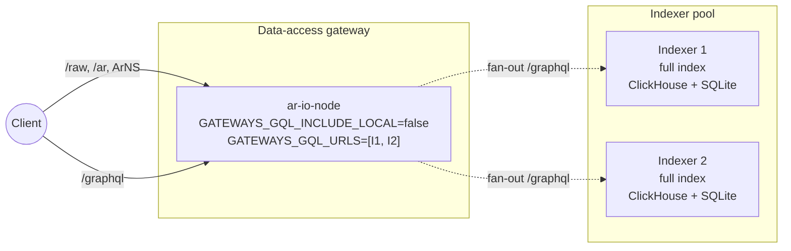
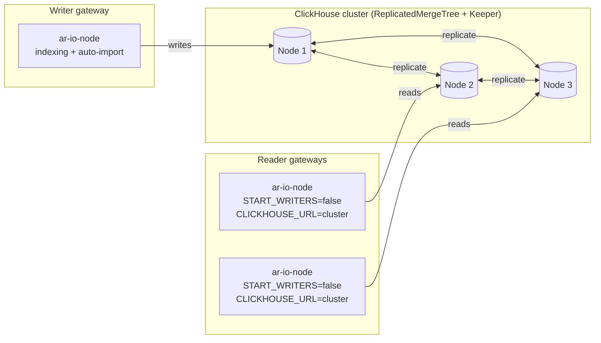
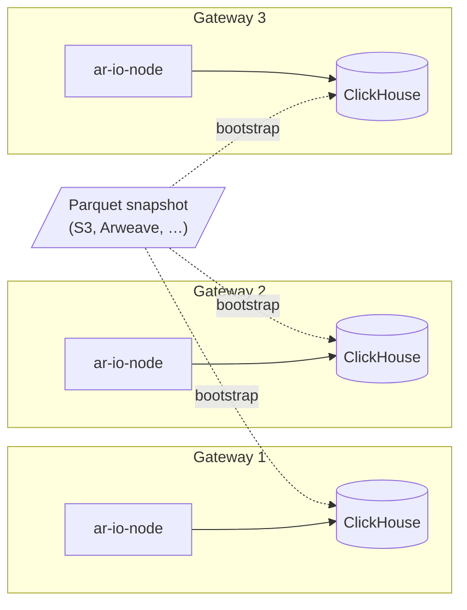
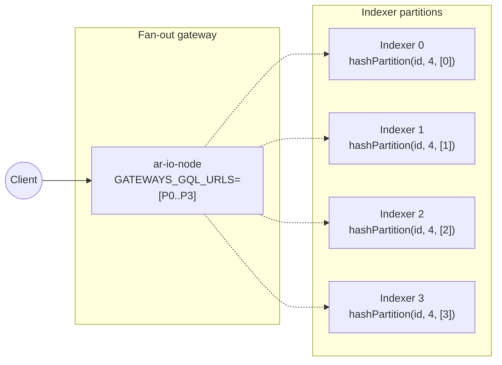
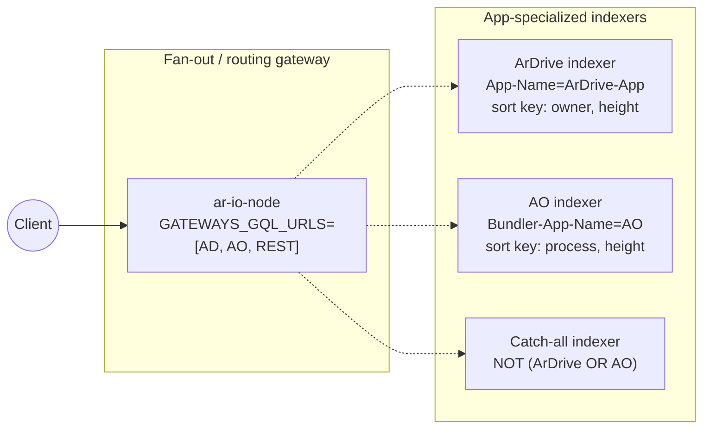

# Deployment Topologies

This document sketches deployment topologies operators can use to scale
indexing and GraphQL query serving beyond a single gateway. It focuses on
**what's composable with the existing knobs** — no topology below requires
code changes. The wiring is driven by a handful of env vars:

- `ANS104_UNBUNDLE_FILTER` / `ANS104_INDEX_FILTER` — narrow what each
  indexer writes. Supports a `hashPartition` operator (see
  [Filters](filters.md#hash-partition-filter)) for deterministic splits
  by TX ID, owner, etc.
- `START_WRITERS=false` — disables block/transaction/bundle indexing
  workers. Appropriate for read-replica roles that consume a shared
  ClickHouse cluster and accept having no local speed layer above the
  composite boundary.
- `CLICKHOUSE_URL` — when set, wraps the SQLite GraphQL queryable with
  `CompositeClickHouseDatabase` (see [ClickHouse Pipeline](clickhouse-pipeline.md)).
  The gateway only knows a single endpoint; replication or sharding is
  handled by the ClickHouse cluster itself.
- `GATEWAYS_GQL_URLS` — fan-out list of upstream GraphQL endpoints.
  `/graphql` queries every upstream in parallel and merges results.
- `GATEWAYS_GQL_INCLUDE_LOCAL=false` — omit the local queryable from the
  merge to get a pure proxy.

The default single-node topology — one gateway running the full stack —
is covered in the setup guides ([Linux](linux-setup.md),
[Windows](windows-setup.md)) and is not reproduced here.

---

## 1. Data-access gateway proxying GraphQL to indexers

**Shape.** Split the gateway role: a front-facing **data-access gateway**
serves data retrieval (`/raw/`, `/ar/`, ArNS), and one or more **indexer
gateways** behind it own the index and answer `/graphql`. The data-access
gateway exposes `/graphql` by proxying to the indexers via fan-out.



**When to use.** Public-facing gateway where you want a thin,
horizontally-scalable edge tier and keep indexing costs isolated on
dedicated hosts.

**Notes.**
- The indexers must expose the ar-io-node cursor format
  (`GATEWAYS_GQL_URLS` assumes this; do not mix with arweave.net-style
  cursors).
- With two healthy indexers holding the same data, fan-out delivers no
  extra coverage — use this topology for **HA on the edge**, not for
  partitioning. Partitioning is covered in §4 and §5.

---

## 2. Shared ClickHouse with replication

**Shape.** Multiple gateways point at a single logical ClickHouse
cluster that uses `ReplicatedMergeTree` tables and Keeper for
coordination. One gateway (or a dedicated jobs host) runs the
`clickhouse-auto-import` daemon; all others are read-only consumers of
the shared data.



**When to use.** You want a single authoritative batch layer shared
across gateways and can afford the Keeper-quorum operational cost.
Readers scale horizontally without re-indexing.

**Notes.**
- ar-io-node itself has no notion of cluster topology — `CLICKHOUSE_URL`
  points at a single endpoint (typically a load balancer or the
  cluster's HTTP interface). Replication, sharding, and failover are
  handled inside the cluster.
- Only one writer should run `clickhouse-auto-import` against a given
  cluster to avoid redundant imports. The staging/final migration is
  per-partition idempotent, so a duplicate run is recoverable but
  wasteful.
- Readers with `START_WRITERS=false` have no local speed layer, so
  heights above the composite boundary are not served at all — there
  is a gap between the ClickHouse tip and the chain tip bounded by
  the auto-import sleep interval. Operators who need recent-height
  coverage on readers should leave writers enabled and accept the
  duplicated ingest work locally.
- **Streaming pipeline (alternative).** With
  `CLICKHOUSE_STREAMING_ENABLED=true` on the writer (see
  [ClickHouse Pipeline → Streaming pipeline](clickhouse-pipeline.md#streaming-pipeline-unstable-head)),
  the writer also streams the unstable head into ClickHouse `new_*`
  tables in near-real time. Readers running with `START_WRITERS=false`
  then see a complete chain — including the live tip — without needing
  a local SQLite. Two mutually exclusive reader configurations:
  - `CLICKHOUSE_GQL_SKIP_SQLITE_READS=true` on readers makes ClickHouse
    the sole read path; SQLite is not queried at all.
  - Leaving the flag unset keeps SQLite available as a circuit-breaker-
    governed fallback for the brief window when the streaming pipeline
    is degraded.

---

## 3. Multiple independent ClickHouse instances

**Shape.** Each gateway owns its own ClickHouse. There is no shared
state. Bootstrap parity comes from the Parquet snapshot-sharing flow
(see [ClickHouse Pipeline → Dataset sharing](clickhouse-pipeline.md#dataset-sharing)):
one gateway (or an external publisher) produces the Parquet warehouse,
others import it.



**When to use.** Simplest scale-out path. No Keeper quorum, no
cross-gateway coupling, each gateway fails independently. Good fit when
gateways serve different audiences or regions and the cost of
duplicated storage is acceptable.

**Notes.**
- After bootstrap, each instance diverges: some may index more bundles
  than others depending on local `ANS104_INDEX_FILTER`. Use a shared
  filter if you need uniform coverage.
- No cross-instance deduplication. If you place these behind a fan-out
  data-access gateway (§1), the fan-out layer's merge step dedupes at
  query time — but query cost scales with the number of upstreams for
  any given page.

---

## 4. Indexing partitioned by TX ID

**Shape.** N indexer gateways each own a `1/N` slice of the data set,
chosen by hashing the transaction/data-item ID. A fan-out data-access
gateway (§1) unions the results at query time. This is horizontal
**write** scaling — each partition indexes faster and uses less disk.



Example `ANS104_INDEX_FILTER` for partition 0 of 4:

```json
{
  "hashPartition": {
    "partitionCount": 4,
    "partitionKey": "id",
    "targetPartitions": [0]
  }
}
```

**When to use.** Index growth has outpaced a single node's ingest
throughput or storage budget, but query patterns don't favor any
particular app/owner layout.

**Notes.**
- Partitioning by `id` gives uniform distribution (~1/N per partition)
  because TX IDs are random. See
  [Filters → Hash Partition](filters.md#hash-partition-filter).
- Each partition still indexes the full L1 chain (blocks, L1 txs) —
  `hashPartition` is usually placed inside `ANS104_INDEX_FILTER` and
  narrows the **data-item** set. L1 transactions are small relative to
  data items so this is rarely a bottleneck.
- Pagination caveat: the fan-out merges N paginated streams. Cursor
  semantics are preserved (upstreams use the ar-io-node cursor format),
  but total query cost per page scales with N.

---

## 5. Indexing split by apps

**Shape.** Same fan-out shell as §4, but each indexer's filter is
scoped to a specific app or protocol rather than a hash slice. Each
indexer's ClickHouse sort key and TTL rules can be tuned to that app's
query patterns (see
[MADR 001 — specialization rationale](madr/001-clickhouse-gql.md)).



Example filter for the ArDrive indexer:

```json
{
  "tags": [
    { "name": "App-Name", "valueStartsWith": "ArDrive" }
  ]
}
```

**When to use.** You operate a gateway tier focused on specific apps or
protocols and want sub-second GraphQL for those apps without paying the
cost of a generalized, everything-sorted-every-way layout. This is the
scaling story MADR 001 points to — specialization over generalization.

**Notes.**
- Filters must be disjoint if you want each item indexed exactly once.
  Overlap is tolerable — the fan-out merge deduplicates on `id` — but
  burns indexing work on both sides.
- A client that knows it only wants ArDrive data can skip the fan-out
  entirely and query the ArDrive indexer directly, paying single-node
  latency.
- Mixed-app queries (e.g. a cross-app feed) still pay fan-out cost.
- Custom ClickHouse sort keys require per-indexer schema work beyond
  what `src/database/clickhouse/schema.sql` ships with today. This is
  operator-side tuning, not something ar-io-node orchestrates for you.

---

## Comparison

| Topology | Primary win | Primary cost | Coupling |
|----------|-------------|--------------|----------|
| 1 — Proxy edge | Cheap, stateless edge tier | Extra hop on every query | Loose (HTTP) |
| 2 — Shared ClickHouse | Single source of truth, reader scale-out | Keeper quorum, write bottleneck at one node | Tight (cluster) |
| 3 — Independent ClickHouse | Simplest scale-out, fault isolation | Duplicated storage; divergence without discipline | None |
| 4 — Partition by ID | Horizontal write scaling, uniform load | Per-page cost scales with partition count | Loose (HTTP) |
| 5 — Split by app | Query latency via specialization | Mixed-app queries fan out; schema tuning work | Loose (HTTP) |

These are composable. A realistic production stack might combine §1
(edge) with §2 (shared ClickHouse) for HA reads, or §1 with §4 for
partitioned writes. The constraints that make topologies incompatible
are storage (shared vs. independent ClickHouse) and write ownership
(who owns `clickhouse-auto-import`), not the proxy/fan-out layer.

## See also

- [ClickHouse Pipeline Architecture](clickhouse-pipeline.md) — the
  batch-layer data flow assumed by topologies 2–5.
- [Filters](filters.md#hash-partition-filter) — `hashPartition` details
  for topology 4.
- [MADR 001: ClickHouse as a Supplemental GraphQL Backend](madr/001-clickhouse-gql.md)
  — rationale behind app-specific specialization (topology 5).
- [Environment Variables](envs.md) — full reference for the knobs
  cited above.
