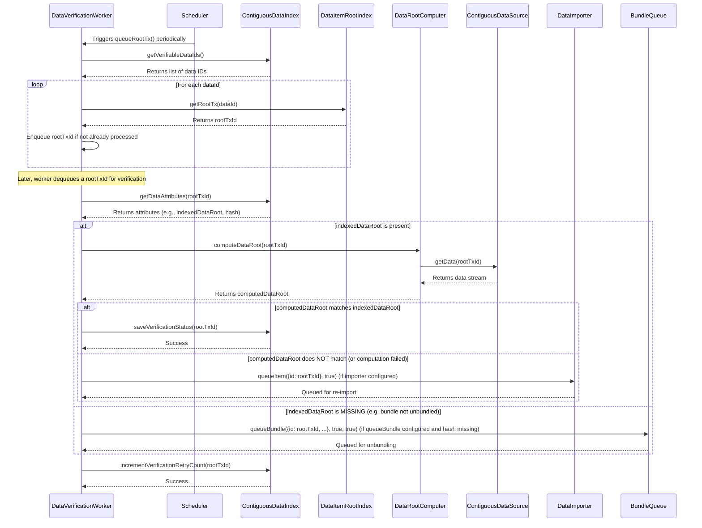

# Data Verification Architecture

## High-Level Overview

The data verification process is a critical component of the AR.IO Gateway infrastructure. Its primary purpose is to ensure the integrity and consistency of data stored and served by the gateway, aligning it with the standards and cryptographic verifiability of the Arweave network. By verifying data, the system guarantees that clients receive authentic and untampered information, maintaining trust and reliability.

Verification typically occurs as a background process after data has been ingested into the system. This involves:
- Cryptographically checking transaction and bundle data against their declared Merkle roots.
- Ensuring that data chunks correctly reconstruct to form the complete data payload.
- Validating metadata and structural integrity of data items.

This proactive verification helps detect and flag corrupted or inconsistent data, allowing for corrective actions such as re-fetching or isolating problematic items.

## Core Components and their Interactions

The data verification system is comprised of several key components that work together to ensure data integrity.

### `DataVerificationWorker` (`src/workers/data-verification.ts`)
The `DataVerificationWorker` is the central orchestrator of the verification process.
-   **Role**: It periodically scans for data items that require verification, manages a queue of items to be checked, and coordinates the verification steps.
-   **Triggers**: It can be triggered on a timed interval and potentially by events indicating new data arrival.
-   **Dependencies**:
    -   `ContiguousDataIndex`: To query for verifiable data IDs and update their verification status.
    -   `DataItemRootIndex`: To fetch the root transaction ID for a given data item, which is crucial for context.
    -   `DataRootComputer`: To compute the Merkle data root of a given data item.
    -   `DataImporter` (optional): To queue data for re-downloading/re-importing if verification fails due to mismatched data roots, suggesting local data corruption.
    -   `ContiguousDataSource`: To get the actual data stream for root computation.
    -   `queueBundle` (optional function): To queue bundles for unbundling if their indexed data root is missing.

### `DataRootComputer` (`src/lib/data-root.ts`)
-   **Role**: This component is responsible for calculating the Merkle data root for a given data item ID. It fetches the necessary data chunks via the `ContiguousDataSource` and performs the cryptographic hashing and tree construction to arrive at the final data root.

### `ContiguousDataIndex` (Interface, implemented by SQL stores)
-   **Role**: This interface represents the storage system that holds metadata about contiguous data items (transactions or data items from bundles). It's queried by the `DataVerificationWorker` to find items needing verification (`getVerifiableDataIds`), retrieve their current attributes (like an indexed `dataRoot` via `getDataAttributes`), and to update their status (`saveVerificationStatus`, `incrementVerificationRetryCount`).

### `DataItemRootIndex` (Interface, implemented by SQL stores)
-   **Role**: Provides a mapping from a data item ID to its root transaction ID. This is important for understanding the context of a piece of data, especially for bundled data items, as verification is often performed on the entire root transaction.

### `ContiguousDataSource` (Interface)
-   **Role**: This interface provides access to the actual byte stream of a data item. The `DataRootComputer` uses it to fetch the data required for computing the Merkle root. Implementations might fetch data from local disk, S3, or other storage backends.

### Validation Utilities (`src/lib/validation.ts`)
-   **Role**: This module provides a collection of utility functions for various validation tasks:
    -   `isValidBlockIndepHash`, `isValidTxId`: Basic format validation for Arweave identifiers.
    -   `sanityCheckBlock`, `sanityCheckTx`, `sanityCheckChunk`: Structural checks for blocks, transactions, and chunks.
    -   `validateChunk`: A crucial function that performs Merkle validation for an individual data chunk against a transaction's data root and proof (tx_path). This is a lower-level validation that can happen independently or as part of the overall data root verification.

## Data Structures and Database Schema

The primary data structure supporting the verification process is the `contiguous_data_ids` table in the database (e.g., SQLite). This table stores metadata for all data items that can be contiguously reconstructed, whether they are standalone transactions or data items unpacked from bundles.

### `contiguous_data_ids` Table
Key columns relevant to data verification include:

-   `id` (TEXT, PRIMARY KEY): The unique identifier for the data item (e.g., a transaction ID).
-   `data_root` (TEXT): The indexed Merkle data root for this data item. This is the root against which the computed root will be compared. This might be absent if the data (e.g. a bundle) hasn't been fully processed yet.
-   `verified` (BOOLEAN, DEFAULT FALSE): A flag indicating whether the data item has been successfully verified. The `DataVerificationWorker` primarily queries for records where `verified = FALSE`.
-   `verification_retry_count` (INTEGER): Stores the number of times verification has been attempted for this item. This is used in the retry logic to potentially deprioritize items that consistently fail or to limit attempts.
-   `verification_priority` (INTEGER): Allows for prioritizing certain data items for verification over others. Higher values might indicate higher priority.
-   `first_verification_attempted_at` (INTEGER): Timestamp (Unix epoch) of the first time verification was attempted for this item.
-   `last_verification_attempted_at` (INTEGER): Timestamp (Unix epoch) of the most recent verification attempt.

(Other columns like `hash`, `size`, `content_type`, etc., exist for general data management but are less central to the verification logic itself, though `hash` can be used to check if a bundle has been unbundled if `data_root` is missing).

### Database Indexes
Several database indexes are crucial for the efficient operation of the data verification worker:

-   `contiguous_data_ids_verified` (on `id` WHERE `verified = FALSE`): This index was historically used to quickly find all unverified items. (As seen in `migrations/2024.11.07T13.51.33.data.verified-contiguous_data_ids.sql`)

-   `contiguous_data_ids_verification_priority_retry_idx` (on `verification_priority DESC`, `verification_retry_count ASC`, `id ASC` WHERE `verified = FALSE`): This is a more advanced index introduced to support the enhanced retry and prioritization system (as seen in `migrations/2025.05.28T18.42.00.data.add-verification-retry-system.sql`). It allows the worker to fetch unverified items, ordered first by their priority (descending, so higher priority comes first) and then by their retry count (ascending, so items with fewer retries come first), ensuring that important and less-attempted items are processed sooner. This index supersedes the older `contiguous_data_ids_verified` index.

## API Details (Internal)

This section details the key internal APIs and function signatures involved in the data verification process. These are primarily interactions between the components described earlier.

### `DataVerificationWorker` (`src/workers/data-verification.ts`)
-   `constructor(options)`: Initializes the worker with dependencies like loggers, data indexes, data sources, and configuration for worker count, timeouts, and intervals.
-   `async start(): Promise<void>`: Starts the worker's periodic polling mechanism to queue and process data items for verification.
-   `async stop(): Promise<void>`: Stops the worker, clears any intervals, and kills the internal queue.
-   `async queueRootTx(): Promise<void>`: Queries `ContiguousDataIndex` for verifiable data IDs, resolves their root transaction IDs using `DataItemRootIndex`, and adds them to an internal processing queue if not already present.
-   `async verifyDataRoot(id: string): Promise<boolean>`: The core verification logic for a single data item (identified by its root transaction ID).
    -   Fetches data attributes (including the indexed `data_root`) from `ContiguousDataIndex`.
    -   If `data_root` is present, calls `DataRootComputer.computeDataRoot(id)` to get the computed root.
    -   Compares the indexed and computed roots.
    -   If they match, calls `ContiguousDataIndex.saveVerificationStatus(id)`.
    -   If they mismatch and `DataImporter` is present, calls `DataImporter.queueItem({ id }, true)` for re-import.
    -   If indexed `data_root` is missing and `queueBundle` is available, may call `queueBundle` to process the bundle.
    -   In all cases (success or failure), calls `ContiguousDataIndex.incrementVerificationRetryCount(id)`.
    -   Returns `true` for successful verification, `false` otherwise.
-   `queueDepth(): number`: Returns the current number of items in the verification queue.

### `ContiguousDataIndex` (Interface)
This interface is typically implemented by database interaction classes.
-   `async getVerifiableDataIds(): Promise<string[]>`: Returns a list of data IDs that are marked as unverified and are eligible for a verification attempt (considering priority and retry counts).
-   `async getDataAttributes(id: string): Promise<Attributes | undefined>`: Retrieves stored attributes for a data item, including its `dataRoot` and `hash`.
-   `async saveVerificationStatus(id: string): Promise<boolean>`: Marks the specified data item as `verified = TRUE` in the database.
-   `async incrementVerificationRetryCount(id: string): Promise<void>`: Increments the `verification_retry_count` and updates `last_verification_attempted_at` for the given data item.
-   (Other methods exist for managing data, but these are key for verification).

### `DataItemRootIndex` (Interface)
-   `async getRootTx(dataId: string): Promise<string | undefined>`: For a given data item ID (which could be from a bundle), returns the ID of the root transaction that contains it.

### `DataRootComputer` (`src/lib/data-root.ts`)
-   `async computeDataRoot(id: string): Promise<string | undefined>`: Fetches the data for the given ID using `ContiguousDataSource`, computes its Merkle data root, and returns it as a string. Returns `undefined` if computation fails.
-   `async stop(): Promise<void>`: Stops any ongoing operations or internal workers if the computer uses them.

### `src/lib/validation.ts`
This module exports several standalone utility functions:
-   `isValidBlockIndepHash(hash: string): boolean`: Checks if a string is a valid Arweave block hash format.
-   `isValidTxId(id: string): boolean`: Checks if a string is a valid Arweave transaction/data ID format.
-   `sanityCheckBlock(block: PartialJsonBlock): void`: Throws an error if the block structure is invalid.
-   `sanityCheckTx(tx: PartialJsonTransaction): void`: Throws an error if the transaction structure is invalid.
-   `sanityCheckChunk(chunk: JsonChunk): void`: Throws an error if the chunk structure is invalid.
-   `async validateChunk(txSize: number, chunk: Chunk, dataRoot: Buffer, relativeOffset: number): Promise<void>`: Validates a single data chunk against a data root and its Merkle proof (`chunk.data_path`). Throws an error if validation fails. This is a lower-level check often used during data import or reconstruction.

## Verification Flow

### Sequence Diagram

This diagram illustrates the sequence of interactions when the `DataVerificationWorker` processes an item.



### Activity Diagram

This diagram shows the overall workflow and decision points in the verification process for a single data item.

```mermaid
graph TD
    A[Start: Verify Data Item ID] --> B{Fetch Data Attributes (indexedDataRoot)};
    B --> C{Indexed Data Root Present?};
    C -- Yes --> D[Compute Data Root];
    D --> E{Computed Successfully?};
    E -- Yes --> F{Indexed Root == Computed Root?};
    F -- Yes --> G[Mark as Verified];
    F -- No --> H{Attempt Re-import?};
    H -- Yes --> I[Queue for Re-import];
    H -- No --> J[Log Mismatch];
    E -- No --> J;
    C -- No --> K{Is it a Bundle needing Unbundling?};
    K -- Yes --> L[Queue for Unbundling];
    K -- No --> M[Log Missing Indexed Root];
    G --> Z[End: Increment Retry Count];
    I --> Z;
    J --> Z;
    L --> Z;
    M --> Z;
```

## Error Handling and Retry Mechanisms

The data verification system incorporates mechanisms to handle errors and to retry verification attempts, ensuring robustness and eventual consistency.

### Error Handling
Several types of errors or exceptional conditions can occur during the verification process:

1.  **Data Root Mismatch**:
    *   **Detection**: The computed data root does not match the indexed data root for a given item.
    *   **Handling**:
        *   The mismatch is logged, providing details of the differing roots.
        *   If an `DataImporter` instance is configured with the `DataVerificationWorker`, the item ID is queued for re-import (e.g., by calling `dataImporter.queueItem({ id }, true)`). This assumes the local data might be corrupted or incomplete and attempts to fetch a fresh copy.
        *   The verification attempt is considered failed for this cycle.

2.  **Missing Indexed Data Root**:
    *   **Detection**: The `getDataAttributes` call for an item returns no `dataRoot`. This often occurs for bundled data that has been indexed but not yet fully unbundled to determine the individual data item roots.
    *   **Handling**:
        *   If a `queueBundle` function is provided to the `DataVerificationWorker` (and other conditions like a missing `hash` suggest it's an unprocessed bundle), the worker may queue the root bundle for unbundling. This allows the system to process the bundle, which should then populate the necessary data roots.
        *   If unbundling is not applicable or not configured, the situation is logged.
        *   The verification attempt is considered failed for this cycle.

3.  **Data Root Computation Failure**:
    *   **Detection**: The `DataRootComputer.computeDataRoot()` method fails to compute a root (e.g., due to I/O errors when reading data from `ContiguousDataSource`, or malformed data chunks).
    *   **Handling**:
        *   The error is logged.
        *   The verification attempt is considered failed for this cycle.

4.  **General Errors**:
    *   Other unexpected errors (e.g., database connection issues, programming errors) are logged by the respective components.

### Retry Mechanism
Regardless of the outcome (success or specific failure type), each verification attempt on a data item triggers an update to its retry-related attributes in the `contiguous_data_ids` table. This is typically handled by `ContiguousDataIndex.incrementVerificationRetryCount(id)`.

-   **`verification_retry_count` (INTEGER)**: This counter is incremented after each verification attempt for an item.
-   **`last_verification_attempted_at` (INTEGER)**: This timestamp is updated to the current time after each attempt.
-   **`first_verification_attempted_at` (INTEGER)**: Set when the first attempt is made.
-   **`verification_priority` (INTEGER)**: This field can be used to influence the order in which items are picked for verification. While not directly modified by the retry mechanism itself, it's used in conjunction with `verification_retry_count` for selecting candidates.

**Selection of Items for Verification**:
The `DataVerificationWorker`, when calling `ContiguousDataIndex.getVerifiableDataIds()`, relies on the database query to use these fields. The typical query (as indicated by the `contiguous_data_ids_verification_priority_retry_idx` index) orders items:
1.  By `verification_priority` (descending - higher priority first).
2.  Then by `verification_retry_count` (ascending - fewer retries first).
3.  Then by `id` (ascending - for deterministic ordering).

This strategy ensures that:
-   High-priority items are attempted more readily.
-   Items that haven't been tried often get a chance before items that have failed many times.
-   The system avoids getting stuck repeatedly trying to verify a persistently problematic item if other, less-attempted items are available.

There isn't an explicit maximum retry limit defined directly in the worker, but the increasing `verification_retry_count` naturally deprioritizes items that have failed many times, especially if there are other items with lower retry counts or higher priority.

## Future Considerations / Potential Improvements

While the current data verification system is robust, several areas could be considered for future enhancements:

1.  **Configurable Max Retries**:
    *   Introduce a configurable maximum retry count. Items reaching this limit could be moved to a separate "quarantine" state or flagged for manual review, preventing them from indefinitely consuming verification resources.

2.  **Exponential Backoff for Retries**:
    *   Instead of just relying on the `verification_retry_count` for ordering, implement an exponential backoff strategy for `last_verification_attempted_at`. Items that fail could have their next eligible attempt time pushed further into the future with each subsequent failure.

3.  **Granular Error Reporting/Categorization**:
    *   Store more specific error codes or categories in the database upon verification failure (e.g., "DataStreamError", "ChunkValidationError", "DataRootMismatch"). This could aid in diagnostics and allow for more targeted retry strategies.

4.  **Verification Profiles**:
    *   Allow different "verification profiles" or strategies based on data type, source, or other attributes. For example, some data might require more urgent or frequent verification than other, less critical data. This could tie into the `verification_priority` system more dynamically.

5.  **Integration with External Validators**:
    *   For certain data types (e.g., specific bundle formats or complex data structures), consider a plugin system to allow external validation modules to be invoked as part of the verification pipeline.

6.  **Performance Monitoring and Alerts**:
    *   Enhanced monitoring of the verification queue depth, average processing time per item, and failure rates. Implement alerts if these metrics exceed predefined thresholds, indicating potential systemic issues.

7.  **Selective Re-verification**:
    *   Develop a mechanism to trigger re-verification of specific data items or sets of items on-demand, perhaps via an admin API. This could be useful if, for example, a bug in a previous version of the validation logic is discovered.

8.  **Batch Verification Optimization**:
    *   Investigate if certain parts of the verification (like fetching multiple data attributes or data streams from the same source) can be batched for improved efficiency, especially when dealing with a large backlog of items.
