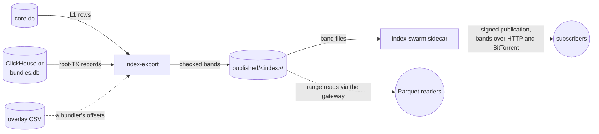

# Index export: building bands

The `index-export` service builds the bands a gateway publishes through
[Index Sharing](index-swarm.md). It runs the core image in the compose
profile `index-export`, reads this gateway's own index, and writes finished
bands under `data/indexes/published/<index>/`. The `index-swarm` sidecar
then signs and offers whatever it finds there. It builds two kinds of band:

- **root-TX bands** (`cdb64-root-tx`), from ClickHouse or `bundles.db`;
- **L1 bands** (`parquet-l1`), from `core.db`.

`INDEX_EXPORT_KINDS` chooses which (default `root-tx-index`; add
`parquet-l1` for L1 bands). For the format of each band and how a reader
uses it, see [index-publication.md](index-publication.md).



## Contents

- [What it builds](#what-it-builds)
- [Where records come from](#where-records-come-from)
- [Checks before publishing](#checks-before-publishing)
- [Running it](#running-it)
- [L1 bands](#l1-bands)
- [Adopting existing bands](#adopting-existing-bands)
- [Building a band by hand](#building-a-band-by-hand)
- [Known limits](#known-limits)
- [Metrics and alerting](#metrics-and-alerting)
- [Troubleshooting](#troubleshooting)

## What it builds

### Root-TX bands

Three roles, named `<role>-h<from>-<to|tip>-<publisher>-<digest>`:

| Role | Range | When |
|---|---|---|
| `h` (history) | Fixed and closed | Cut at the first run, at multiples of `INDEX_EXPORT_RECENT_MAX_BLOCKS` from `INDEX_EXPORT_START_HEIGHT`. Never rebuilt |
| `r` (recent) | `[R_lo, R_hi]` | Folded weekly: its own entries plus the sources' rows above it, so rows the index has since expired (ClickHouse TTL) are kept. At `INDEX_EXPORT_RECENT_MAX_BLOCKS` it is frozen and a new `r` starts above it |
| `d` (delta) | From 512 blocks below the top of the highest `h` or `r` to the tip | Rebuilt daily at `INDEX_EXPORT_RUN_AT_UTC`. Published only when its content changed |

A fold publishes the new `r` (superseding only `r` bands) before the new
`d` (superseding only `d` bands). On a fold day the `d` keeps its old start
and moves up over the new `r` the next day. A subscriber keeps a superseded
band until its successor installs, so every height stays covered whichever
band installs first. Each new band also names the ids its predecessors
replaced, so a subscriber that missed one still keeps its old band.

### L1 bands

L1 bands cover two nested fixed grids, the same for every publisher, so two
publishers of the same chain cut it at the same heights. A finalised
height's rows never change, so a band over a completed range is written
once.

| Role | Covers | Built | Size |
|---|---|---|---|
| `h` | A whole 100,000-height range | Once the range is below the top. Supersedes the `d` bands inside it | About 700 MB |
| `d` | A whole 5,000-height sub-range | Once the sub-range is below the top. Never rebuilt | About 35 MB |
| tip | The one incomplete sub-range | Each run the top has moved. Supersedes the tips before it | Up to 35 MB |

Only the tip is rebuilt, so a subscriber downloads at most about 35 MB a
day. The top is one below the stable top, so the block above every band's
last block is there to anchor it. The whole chain is 24 bands.

## Where records come from

**Root-TX bands** read `INDEX_EXPORT_SOURCES` (see [envs.md](envs.md)): by
default this gateway's ClickHouse, or its SQLite `bundles.db` without one.
Several sources merge under one rule:

- the later root wins;
- an overlay (a bundler's own offsets, as coverage-named CSV files) wins
  within its coverage;
- two sources that disagree on an item's offsets are left out, or fall back
  to the earlier entry, rather than signed.

Where a peer indexer's database is not reachable, the peer can run
`ar-io-node index-band-export` into coverage-named files that this service
reads as a peer (`"rank": 0`). Offsets are placed only where proven: an item
whose `root_parent_offset` is ambiguous keeps its root without them.
[`index-band-export`](cli.md#index-band-export) shows what one source gives.

**L1 bands** read `core.db` (`INDEX_EXPORT_CORE_DB`, read-only). It must hold
every block from height 0. A gateway that started above it (`START_HEIGHT`)
cannot build L1 bands, and its runs say so (`incomplete`, not retried).
Only transactions a block lists are written, with their own tags. A row a
fork left in `core.db` is counted (`strayTransactions`) and never published.

## Checks before publishing

### Root-TX bands

Each band is read back, and a sample of its entries is header-checked
against `INDEX_EXPORT_HEADER_CHECK_URL`: 150 entries, plus up to 50 whose
offsets were repaired and 200 the overlay changed. The check reads root
transactions over the network, so point it at a gateway that holds them,
not one that would have to fetch them.

| Outcome | What happens |
|---|---|
| Published | Renamed into place. The sidecar offers it at its next scan |
| Unchanged | Nothing written |
| Skipped | A `d` under 1,000 entries (normal for a small publisher just after a fold), or nothing new. Not an error. An `h` or `r` publishes whatever its size, or its heights would stay uncovered |
| Couldn't check | A source down; the check gateway unable to serve (under 80% read, none wrong, after retrying each read twice); too little disk; or an optional source down during a fold that freezes its band. Retried after 15 minutes, doubling to 2 hours, until the next daily run |
| Rejected | A wrong header, conflicts over 1% of the band, a band with no offsets to check, a failed read-back, or bands in `published/` it did not build (bootstrap). Not retried. `tools/index-swarm-status` shows it as a FAIL |

A failed run never withdraws a band already published. A rejected fold is
not rebuilt every day: it waits until an operator runs `--once`.

### L1 bands

- Every block links to the one before it and is linked to by the one above.
- Each `hash_list_merkle` follows from the previous block.
- Each block's `tx_root` is recomputed from its transactions where the
  index holds them all (see [`tx_root`](glossary.md#tx-root) for what that
  proves).
- Each transaction is at the height and position its block lists it at.
- Each owner's address is the SHA-256 of its key.
- Where the index keeps signatures (`WRITE_TRANSACTION_DB_SIGNATURES`, off
  by default), each transaction's id is the SHA-256 of its signature.

A range that fails is rejected, naming the heights, and nothing is written.
These checks do not cover the order of transactions within a block.
Comparing two publishers' `block_transactions` digests does; when they
disagree for a range, a raw node's `/block/height/<h>` settles one block.

## Running it

It needs a core image that includes it (Release 85 or later). Set
`INDEX_EXPORT_IMAGE_TAG` if core runs an older one. Use the gateway's own
compose `-f` files with every command below.

```bash
# Once, without publishing: the plan, rows, time and peak disk per band and
# in total, and the header check's result. -T keeps the logs on stderr, out
# of the JSON report.
docker compose --profile index-export run --rm -T index-export --once --dry-run > plan.json
# The same at a fixed height, keeping the bands to compare (under
# data/indexes, so on the bands' filesystem).
docker compose --profile index-export run --rm -T index-export \
  --once --to 2010000 --keep data/indexes/export/compare > compare.json
# The service. Its first run is about 5 minutes after it starts, then daily.
docker compose --profile index-export up -d --no-deps index-export
```

A dry run of a bootstrap plans every band; cap it with `--to`. Run a long
`--once` (a bootstrap can take hours) in `tmux` or `screen`. A `--once` run
counts as an operator's, so it retries a rejected fold.

- **One run at a time.** A run holds `data/indexes/export/lock`, touched
  every 30 s and broken when 5 minutes stale (a killed run). A `--once`
  beside the running service exits with `locked`.
- **Working directory.** It works under `data/indexes/export/` (scratch,
  `state.json`, the lock; dry runs under `export/dry-run/`), on the same
  filesystem as `published/`.
- **Disk.** It never eats into a margin of 5% of the filesystem, at least
  10 GiB, since the gateway's own data may share that disk. Before a
  root-TX band it also needs three times the band it folds (the old band
  stays through the grace beside the scratch and the new one). Before an
  L1 band it needs eight times the largest band published, at least
  10 GiB. DuckDB's spill is capped at 16 GB and kept in the band's staging.
- **Memory and I/O.** 6 GB of memory and a 4 GB heap; read-only,
  low-priority ClickHouse queries of 2 threads; and an I/O weight where the
  kernel's I/O scheduler honours one (check `BlkioWeight` in
  `docker inspect`).
- **`state.json`** holds adoptions, the last fold, a pending retry and the
  last run, per index. The bands themselves are read from `published/`, so
  losing it costs the adoptions and the status history.
- **Ownership.** The container runs as root, so the band directories it
  writes are root's. Removing one by hand takes `sudo`.
- **Logs.** It logs by `LOG_LEVEL` and `LOG_FORMAT`, capped like the
  sidecar's by `INDEX_SWARM_LOG_MAX_SIZE` and `INDEX_SWARM_LOG_MAX_FILE`.

## L1 bands

Turn them on with `INDEX_EXPORT_KINDS=root-tx-index,parquet-l1`, and list
`{"name":"parquet-l1","kind":"parquet-l1"}` in `INDEX_SWARM_PUBLISH` too.
The sidecar is what retires a superseded tip band; without it
`published/parquet-l1/` keeps every one. They are built in the same run as
root-TX bands, under the same lock.

### Normalised columns

Two honest publishers of the same chain write identical rows, so comparing
their digests per range checks each other's index. Three columns are ones
a gateway fills in for itself, so a band writes one canonical value for
each, whatever `core.db` holds:

| Column | Written as | Why |
|---|---|---|
| `blocks.tx_root` below the 2.0 fork (422,250) | null | A pre-fork block hash does not commit it, and it cannot be recomputed |
| `transactions.data_root` on format 1 | null | A format-1 header carries none; some gateways hold one computed from the data. Format 2 signs its `data_root`, so it is kept |
| `transactions.content_type`, `content_encoding` | The first `Content-Type` / `Content-Encoding` tag by position, names compared without case; null if none | Older releases stored the last matching tag, so the stored value depends on the release that indexed the row |

No check reads a pre-fork `tx_root`, and `tx_root` recomputation derives a
format-1 transaction's root from its data, never from the stored column.
An import never erases a pre-fork `tx_root` or a format-1 `data_root` the
gateway already holds.

### Layout `l1-3` and lookup files

These are layout `l1-2`'s rules (`schema` in `band.json`). Layout `l1-3`
keeps them and adds three [lookup files](index-publication.md#lookup-files)
to every band. Lookup files add 10 to 20% to a band. A reader accepts
`l1-1`, `l1-2` and `l1-3`.

Every band built is `l1-3`: the service writes the tables, derives the
lookup files from them, and writes `band.json` last. A published band whose
tables are current but which has no lookup files (`l1-2`, or `l1-1`
confirmed identical under `l1-2`) is not rebuilt. Each run derives its
lookup files from its own tables, adds them in place, and keeps its id,
then replaces `band.json` with one naming them. No file already in the band
changes, and a subscriber that already holds the band fetches only the new
files. This needs no `core.db`, so it runs first, before any build, and
again after them. It reports each band under `l1Derived` and counts it as
`index_export_runs_total{kind="derive"}`.

**Upgrading a publisher from `l1-1` rebuilds every band once.** A rebuilt
band whose rows did not change keeps its id, since the id comes from the
rows. Its files are left alone, so subscribers download nothing. Only
ranges whose rows changed get new ids.

**Upgrade order.** A sidecar that does not know `l1-3` cannot read an
`l1-3` band. As a subscriber it refuses the band, naming the layout, and
keeps its copy. As a publisher it cannot describe the band, so the band
goes unpublished. Upgrade subscribers first, then a publisher's
`index-swarm` with or before its `index-export`. The gateway reads no
`parquet-l1` band and needs nothing.

### Time budget

A bootstrap of the whole chain takes hours. A run starts no new whole band
after `INDEX_EXPORT_L1_RUN_BUDGET_MINUTES` (4 hours by default). The rest are
listed as `l1Deferred`, and the next run starts 15 minutes later. For a
bootstrap or a one-time rebuild, raise it so one run does the lot.

### Load on the gateway

Reads are short, by key or index, in windows of 200 heights, so the
gateway's WAL checkpoints are not held back. A bootstrap still reads all of
`core.db` once, so schedule it off-peak.

Each index keeps its own outcome, retry and last run, in `state.json` and in
the metrics (`index` label). A failing L1 band neither retries nor marks
root-TX bands, or the reverse.

## Adopting existing bands

The service refuses to bootstrap while `published/` holds bands it did not
build and has not adopted, since new bands would overlap them. A publisher
with bands built another way hands them over first, with the service
stopped (adopting takes the lock):

```bash
docker compose --profile index-export run --rm -T index-export \
  --adopt <band-id> --as h|r|d [--top <highest height it covers>]
```

Adopt every band: the recent one as `r` (folded like the service's own;
under `INDEX_EXPORT_RECENT_MAX_BLOCKS` in span), older ones as `h`, and a
daily delta as `d`, so the service's first `d` supersedes it. `--top` is
required for a band open at the tip, since bands store no heights. Err low,
since the fold reads the sources from just below it. Stop whatever else
built the bands before adopting, or it will replace them under new ids.

## Building a band by hand

[`ar-io-node index-band-build`](cli.md#index-band-build) builds a root-TX
band from CSV records in one step. It deduplicates, names the band so its id
is unique to the publisher and changes with its content, header-checks a
sample, and only then renames it into place, never over an existing band.
[`index-band-verify`](cli.md#index-band-verify) runs the same check on any
band.

Without the CLI, a band is a
[partitioned CDB64 index](cdb64-format.md#partitioned-cdb64-index-format),
for example from the local database:

```bash
./tools/export-sqlite-to-cdb64 --partitioned \
  --output-dir data/indexes/published/root-tx-index/band-tip.tmp
mv data/indexes/published/root-tx-index/band-tip.tmp \
  data/indexes/published/root-tx-index/band-tip
```

Build under a `.tmp` name and rename into place. Directories ending in
`.tmp`, or in `.tmp.<pid>` (the partitioned writers' own build
directories), are skipped, so a band is never described half-written.

A band must carry all of its partitions as local files. The publisher and
every subscriber refuse a `manifest.json` that names a partition by URL or
Arweave ID, as the shipped remote indexes in `resources/` do.

### Band metadata

Two optional fields in a band's `manifest.json` `metadata` change how
subscribers treat it. Add them before renaming the band into place: a
manifest edit changes the band's digests.

```bash
m=data/indexes/published/root-tx-index/band-tip.tmp/manifest.json
jq '.metadata = ((.metadata // {}) + {heightRange: [1950000, null]})' "$m" > "$m.new" && mv "$m.new" "$m"
```

| Field | Effect |
|---|---|
| `heightRange: [from, to]` | The heights the band covers; `to` is `null` for a band that follows the tip. Subscribers install bands newest heights first by this range. A band without it installs last. `export-sqlite-to-cdb64` does not write it |
| `supersedes: "<band id>"` (or a list) | This band replaces the named ones. The publisher stops offering them in the same scan that describes this band, and deletes them after `INDEX_SWARM_SUPERSEDE_GRACE_SECONDS`. Subscribers retire them the same way |

To replace a band, give each build a fresh id with `supersedes` naming the
previous one. Subscribers then keep serving the old band until the new one
has installed. Without `supersedes`, a subscriber retires a band as soon as
the publisher stops offering it, and the operator deletes the old directory
after the next scan. Set `supersedes` when the band is first published:
adding it later edits the manifest, which makes a new version of the band.
A `supersedes` naming an id the publisher does not hold retires nothing; the
publisher warns once. Swapping a band under the same id also works, but
there is a moment when the band is absent and subscribers retire it.

## Known limits

- Rows indexed late at heights already frozen into a root-TX band
  (backfills) are not exported.
- An item under two roots at one height keeps whichever sorts first.
- A whole L1 band is never rebuilt, so it waits (`incomplete`) while the
  index lacks a transaction a block lists, or an owner's key. A tip band
  publishes anyway and counts them (`missingTransactions`,
  `missingWallets`); it is rebuilt each run.
- A band published wrongly cannot be replaced under its range by the
  service. Remove it from `published/<index>/` (`sudo`) and run `--once`.

## Metrics and alerting

`/healthz` and `/metrics` are on `INDEX_EXPORT_METRICS_PORT` (9102), in
`--once` runs too. `/healthz` reports only that the loop is alive, never
whether runs succeed, so autoheal cannot restart-loop a failing export. The
shipped `prometheus.yml` scrapes it as the `index-export` job.

| Metric | Read it as |
|---|---|
| `index_export_runs_total{index,kind,result,reason}` | Outcomes per band role. `kind="derive"` counts lookup files added in place |
| `index_export_last_success_timestamp_seconds{index,kind}` | The last success per role. Set again from `state.json` after a restart |
| `index_export_run_in_progress`, `index_export_run_started_timestamp_seconds` | A run that is taking long |
| `index_export_heartbeat_timestamp_seconds` | The loop is alive |

Alert when the daily band is late:

```promql
time() - index_export_last_success_timestamp_seconds{index="root-tx-index",kind="d"} > 2 * 86400
  or absent(index_export_last_success_timestamp_seconds{index="root-tx-index",kind="d"})
```

Add the same rule with `index="parquet-l1"` where L1 bands are built. It
fires through a bootstrap, until the first tip band.

`tools/index-swarm-status` also reports the export: the last daily band and
fold, the last run, a pending retry, a recent rejection and a stale lock,
for root-TX and L1 bands separately.

## Troubleshooting

**`incomplete`.** `core.db` does not hold everything a range needs: blocks
below `START_HEIGHT`, a transaction a block lists, or an owner's key. Not
retried for a whole band until the gateway has backfilled it.

**`held`.** An L1 band failed its chain checks. It stops the L1 part, since
bands are imported in height order, and scheduled runs do not rebuild it.
Repair the named blocks in `core.db`, then run `--once`.

**Refused reads.** The gateway writes to `core.db` while the export reads
it. During a WAL checkpoint SQLite can refuse a read, reporting it as a
write to a read-only database. The band is built again, twice (15 s, then
30 s later), before the run gives up on it. A chain check is never retried:
it would fail the same way.

**`Couldn't check`.** The check gateway could not serve enough roots, or a
source was down. Point `INDEX_EXPORT_HEADER_CHECK_URL` at a gateway that
holds the roots (see [choosing `--gateway-url`](cli.md#choosing---gateway-url)).

**`locked`.** Another run holds the lock. A lock untouched for 5 minutes
belongs to a run that died; the next run clears it.
