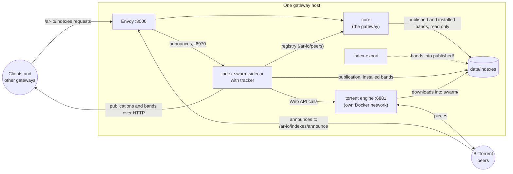
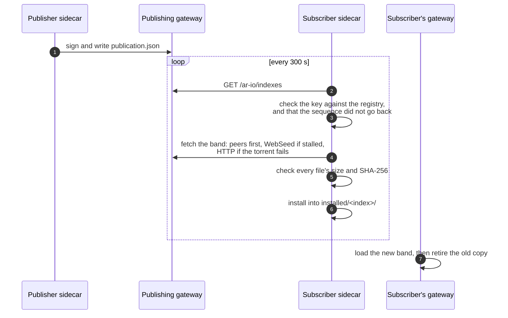
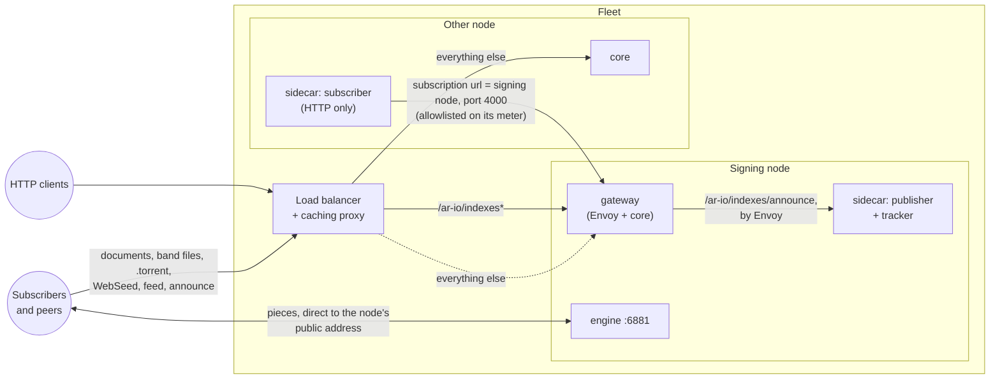

# Index Sharing: the `index-swarm` sidecar

The `index-swarm` sidecar publishes the bands this gateway offers and
subscribes to bands other gateways publish. Bands install and retire under a
running gateway without a restart.

It is **off by default**. A gateway that never enables the `index-swarm`
compose profile behaves as it always did. Related pages:

- [index-export.md](index-export.md): how a publisher builds its bands;
- [index-publication.md](index-publication.md): the protocol, for anyone
  reading bands without the sidecar;
- [cli.md](cli.md): the `ar-io-node` commands for bands.

## Status

A publisher signs its bands and serves them over HTTP. A subscriber
verifies, downloads and installs them, and the gateway beside it loads them
without a restart. Without a torrent engine, every subscriber fetches from
the publisher's metered HTTP routes. With one, bands also move peer to peer:
a publisher seeds a torrent of every band, a subscriber fetches from peers
first and falls back to HTTP, and every subscriber seeds what it installed.
See [Torrent engine](#torrent-engine).

## Quick start

Two scripts do the setup and the checking, from the gateway's directory
(where `.env` and `docker-compose.yaml` are). They need only Docker, since
they run in the core image. Both are covered in
[setup and status scripts](#setup-and-status-scripts); the manual steps they
replace are under [doing it by hand](#doing-it-by-hand).

### Subscribe to another gateway's index

1. Run a gateway release that ships `tools/index-swarm-setup`. The sidecar
   runs the same image (`CORE_IMAGE_TAG`).
2. Set it up and start it. turbo-gateway.com publishes under the gateway
   wallet `34LYvMptiDvBP5sqfh1oAd6Q4qFsy4PWaZ1HTFmML7h5`:
   ```bash
   ./tools/index-swarm-setup --subscribe 34LYvMptiDvBP5sqfh1oAd6Q4qFsy4PWaZ1HTFmML7h5 --torrent --restart
   ```
   To subscribe to another publisher, pass its gateway wallet instead; a
   publishing gateway shows it as `publisher` in its `/ar-io/indexes`.
   The script subscribes to the publisher's root-TX bands, points the
   gateway at them, generates the torrent engine's password, and restarts
   what needs it, by name. Leave out `--torrent` to move bands over HTTP
   only. Run with `--dry-run` first to see the changes; `.env` is backed up
   before it is written.
3. With `--torrent`, open port 6881, TCP and UDP, to the internet if
   possible. A subscriber behind NAT still downloads from peers and seeds to
   the ones it connects to, so this is recommended, not required. The engine
   does not use UPnP; behind a home router, forward the port by hand. See
   [Running the engine](#running-the-engine) for ports and firewalls.
4. Check it:
   ```bash
   ./tools/index-swarm-status
   ```
   Bands arrive newest heights first. A first pull of the root-TX bands
   (about 20 GB) takes minutes to hours. Each line says `ok`, `WARN` or
   `FAIL`, and every problem comes with the fix. `All good` means the gateway
   answers root-TX lookups from the installed bands.

From then on, new bands install and replace the ones they supersede by
themselves. The gateway loads each within 30 seconds.

### Publish this gateway's index

1. The gateway must be **registered** and reachable at its registry URL. The
   routes that serve bands live in the gateway, not the sidecar.
2. Its observer key must be the registered one. Set
   `INDEX_SWARM_OBSERVER_KEYPAIR_FILE` to the keypair file's host path, or
   `OBSERVER_PRIVATE_KEY` (not both), and `AR_IO_WALLET` to the gateway's
   wallet. Publications are signed over a fixed `ar-io-index-publication/v1`
   prefix, so no Solana transaction or HTTPSIG signature can pass for one.
   A wallet asked to sign an arbitrary message with that prefix would
   produce one, so do not use the observer key in a wallet that signs
   messages for dApps.
3. The `index-export` service builds the bands from this gateway's own
   index, once a day (see [index-export.md](index-export.md)). Publishing is
   for gateways that unbundle: one that indexes no data items has nothing to
   offer.
4. Set it up, dry-run the first build, and start it:
   ```bash
   ./tools/index-swarm-setup --publish --start-height 1950000 --torrent --public-host <this node's public IP>
   docker compose --profile index-export run --rm -T index-export --once --dry-run > plan.json
   ./tools/index-swarm-setup --publish --restart
   ```
   `--restart` recreates the gateway when its index settings in `.env`
   differ from what it runs, which applies every pending change to its
   settings. On a live gateway, start the services by name instead, with the
   gateway's compose `-f` files and
   `up -d --no-deps index-swarm index-export`. `--public-host` is where peers
   reach this node's engine. Peers announce to the tracker through the
   gateway itself, at `https://<ARNS_ROOT_HOST>/ar-io/indexes/announce`
   (`--public-url` names another origin). The first scan hashes every file
   once (minutes for tens of GB).
5. With `--torrent`, open 6881 (TCP and UDP) to the internet. The tracker
   needs no port of its own: see [the tracker](#the-tracker).
6. Check it with `./tools/index-swarm-status`, and from outside:
   `curl -s https://<your gateway>/ar-io/indexes | jq '{sequence, publisher, bands: [.indexes[].bands[].id]}'`.
7. Behind nginx, read [running behind nginx](#running-behind-nginx) before
   anyone subscribes. A fleet behind a load balancer also needs
   [publishing torrents from a fleet](#publishing-torrents-from-a-fleet-behind-a-load-balancer).

A gateway can do both: pass `--subscribe` and `--publish` together.

### Setup and status scripts

**`tools/index-swarm-setup`** edits `.env` and nothing else, unless given
`--restart`.

| Flag | Effect |
|---|---|
| `--subscribe <wallet>` | Adds the publisher to `INDEX_SWARM_SUBSCRIBE` (repeatable; existing entries are kept). Sets `INDEX_SWARM_MAX_DISK_BYTES` to 50 GiB if unset. Puts the installed directory first in `CDB64_ROOT_TX_INDEX_SOURCES` and `cdb` right after `db` in `ROOT_TX_LOOKUP_ORDER` (see [pointing the gateway at installed bands](#pointing-the-gateway-at-installed-bands) and [lookup order](#lookup-order)) |
| `--publish` | Adds `root-tx-index` to `INDEX_SWARM_PUBLISH` and starts `index-export`. Sets `INDEX_EXPORT_HEADER_CHECK_URL` (default `https://turbo-gateway.com`). Refuses, writing nothing, without a registered key or `AR_IO_WALLET`. With `--torrent`, sets `INDEX_SWARM_TRACKERS` (if unset) to this node's tracker: through the gateway, `<public URL>/ar-io/indexes/announce`, or with no public URL, `http://<public host>:6969/announce` |
| `--start-height <n>`, `--header-check-url <url>` | With `--publish`: `INDEX_EXPORT_START_HEIGHT` and `INDEX_EXPORT_HEADER_CHECK_URL` |
| `--torrent` | Generates `INDEX_SWARM_ENGINE_AUTH` (`swarm:` and 48 random hex characters; never printed) if unset. That alone turns the engine on: `INDEX_SWARM_ENGINE_URL` defaults to the compose engine |
| `--public-host <addr>`, `--engine-port <n>` | `INDEX_SWARM_ENGINE_PUBLIC_HOST`, `INDEX_SWARM_ENGINE_PORT`. Work on their own, to move an engine that already runs (with `--restart`, the engine is recreated on the new port) |
| `--public-url <origin>` | The gateway's public origin, such as `https://gateway.example`, for the tracker URL. Defaults to `https://<ARNS_ROOT_HOST>`. To change the feeds' origin too, set `INDEXES_PUBLIC_URL` |
| `--max-disk-gib <n>` | `INDEX_SWARM_MAX_DISK_BYTES`. Works on its own, to change an existing subscriber's budget |
| `--no-gateway` | Leaves the two gateway keys alone |
| `--dry-run` | Shows the changes and writes nothing |
| `--restart` | Then recreates what needs it: the gateway only when its two keys differ from what it runs with, then the sidecar (and the engine, with torrents), by service name, with the compose files the running gateway was started with |
| `--env-file <path>` | A file other than `.env`, relative to the gateway's directory |

It is idempotent: a second run changes only what is missing, so it is also
how to add a publisher or turn torrents on later. It never replaces a value
it cannot parse or a password it did not write; it stops and says what to
fix. Before writing, it copies `.env` to `.env.bak-index-swarm-<time>`
(owner-readable only, as it holds secrets). It warns when an explicit
`ROOT_TX_LOOKUP_ORDER` keeps `hyperbeam`, but does not remove it.

**`tools/index-swarm-status`** is read-only. It runs inside the sidecar, so
it sees what the sidecar sees. It exits 1 when a check fails, so it can run
from cron or a health script. It checks:

- **Sidecar:** that it is up, its roles, and that the gateway's release is
  new enough.
- **Subscribing**, per publisher: the sequence accepted and its age; any
  `signature_failed`, `replayed` or `verify_failed` (security-relevant);
  failed downloads; bands skipped by the disk budget. Then the installed
  bands and their size, and a warning when they fill more than 80% of
  `INDEX_SWARM_MAX_DISK_BYTES`. Then the gateway: that it reads the
  installed directory, that it has every installed **root-TX** band loaded
  (L1 bands are never loaded by the gateway, so they are not counted), and
  that root-TX lookups reach the bands.
- **Publishing:** the document served, its expiry, and how many bands seed.
- **Building bands (index-export):** the last daily band and fold, the last
  run, a pending retry, a recent rejection, a stale lock, and stale overlays.
- **Building L1 bands (index-export):** the last tip band, the last whole
  band, the last run, a pending retry and a recent chain-check failure.
- **BitTorrent:** that the engine answers, whether any peer has connected in
  (so a closed port shows), and the day's upload against the budget.

### Doing it by hand

What the setup script writes, for an operator who would rather edit `.env`
directly:

```bash
INDEX_SWARM_SUBSCRIBE='[{"publisher":"<publisher gateway wallet>","name":"root-tx-index"}]'
INDEX_SWARM_MAX_DISK_BYTES=53687091200   # 50 GiB
CDB64_ROOT_TX_INDEX_SOURCES=data/indexes/installed/root-tx-index,<previous sources>
ROOT_TX_LOOKUP_ORDER=db,cdb,gateways,graphql
INDEX_SWARM_ENGINE_AUTH=swarm:<openssl rand -hex 24>   # only for BitTorrent
```

See [pointing the gateway at installed bands](#pointing-the-gateway-at-installed-bands)
for `<previous sources>`. Then start the services by name, with the same
`-f` files the gateway was started with (a bare `up` also starts every
default service):

```bash
docker compose up -d --no-deps core
docker compose --profile index-swarm --profile index-swarm-torrent \
  up -d --no-deps index-swarm-engine-init index-swarm-engine index-swarm
```

Without BitTorrent, leave out the `index-swarm-torrent` profile and the two
engine services.

## What it is, and what it is not

| | |
|---|---|
| Shares with the gateway | One directory, `data/indexes`. The sidecar writes; the gateway reads through its [collection source](cdb64.md#collection-directory). |
| Talks to | Its own gateway (`/ar-io/peers` for registry records, `/ar-io/info`) and other gateways' `/ar-io/indexes`, over HTTP. |
| Never touches | The gateway's databases, its process, or the chain: it makes no RPC calls. It signs with the observer key, read only, and never writes key material. |
| If it dies | Nothing degrades. Bands already installed keep serving; the gateway does not depend on the sidecar being up. |

### On one node



The sidecar, the engine and `index-export` are optional, each in its own
compose profile. Without the engine, everything moves over HTTP and there is
no tracker or peer port. Without the sidecar, the gateway serves nothing
under `/ar-io/indexes` and loads only the CDB64 sources it is given. The
engine is on a network of its own, so the only thing it can reach on the node
is the sidecar.

### How a band moves



## Running it

```bash
docker compose --profile index-swarm up -d index-swarm
```

Name the service. The sidecar declares no `depends_on`, so this cannot start
or recreate the core, observer or any other service, and it works whether or
not the gateway is running. To stop it:

```bash
docker compose --profile index-swarm stop index-swarm
```

### It runs the core image

The sidecar is compiled into the same `dist/` tree as the gateway, so it runs
`ghcr.io/ar-io/ar-io-core` with a different entrypoint rather than an image
of its own. `CORE_IMAGE_TAG` pins both, which keeps them from drifting apart.

## Configuration

Every setting is read once at startup, so a malformed value fails at once
with a message naming the entry. See [envs.md](envs.md) for the full table.

```bash
# Publish the indexes this gateway builds.
INDEX_SWARM_PUBLISH='[{"name":"root-tx-index","kind":"cdb64-root-tx"},{"name":"parquet-l1","kind":"parquet-l1"}]'

# Subscribe to a publisher, by its registered gateway wallet.
INDEX_SWARM_SUBSCRIBE='[{"publisher":"<gateway wallet>","name":"root-tx-index"}]'
```

The signing identity is the gateway's registered observer key:
`OBSERVER_PRIVATE_KEY`, or the keypair file named by
`INDEX_SWARM_OBSERVER_KEYPAIR_FILE` (mounted into the sidecar on its own,
never the whole wallets directory). Its address is the `observerAddress` on
the gateway's registry record. A subscriber verifies a publication against
that record, so a publisher on the auto-generated fallback key refuses to
publish.

### Producing bands

The publisher offers whatever band directories are under
`data/indexes/published/<index>/`; it does not build them. The
`index-export` service does: see [index-export.md](index-export.md).

### Publishing torrents

With a torrent engine (`INDEX_SWARM_ENGINE_AUTH` set), the publisher also
offers every band as a torrent. It builds one when the band is first
described or changes, and writes it to `published/.torrents/<v1
infohash>.torrent`. It adds a `torrent` entry to the band in the publication
(both infohashes, a magnet link and the `.torrent` URL), and has the engine
seed it. A band
rebuilt under the same id gets a new infohash and so a new URL. The torrent
is offered only if the bytes it read match the digests the band was
described with; a rebuild caught in between is offered over HTTP until the
next scan. Without an engine there are no torrent entries.

The engine seeds from `published/.seed/<v1 infohash>/`, a hard link per file
to its blob, not from the band directory. The links pin the bytes that were
hashed, so a band rebuilt in place cannot hand peers pieces that fail their
hashes.

Torrents are deterministic. The name comes from the band's file names, sizes
and digests (see [Torrent Name](glossary.md#torrent-name)), and nothing
publisher-specific goes in: no creation date, no WebSeed and no private
flag. Two publishers holding the same bytes share one infohash and one
swarm. Subscribers add the publisher's WebSeed (`/ar-io/indexes/webseed/`)
themselves, and only when peers are not delivering. Engines otherwise pull
about half of a band from a WebSeed even with a seeder available, and the
WebSeed is the publisher's metered tier.

Every torrent is hybrid (v1 and BEP 52 v2) with 256 KiB pieces. The piece
size is fixed so that publishers of the same bytes agree on the torrent. It
also suits range readers: a client can check each 256 KiB piece it fetches
over HTTP against the torrent's piece layer, which the signed `infohashV2`
covers, without the rest of the file (see [Piece
Layer](glossary.md#piece-layer)). Subscribers accept any power-of-two
piece length from 16 KiB to 64 MiB. When the piece length changes between
releases, a publisher rebuilds each band's torrent once, offers it under the
new infohashes and stops seeding the old one. Band ids and files do not
change, so a subscriber keeps what it installed and seeds the new torrent.

`INDEX_SWARM_TRACKERS` sets the announce list. Point it at this node's own
tracker (below) through the gateway:
`https://<gateway>/ar-io/indexes/announce`. Subscribers pass on to their
engine only trackers on public hosts. The engine also runs DHT and peer
exchange, so peers find one another without the tracker.

The gateway also serves an RSS feed of each index's torrents, so anyone can
follow a publisher in an ordinary BitTorrent client (see
[following an index in a BitTorrent
client](index-publication.md#following-an-index-in-a-bittorrent-client)).

### The tracker

A publisher runs a closed tracker in its sidecar, and its torrents announce
to it. It answers only for the bands the publisher offers at that moment,
under both infohashes of each torrent, and refuses every other torrent with
`unregistered torrent`. Peers reach it one of two ways:

- **Through the gateway** (recommended):
  `https://<gateway>/ar-io/indexes/announce`. The gateway's Envoy forwards
  that path to the sidecar's `INDEX_SWARM_TRACKER_PROXY_PORT` (default 6970),
  which is never published, so no port needs opening. Only the gateway's own
  host is routed; ArNS subdomains keep their paths. The route sits under
  `/ar-io/indexes`, so an nginx location or a fleet pin for that prefix
  already covers it.
- **Directly**, on `INDEX_SWARM_TRACKER_PORT` (default 6969), published on
  the host: `http://<public address>:6969/announce`.

Anyone can reach it, so it is bounded: at most 2,000
peers per torrent and 50,000 in all, and 4 ports per address. Each response
holds a random sample of 50 peers. An address may announce each torrent 10
times a minute (an IPv6 /64 counts as one address), and connections are
capped. qBittorrent's
embedded tracker would track any infohash anyone announces, so the engine's
init turns it off.

The tracker always lists this node's own engine for its bands, at
`INDEX_SWARM_ENGINE_PUBLIC_HOST` (or the tracker URL's host) and
`INDEX_SWARM_ENGINE_PORT`, whether or not the engine's own announce reaches
it. On a host with an INPUT firewall, that announce is often refused inside
Docker, while announces from real peers arrive as usual.

The tracker keeps its peers in memory. After a restart they are back within
one announce interval (300 s); meanwhile peers find one another through DHT.
Every answer is `no-store`.

A tracker hands out addresses, so it must record each peer's real one. On
the gateway route every connection comes from Envoy, and the tracker reads
the peer's address from `X-Forwarded-For`, believing the hops added by
private addresses (Envoy, and an nginx on the same network) and by
`INDEX_SWARM_TRACKER_TRUSTED_PROXIES`. So every proxy in front of the
gateway must append `X-Forwarded-For`, as the [nginx
location](#running-behind-nginx) does, and a proxy that reaches the gateway
from a public address must be listed in `INDEX_SWARM_TRACKER_TRUSTED_PROXIES`.
Otherwise peers appear at the proxy's address and the per-address caps
throttle them together. The direct port believes only
`INDEX_SWARM_TRACKER_TRUSTED_PROXIES`: it is reachable from outside, where
any client can write the header.

The tracker lists this node's engine under the host of the first tracker
URL when `INDEX_SWARM_ENGINE_PUBLIC_HOST` is unset. That is right when the
gateway's name resolves to this node. Behind a CDN or a load balancer that
does not forward the peer port, set `INDEX_SWARM_ENGINE_PUBLIC_HOST`.

Every scan reconciles the engine with the publication. Bands offered are
seeded, bands no longer offered are removed from the engine, and their
`.torrent` files and seed directories are deleted. An engine that is down
delays seeding to the next scan and stops nothing else.

### Publishing torrents from a fleet behind a load balancer

A large gateway is often several nodes behind an HTTP load balancer with a
caching proxy, and only one of them holds the observer key and signs.
BitTorrent needs a few things an HTTP proxy does not give:

1. **One node publishes and seeds.** The signing node, the one
   `/ar-io/indexes*` is pinned to, runs the engine and the tracker. The
   other nodes need neither.
2. **The engine's peer port reaches that node directly.** The load balancer
   cannot carry BitTorrent. Publish `INDEX_SWARM_ENGINE_PORT` (TCP and UDP)
   on the node's own public address (see
   [running the engine](#running-the-engine) for the firewall), and set
   `INDEX_SWARM_ENGINE_PUBLIC_HOST` to that address. Without it the tracker
   lists the engine under the host of its tracker URL, which for a fleet is
   the load balancer.
3. **The tracker, through the load balancer.** Announce to
   `https://<gateway>/ar-io/indexes/announce`. The `/ar-io/indexes*` pin
   already sends it to the signing node, whose Envoy forwards it to the
   tracker. The load balancer and any proxy after it must append
   `X-Forwarded-For` (`proxy_set_header X-Forwarded-For
   $proxy_add_x_forwarded_for;`), and any that reach the node from a public
   address go in `INDEX_SWARM_TRACKER_TRUSTED_PROXIES`. Otherwise every peer
   appears at the proxy's address and the per-address caps throttle them
   together. Publishing `INDEX_SWARM_TRACKER_PORT` on the node's public
   address and announcing to `http://<that address>:6969/announce` also
   works.
4. **The `.torrent`, WebSeed, feed and tracker routes** sit under
   `/ar-io/indexes`, so the pin and cache rules for that prefix cover them
   (see [running behind nginx](#running-behind-nginx)). Metering needs no
   extra configuration: the rate limiter and x402 apply to the byte routes
   as they do to data, and the document, feeds and `.torrent` files are
   free. Peer transfer never touches the gateway, and an announce is a few
   hundred bytes through Envoy to the sidecar, never to core. With the
   prefix pinned, all metering happens on one node.
5. **Bound what seeding costs.** Every byte seeded is the publisher's
   upload. `INDEX_SWARM_UPLOAD_LIMIT_BYTES_PER_SEC` caps the rate (10 MB/s)
   and `INDEX_SWARM_UPLOAD_DAILY_LIMIT_BYTES` caps the day (100 GB, then
   1 KiB/s until the next UTC day). Raise both for a large publisher.

**The other nodes.** A node that answers root-TX lookups from its own disk
needs the bands installed too. Subscribe it over HTTP to the fleet's own
publication, pointed at the publishing node with the entry's `url`:

```bash
INDEX_SWARM_SUBSCRIBE='[{"publisher":"<fleet wallet>","name":"root-tx-index","url":"http://<publishing node>:4000"}]'
```

`url` changes only where the document and files come from. The signature is
still checked against the registered observer key, so an internal address
is safe. That node is a client of the publisher's meter: list its address in
`RATE_LIMITER_IPS_AND_CIDRS_ALLOWLIST` on the publishing node. It needs no
torrent engine; between two nodes in one network, HTTP is simpler. Set
`INDEXES_ADVERTISE_FROM_URL` on every node that does not sign (see
[running behind nginx](#running-behind-nginx)).



Subscribers behind NAT still work: they reach the publisher's engine, and a
reachable subscriber can be reached back. Two peers that are both
unreachable cannot exchange pieces with each other, but they still have the
publisher and the WebSeed.

### Publishing cadence

The publisher rescans every `INDEX_SWARM_PUBLISH_SCAN_INTERVAL_SECONDS`
(default 60). It writes a new document only when the band set or a file
digest has changed, or when the current document is halfway through its TTL.
Subscribers alarm once `expiresAt` passes, so the second condition keeps a
quiet publisher from reading as dead. Set `INDEX_SWARM_PUBLISH_TTL_SECONDS`
to about twice the interval at which bands are expected to change.

Only bands whose files changed are re-hashed. The description is keyed on
each file's name, size and modification time and persisted, so a restart
does not re-read tens of gigabytes.

### Subscribing

A subscriber names a publisher by its **wallet**, never a hostname. The
gateway registry gives the two facts it needs: where to fetch from, and which
key must have signed. `url` on a subscription overrides only where the bytes
come from, so pointing a subscription at a mirror cannot change whose
documents are accepted.

The sidecar reads the registry through its own gateway's `/ar-io/peers`,
which the gateway refreshes hourly, and caches it for
`INDEX_SWARM_REGISTRY_CACHE_TTL_SECONDS` (default 300). It adds no load on
the Solana RPC provider and needs no RPC settings. The view lists the
gateways the gateway itself would use: not its own wallet, and by default
not gateways that are leaving.

Each publisher is polled on its own, so a slow one holds up only itself.
Every poll reconciles, whether or not the document changed. The sequence
records what has been *seen*, not what installed, so a band that failed to
download or was skipped by the disk budget is retried on the next poll.

What a subscriber refuses, and why:

| Refused | Because |
|---|---|
| A document signed by a key the registry does not name for that wallet | A signature that verifies against some other key proves only that somebody signed something |
| A document naming a different publisher than the wallet it came from | Otherwise a relayed document could be attributed to the wrong gateway |
| A sequence lower than one already seen, even if that newer document failed to install | A cache or mirror replaying an older document must not roll the node back |
| Bytes that do not match the digests the document names | The signature covers the digests; the digests cover the bytes |
| A band that passes its digests but is not a readable index | Digests prove the bytes are the ones named, not that they are servable |
| A band that would exceed `INDEX_SWARM_MAX_DISK_BYTES` | The volume the gateway serves from is not worth filling for an index |
| A publisher not in `INDEX_SWARM_TRUSTED_PUBLISHERS`, when that list is set | Counted as `unreachable`, with a warning naming the publisher |
| A band with no HTTP location | Counted as `unreachable`, even with a torrent entry: HTTP is the fallback every download relies on |

An expired document is installed anyway, with a warning: expiry means the
publisher has gone quiet, not that its bands have gone bad.
`INDEX_SWARM_TRUSTED_PUBLISHERS`, a comma-separated list of wallets, narrows
the registry check and never replaces it.

A band's files are fetched from the publication's own origin, or from an
origin listed in `INDEX_SWARM_ALLOWED_FILE_ORIGINS` (for a publisher that
serves bands from a mirror or CDN). A band naming any other server is
skipped. The sidecar runs on the gateway's network beside ClickHouse, redis
and the observer, so neither the document fetch nor any file download
follows a redirect. Every request carries
`User-Agent: ar-io-index-swarm/<release> (<gateway wallet>)`.

Two limits to know. The publication's origin is the URL in the publisher's
registry record, fetched as given, so subscribe only to publishers whose
registered URL the gateway may call. And removing a publisher from
`INDEX_SWARM_SUBSCRIBE` retires the bands it installed.

**L1 bands.** A subscription takes L1 bands only when it names them:
`"name": ["root-tx-index", "parquet-l1"]`. A subscription with no `name`
takes every index the publisher offers except `parquet-l1`. L1 bands add
about 15 GB and share `INDEX_SWARM_MAX_DISK_BYTES` with root-TX bands. The
gateway does not read them: they are for
[`index-l1-import`](cli.md#index-l1-import) and for
[querying in place](index-publication.md#reading-installed-bands). An index
taken off `name` has its bands retired.

#### Over the swarm

With a torrent engine, a band the publication offers as a torrent is fetched
through the engine:

1. The `.torrent` is fetched from the publisher under the same rules as a
   band file (the publication's origin or `INDEX_SWARM_ALLOWED_FILE_ORIGINS`,
   no redirects, a bounded size) and checked against the infohashes the
   publication signed. A mismatch is refused before the engine sees it
   (`verify_failed`, transport `torrent`), and the band is fetched over HTTP.
2. Its file list is checked against the band's signed files: exactly those
   names and sizes, plus the pad files BEP 47 allows, and nothing else (no
   symlinks, no subdirectories, a sane piece length).
3. Only the signed part reaches the engine. The sidecar keeps the info
   dictionary and piece layers byte for byte and only trackers on public
   hosts, drops every WebSeed, and checks the infohashes again. The checked
   torrent is kept in `torrents/<infohash>.torrent`.
4. The engine downloads into `swarm/<infohash>/`, handed to its user
   (`INDEX_SWARM_ENGINE_UID`), with peers only.
5. If nothing has moved for `INDEX_SWARM_WEBSEED_AFTER_SECONDS` (120 s), the
   publisher's WebSeed is turned on (see
   [publishing torrents](#publishing-torrents) for why not sooner).
6. On completion the engine lets go of the torrent. Each signed file is
   copied out of `swarm/` into the band's incoming directory, hashed as it
   is copied, then validated and installed exactly as over HTTP. Only a
   regular file of the signed size is read, never through a link, and the
   engine's own directory is never installed.
7. The installed band is seeded from its generation directory, so every
   subscriber is also a seeder.

If the engine already holds the torrent (this node publishes the same bytes,
or seeds them from another installed copy), the band is installed from that
copy without the engine being touched.

Peers are not metered, so a band the swarm can bring still starts after the
publisher's HTTP meter has answered `402` or `429`.

At most four torrent downloads run at once (`INDEX_SWARM_DOWNLOAD_CONCURRENCY`);
a band past that waits for a later poll. A download in progress is kept in
`state.json`, so a restart picks it up where the engine left it. An engine
error, the engine losing the torrent, or
`INDEX_SWARM_TORRENT_TIMEOUT_SECONDS` (3600) without progress abandons the
torrent and fetches the band over HTTP in the same poll
(`transport_fallback`). A poll watches its unfinished torrents for up to a
minute in all, then moves on.

A band that came over HTTP (the engine was down, or the torrent was
abandoned) is seeded too, once the engine answers and the `.torrent` checks
out. At startup the sidecar waits up to two minutes for the engine, so a
fresh start does not send the first poll to HTTP.

### Pointing the gateway at installed bands

The subscriber installs into `data/indexes/installed/<index>/`. The gateway
loads a root-TX band only if that directory is one of its CDB64 sources, so
add it, **first**, to `CDB64_ROOT_TX_INDEX_SOURCES`, keeping what was there
after it:

```bash
CDB64_ROOT_TX_INDEX_SOURCES=data/indexes/installed/root-tx-index,<previous sources>
```

Sources are searched in the order given, and a fresh band from a publisher
should answer before an older shipped snapshot. If the variable was unset,
`<previous sources>` is the shipped default: three Arweave-hosted indexes
that stop at height 1,820,000 and carry no offsets.

```text
resources/cdb64-root-tx-index-non-ao-non-redstone-with-content-type-to-height-1820000,resources/cdb64-root-tx-index-non-ao-non-redstone-without-content-type-to-height-1820000,resources/cdb64-root-tx-index-ao-to-height-1820000
```

Write it out to keep searching them, or leave it off: each lookup against
them fetches from Arweave, which is slow, and a subscribed set that covers
the whole chain makes them redundant.

The directory need not exist when the gateway starts. A missing local source
not named like a `.cdb` file is checked for every 30 seconds until it
appears, so the order in which the gateway and the sidecar start does not
matter. This needs
`CDB64_ROOT_TX_INDEX_WATCH` left at its default, `true`, which is also what
lets bands come and go without a restart. Changing
`CDB64_ROOT_TX_INDEX_SOURCES` needs a gateway restart.

### Lookup order

`ROOT_TX_LOOKUP_ORDER` decides which root-TX sources are asked, and in what
order, until one gives a usable answer. Its default,
`db,gateways,graphql,hyperbeam,cdb`, asks every network source before the
installed bands, so a subscriber gets little from them. Put `cdb` right
after `db`:

```bash
ROOT_TX_LOOKUP_ORDER=db,cdb,gateways,graphql
```

An installed band answers from local disk, in milliseconds, against hundreds
of milliseconds for peers or GraphQL, and with offsets the answer is
verifiable. Drop `hyperbeam` unless the `hb` profile runs, or every lookup
that reaches it waits on a dead endpoint. Changing the order needs a gateway
restart.

Installed bands also answer `GET /ar-io/offsets/:id`, which peers and
clients use to locate an item without a retrieval. It asks the local index,
then CDB64 sources on local disk only; remote sources are never fetched for
it. An answer from a band carries no `dataSize` or `contentType`, so a
consumer verifies the item before serving it. This needs `cdb` in
`ROOT_TX_LOOKUP_ORDER` (it is in the default).

### What the gateway serves

The gateway's side is six read-only routes under `/ar-io/indexes`: the
signed publication document, each published file by name, each by its
SHA-256 (blob), a band's `.torrent` by its v1 infohash, the WebSeed route,
and an RSS feed of each index's torrents (`/ar-io/indexes/feed/<index>.xml`).
They serve **only what the publication lists**: a request is looked up in a
map built from the signed document rather than joined onto a path, so a band
still being written, or the sidecar's own state, is unreachable. A seventh
path, `/ar-io/indexes/announce`, is not core's: Envoy forwards it to the
sidecar's tracker.

The feed's absolute URLs (each `.torrent` and the publication) start with
`INDEXES_PUBLIC_URL`, by default `https://<ARNS_ROOT_HOST>`, and never with
the request's `Host` header, which whoever sends the request controls. With
neither set, the feeds answer `404`.
See [openapi.yaml](openapi.yaml) for the headers each returns, and
[index-publication.md](index-publication.md) for the protocol.

While a valid publication exists, `/ar-io/info` carries an `indexes` block
naming what is published and where the document lives. The routes and that
block read one shared view of the publication, so an index is advertised
exactly when it is servable. The gateway rechecks the document file every
five seconds, off the request path, so a new document is served within a few
seconds.

The byte routes (files by name, blob and WebSeed) are rate limited and
priced like data egress (see
[x402-and-rate-limiting.md](x402-and-rate-limiting.md)); the document, the
feeds and `.torrent` files are not. The gateway mounts `data/indexes` read only: it
serves `published/`, loads `installed/`, and never writes to either.

## Running behind nginx

Most gateways sit behind nginx, and many cache. Give `/ar-io/indexes` its own
uncached location:

```nginx
location ^~ /ar-io/indexes {
    proxy_pass http://<signing node's gateway>;   # e.g. 127.0.0.1:3000 (envoy)
    proxy_set_header Host $host;
    proxy_set_header X-Real-IP $remote_addr;
    proxy_set_header X-Forwarded-For $proxy_add_x_forwarded_for;
    proxy_http_version 1.1;
    proxy_cache off;              # keeps range requests working
    proxy_buffering off;          # stream, do not stage a large body
    proxy_max_temp_file_size 0;
    proxy_read_timeout 300s;
}
```

- **`proxy_cache off`, not only `proxy_buffering off`.** When a location has
  a cache zone, nginx strips the client's `Range` from the upstream request
  and fetches the whole object, before it has seen any `Cache-Control`. No
  response header can prevent it. On a metering gateway the responses are
  `private`, so nothing is stored and every range request returns `200` with
  the whole file, which then spends the client's allowance. On a gateway
  that does not meter, nginx answers ranges from cache but still pulls each
  whole file once and fills the zone with band files of up to 1.35 GB.
  Either way it breaks WebSeeds and
  [querying over HTTP](index-publication.md#querying-a-dataset-over-http).
- **No trailing slash** on the prefix. With one, nginx answers
  `/ar-io/indexes` with a `301` to the slashed form, and the document at
  `/ar-io/indexes` is what every subscriber polls. HTTPSig signs `@path`, so
  a redirect moves the signed path.
- **Forward the client IP.** The meter keys on `X-Forwarded-For`, and so
  does the tracker at `/ar-io/indexes/announce`; the stock config in
  [linux-setup.md](linux-setup.md) sets it. Without it, every subscriber
  shares the proxy's allowance, and every peer is listed at the proxy's
  address.
- **Check every server block** that serves the gateway. A TLS listener and
  an internal cache listener often live in different files. After
  `nginx -s reload`, old workers finish their requests on the old
  configuration, so re-test a few seconds later.
- **More than one node.** Only the node holding the observer key signs. Send
  the whole `/ar-io/indexes` prefix to it: nodes that do not publish answer
  `404`, and two nodes publishing with the same key diverge, so subscribers
  refuse the lower sequence. Leave `/ar-io/info` on each node, since it
  describes the node that answered. Set `INDEXES_ADVERTISE_FROM_URL` on every
  node that does not sign, to the signing node's gateway (the same upstream
  as the `location` above). The node fetches the document every minute and
  advertises the same `indexes` block, as long as the document names its
  `AR_IO_WALLET` as publisher and its signature verifies. It drops the block
  when the signing node answers `404` or an invalid document, and after five
  minutes of failed fetches.

What the gateway sends:

| Response | `Cache-Control` | Why |
|---|---|---|
| The document, `200`/`304` | `public, max-age=60` | A subscriber tolerates a document a minute old: the sequence cannot go backwards and `expiresAt` bounds it |
| A blob (by digest), `200`/`206`/`304` | `public, max-age=31536000, immutable`; `private, …` when metered | The address is the digest, so the bytes can never change |
| A file by name, `200`/`206`/`304` | `public, no-cache`; `private, no-cache` when metered | A rebuild under the same name must be revalidated. The `ETag` is the digest, so an unchanged file costs a `304` |
| A WebSeed file, `200`/`206`/`304` | As a blob | Its address is derived from the digests |
| A `.torrent`, `200` | `public, max-age=86400`, never metered | Addressed by infohash |
| A feed, `200`/`304` | `public, max-age=60`, never metered | Like the document it is built from |
| A tracker announce | `no-store` | Each answer is a sample of live peers |
| **Every error** (400, 402, 404, 416, 429, 500, 503) | `no-store` | A cache never keeps a refusal and replays it |

"Metered" means `ENABLE_RATE_LIMITER=true` or x402 is enabled
(`ENABLE_X_402_USDC_DATA_EGRESS`). A shared cache serves what it holds
without reaching the gateway, so a cached copy of a paid file would reach
anyone. A gateway that wants a CDN to spread egress runs the byte routes
without metering and gets `public` responses, which are safe to cache.

A `proxy_cache_use_stale` rule can serve an expired document when the gateway
errors. Subscribers cope, since an older sequence is refused as a replay, but
it hides a publisher outage, so prefer no cache for the document.

## Torrent engine

The torrent engine runs in a separate container, in its own compose profile,
`index-swarm-torrent`, and the sidecar drives it over its Web API. Without
it, and without `INDEX_SWARM_ENGINE_AUTH`, everything moves over HTTP.

### Running the engine

```bash
# .env
INDEX_SWARM_ENGINE_AUTH=swarm:<a long random password>
```

With a password set, `INDEX_SWARM_ENGINE_URL` defaults to the compose engine.
Set the URL only for an engine run some other way.
`./tools/index-swarm-setup --torrent` writes the password.

```bash
docker compose --profile index-swarm --profile index-swarm-torrent \
  up -d --no-deps index-swarm-engine-init index-swarm-engine index-swarm
```

Recreate `index-swarm` too when turning the engine on, so it reads
`INDEX_SWARM_ENGINE_AUTH` and joins the engine's network.
`index-swarm-engine-init` is a one-shot container that writes the settings
below into the engine's configuration and exits. Without
`INDEX_SWARM_ENGINE_AUTH` it fails with a message saying so, and the engine
never starts.

What the init manages on every engine start (anything else in the file,
including an operator's own tuning, is left alone):

| Setting | Value | Why |
|---|---|---|
| DHT, peer exchange | On | Peers find one another while a publisher's tracker restarts |
| Local service discovery, UPnP | Off | They help nobody on a hosted server |
| Embedded tracker | Off | It is an open tracker; the sidecar runs a closed one |
| Torrent queueing | Off | A gateway seeds every band it holds |
| Share-ratio and seeding-time limits | None | A limit reached would stop a seeded band; the upload budget bounds the cost instead |
| Save path | `swarm/`, no temp path | The only directory the engine can write data to |
| Automatic torrent management | Off | It would move a seeded band out of `published/` |
| Upload limit | `INDEX_SWARM_UPLOAD_LIMIT_BYTES_PER_SEC` | Peer upload is otherwise unbounded |
| Web UI user and password | From `INDEX_SWARM_ENGINE_AUTH` | Stored as qBittorrent's own PBKDF2 hash |
| Subnet allowlist | Off | It would exempt a whole Docker network from the password |
| IP filter, peers and trackers | Private ranges, unless `INDEX_SWARM_ENGINE_BLOCK_PRIVATE=false` | See below |
| Loopback without a password | Off | A request reaching the engine's loopback must not skip the password |

The engine sees the index directories at the same paths as the sidecar. It
can write only `swarm/` and its own configuration; `published/` and
`installed/` are mounted read only.

It runs on its own Docker network (`INDEX_SWARM_ENGINE_NETWORK_NAME`),
shared only with the sidecar. The trackers, peers and WebSeeds it talks to
are chosen by other gateways, so it must not reach the gateway, the
observer, ClickHouse or anything else on `ar-io-network`. Two more layers
keep it off the node's network:

- The sidecar hands the engine only trackers on public hosts, and no WebSeed
  but the publisher's own. The exception is a tracker listed in
  `INDEX_SWARM_ALLOWED_TRACKERS`, useful only with
  `INDEX_SWARM_ENGINE_BLOCK_PRIVATE=false`.
- The engine's IP filter refuses private, loopback, link-local and
  carrier-grade NAT addresses for peers, trackers and WebSeeds. Set
  `INDEX_SWARM_ENGINE_BLOCK_PRIVATE=false` only for a swarm between gateways
  on one LAN, and list that network's tracker in
  `INDEX_SWARM_ALLOWED_TRACKERS`.

**Ports and firewalls.** The engine publishes its peer port,
`INDEX_SWARM_ENGINE_PORT` (6881, TCP and UDP), and the sidecar publishes the
tracker port, `INDEX_SWARM_TRACKER_PORT` (6969, TCP), whenever they run, so
no other program may hold them. Only the peer port needs to be open to the
internet: announces reach the tracker through the gateway's HTTPS, so leave
6969 closed unless peers announce to it directly. Docker forwards published ports before the
host's INPUT chain sees them, so a host firewall (nixos-fw, ufw) neither
blocks nor protects them. To restrict them, filter where Docker forwards.
With Docker's default iptables backend, use the `DOCKER-USER` chain. With
its nftables backend (`"firewall-backend": "nftables"`), which has no
`DOCKER-USER`, use a chain of your own table on the `forward` hook, at a
priority before Docker's. The Web API is not published. It stays on the
engine's network, at `index-swarm-engine:8080`.

Notes from running it:

- **Memory.** libtorrent 2 maps the files it seeds, and mapped pages count
  as resident memory: an engine seeding 22 GiB showed about 100 MiB of its
  own memory and up to 830 MiB of mapped file pages. They are shared and
  reclaimable, but they count against a container memory limit, so size a
  limit for them, or alert on anonymous memory rather than RSS.
- **Reach it at its own port.** qBittorrent answers 401 to every request
  when the `Host` header names a different port or host than it listens on,
  which is what publishing its API port under another number does. The
  sidecar reports that case by name.
- **Failed logins are not retried**, because qBittorrent bans an address
  after five. Check `INDEX_SWARM_ENGINE_AUTH` if the engine refuses the
  sidecar.
- `index_swarm_engine_available` can read 0 for a moment after both start
  together; the next check flips it.

### Why qBittorrent

It is the one engine tested that verifies both halves of a hybrid torrent,
seeds from a read-only mount and changes WebSeeds at runtime. See
[ADR 006](madr/006-qbittorrent-torrent-engine.md).

## Volume layout

```text
data/indexes/
  published/
    publication.json  # the signed document; the gateway serves it
    <index>/<band>/   # bands this node offers
    blobs/            # the same files by SHA-256, as hard links
    .torrents/<v1 infohash>.torrent  # with an engine: each band's torrent
    .seed/<v1 infohash>/             # with an engine: what it seeds, links to blobs/
  incoming/
    <publisher>/<index>/<band>/  # downloads in progress; never read by the gateway
  installed/
    <index>/<band>~<generation>/ # bands in use; the gateway loads these
  swarm/<infohash>/   # with an engine: torrent downloads; the engine's only writable directory
  torrents/<infohash>.torrent    # with an engine: checked torrents kept for seeding
  state.json          # hashes, sequences seen and bands installed
  export/             # index-export: scratch, state.json and lock
```

Each copy of a band installs into its own directory, named by the band id
and a short digest of its files. The gateway loads a replacement before the
copy it replaces is retired. The old copy is recorded, in the same state
write as the install, as due for retirement no sooner than a minute later;
the next housekeeping retires it. Lookups to a band never miss while it
is rebuilt, and a crash in between cannot orphan the old copy. A directory
under `installed/` that no record points at is retired once it has sat
untouched for ten minutes. A copy already on disk whose files verify (after
lost state, say) is adopted rather than downloaded again.

A band id belongs to the publisher whose copy is live. Another publisher
offering different bytes under the same id is skipped and counted as
`band_conflict`.

`state.json` is re-derivable. If it is unreadable, the sidecar renames it to
`state.json.corrupt` and starts empty. A file written by a newer sidecar
(after a downgrade) stops it from starting, since rewriting it would drop
what it does not understand. Run the newer version, or move the file aside.

## Health and metrics

Served on `INDEX_SWARM_METRICS_PORT` (default 9101), inside the container.
Nothing reaches the host unless the operator maps the port.

| Path | Meaning |
|---|---|
| `/healthz` | 200 while running, 503 during shutdown. The container healthcheck acts on it, and so does autoheal when `RUN_AUTOHEAL=true`. It does not track poll progress, since a multi-gigabyte first pull can run longer than any threshold. Alarm on `index_subscription_manifest_age_seconds` instead |
| `/metrics` | Prometheus exposition, scraped by the shipped `prometheus.yml` as the `index-swarm` job |

Metrics worth a dashboard:

| Metric | Read it as |
|---|---|
| `index_swarm_up` | 1 while running; 0 during shutdown |
| `index_swarm_configured_total{role}` | Zero on both roles means idle by configuration, not broken |
| `index_swarm_core_compatible{result}` | Exactly one of `compatible`, `too_old`, `unknown` is 1. `too_old` means the gateway cannot load bands; `unknown` means it could not be reached |
| `index_swarm_build_info{version,node_version}` | Which build is deployed |
| `index_publish_total{index,result}` | `published` when a new document was written, `unchanged` when none was needed, `failed` on error |
| `index_publish_manifest_age_seconds` | Age of this node's document. Past the TTL, subscribers see this publisher as stale |
| `index_publish_sequence`, `index_publish_bands{index}` | What is offered |
| `index_publish_describe_duration_seconds{index}` | Time spent hashing a band. A steady stream means bands are churning |
| `index_subscription_total{publisher,index,transport,result}` | Outcomes: one per poll for the document (`index` empty), plus one per band fetched. `installed` is healthy; see the table below for the rest |
| `index_subscription_manifest_age_seconds{publisher}` | Age of the newest document from each publisher. **The alarm that matters**: climbing past the publisher's TTL means it has gone quiet |
| `index_subscription_sequence{publisher}` | The latest sequence seen |
| `index_swarm_installed_bands{index}` | What is installed |
| `index_subscription_bytes_total{transport}` | Bytes fetched, by `http` or `torrent`. The `torrent` share is how much the swarm carries |
| `index_swarm_upload_today_bytes`, `index_swarm_upload_throttled` | Seeding today against the daily budget; 1 means it is spent and seeding is throttled until the next UTC day |
| `index_swarm_engine_available` | 1 while the torrent engine answers. Absent when none is configured |
| `index_publish_seeding_bands{index}` | Bands handed to the engine on the last scan. Below `index_publish_bands` means some are offered over HTTP only |
| `index_swarm_tracker_announces_total{result}`, `index_swarm_tracker_peers` | The tracker: `ok`, `unregistered`, `malformed`, `rate_limited`. The peer gauge counts each peer once per torrent |
| `index_swarm_tracker_seeders`, `index_swarm_tracker_seeding_hosts` | Seeders are tracked peers holding a whole band. Seeding hosts are the distinct addresses seeding at least one band, this node's own engine left out: roughly how many other gateways share the index |

On the gateway, at `/ar-io/__gateway_metrics`:

| Metric | Read it as |
|---|---|
| `indexes_requests_total{route,status}` | Requests to the index routes (`publication`, `file`, `blob`, `torrent`, `webseed`) by status. On a publisher, `402` and `429` are the meter at work |
| `indexes_bytes_served_total{route}` | Bytes served by the index routes |
| `root_tx_lookup_total{source="cdb64",status}` | How often installed bands answered a lookup |

Subscription results that need attention:

| `result` | Meaning | Action |
|---|---|---|
| `signature_failed` | A document did not verify against the registered key | Security-relevant; should be zero. Check the publisher's registry record and who answers at its URL |
| `replayed` | A document older than one already seen | Security-relevant if sustained; a cache in front of the publisher can cause one-offs |
| `verify_failed` | Downloaded bytes did not match their signed digests; the document was malformed; or a band matched its digests but was not a readable index | Retried every poll. Sustained means a bad mirror, disk or publisher |
| `download_failed` | A stall (no bytes for `INDEX_SWARM_DOWNLOAD_STALL_TIMEOUT_SECONDS`), a connection error, or `402`/`429` from the publisher's meter. The log line carries the status and `completeFiles` / `totalFiles` | Retried every poll; completed files are kept and a partial file resumes. After a `402` or `429`, nothing new starts from that publisher until the next poll. Sustained `402`/`429` means the subscriber should be allowlisted or pay |
| `skipped_disk_budget` | The band would exceed `INDEX_SWARM_MAX_DISK_BYTES` | Raise the budget or subscribe to less |
| `band_conflict` | Another subscribed publisher's copy of this band id is live, with different bytes | Subscribe to one of them for that index (use `name`), or ask the publishers to use distinct band ids |
| `sequence_jump` | A document more than 1,000,000 sequences ahead of the last one seen | Security-relevant: should be zero. Nothing is installed from it |
| `unknown_kind` | A band of a kind this build does not implement | Upgrade the sidecar, or ignore |
| `transport_fallback` (transport `torrent`) | A torrent was not used: the engine was down, errored or lost it, or it timed out | The band is fetched over HTTP in the same poll. Sustained means an engine problem or no peers |
| `unreachable`, `error` | The publisher or the registry could not be read; the publisher is not in `INDEX_SWARM_TRUSTED_PUBLISHERS`; or a band offers no HTTP location | Bands already installed keep serving |

## Operational notes

- **Logs are capped** at `INDEX_SWARM_LOG_MAX_SIZE` × `INDEX_SWARM_LOG_MAX_FILE`
  (50 MB × 3 by default) for the sidecar, the engine, its init and
  `index-export`. Docker's json-file driver is otherwise unbounded.
- **Outside compose**, override the healthcheck. The image's own
  `HEALTHCHECK` probes the gateway's port, so a sidecar started with plain
  `docker run` reports unhealthy while working. Pass `--health-cmd` with the
  `/healthz` check from `docker-compose.yaml`.
- **`init: true`** is set, so signals reach the process and exited children
  are reaped.
- **`stop_grace_period` is 30s.** On a stop signal the sidecar aborts
  downloads in progress (they resume on the next start), starts nothing new,
  and waits for an install or a publish already under way.
- **Disk.** It depends on what is subscribed. turbo-gateway.com's root-TX
  bands are about 20 GB and its L1 bands about 15 GB; the three older
  snapshots shipped as the gateway's defaults are 122, 150 and 245 GB.
  `INDEX_SWARM_MAX_DISK_BYTES` counts installed bands (retired ones too,
  until swept), `incoming/`, and every torrent download at its full size
  from the start. A band that may come over the swarm needs its size twice,
  for the copy out of `swarm/`. The copy a band replaces is left out, so a
  replacement needs room for itself, not for both. The budget is a ceiling,
  not a reservation: nothing checks the filesystem's free space, so keep at
  least the budget free where `data/indexes` lives. That directory must be
  one filesystem (installs are renames, and a publisher seeds from hard
  links). To move it, move all of it and set `INDEX_SWARM_DATA_PATH`, which
  the gateway mounts too.
- **Validating a band reads it once.** Before a root-TX band installs, every
  partition is walked end to end and every record and table pointer checked,
  so a crafted file cannot reach the gateway's reader. Roughly a minute for
  a 7 GB band on a spinning disk.
- **Disk reads on every poll.** A file already in `incoming/` is re-hashed
  from local disk to confirm it before being skipped. On a spinning disk
  holding multi-gigabyte bands that is real I/O during a large first pull.
- **Anonymous volume.** The core image declares `VOLUME /app/data`, so each
  container creates an anonymous volume holding only the mount point for
  `data/indexes`. Harmless; `docker compose down -v` clears them.

## Turning it off

Stopping the sidecar changes nothing the gateway serves: installed bands stay
loaded and published bands stay served, from the last document written.
Subscribers see that document age and, once it expires, alarm. To remove the
feature:

1. `docker compose --profile index-swarm stop index-swarm`, then
   `docker compose --profile index-swarm rm -f index-swarm`. With the engine,
   also `docker compose --profile index-swarm-torrent stop index-swarm-engine`
   and remove it and `index-swarm-engine-init` the same way; then
   `data/indexes/swarm/`, `data/indexes/torrents/` and
   `data/index-swarm-engine/` can be deleted. Remove
   `INDEX_SWARM_ENGINE_AUTH` from `.env` too: while it is set, the sidecar
   expects the compose engine and warns that it is not answering.
2. On a subscriber, restore the previous `CDB64_ROOT_TX_INDEX_SOURCES` and
   restart the gateway, then delete `data/indexes/installed/`. In that order,
   so the gateway no longer holds the files open when they go.
3. On a publisher, stop `index-export`, then delete
   `data/indexes/published/publication.json`. The gateway stops serving the
   routes and drops the `indexes` block from `/ar-io/info` on its next
   request, without a restart. The band directories can then go too.

`state.json` can be deleted with everything else. Kept, it holds the
sequences already seen, which stops a re-enabled subscriber from accepting a
replayed older document.

## Troubleshooting

**A range request on a band file returns `200` and the whole file.** A proxy
in front has a cache zone for the prefix (see
[running behind nginx](#running-behind-nginx)). Compare the layers,
innermost first:

```bash
BAND=.../transactions.parquet      # a band file from /ar-io/indexes
for u in http://localhost:4000 http://localhost:3000 https://<gateway>; do
  echo "$u: $(curl -s -o /dev/null -w '%{http_code} %{size_download}' -r 0-99 "$u/ar-io/indexes/$BAND")"
done
```

Every layer should answer `206 100`. The first that answers `200` with the
full size is the one to fix.

**`402` on a band file right after a full-file transfer.** The byte routes
are metered like data, so one accidental whole-file download can spend an
address's allowance. Allowlist the client in
`RATE_LIMITER_IPS_AND_CIDRS_ALLOWLIST`, or wait for the limit to refill.

**`index-swarm idle: nothing configured`.** Neither `INDEX_SWARM_PUBLISH`
nor `INDEX_SWARM_SUBSCRIBE` is set. This is the default, not an error.

**`Gateway is too old to load installed index bands; not installing until it
is upgraded`.** The gateway predates the collection source. The subscriber
skips its polls until the gateway reports `INDEX_SWARM_MIN_CORE_RELEASE` (84)
or later, and notices an upgrade by itself. A publisher's gateway needs the
same release: the routes that serve bands are in the gateway, so on an older
one every request gets a `404`.

**`Could not determine the gateway release`.** The gateway was unreachable
at `INDEX_SWARM_CORE_URL`, or reported a release the sidecar could not parse.
Seen once at startup this is normal; the check repeats before each poll.

**`Set OBSERVER_KEYPAIR_PATH or OBSERVER_PRIVATE_KEY, not both`.** Compose
passes the gateway's `OBSERVER_PRIVATE_KEY` through and derives the
sidecar's `OBSERVER_KEYPAIR_PATH` from `INDEX_SWARM_OBSERVER_KEYPAIR_FILE`,
so both are set in `.env`. Keep one.

**`index-swarm publisher requires a registry-bound observer key`.**
Publishing is configured but no observer key is set. Set
`OBSERVER_PRIVATE_KEY`, or `INDEX_SWARM_OBSERVER_KEYPAIR_FILE` to the
keypair file's host path. The gateway's `OBSERVER_KEYPAIR_PATH` alone does
not reach the sidecar.

**`The gateway's /ar-io/peers carries no registry fields`.** The gateway
predates the registry fields on its peer list. Upgrade the gateway.

**Publisher not resolvable** (`unreachable`). The sidecar resolves
publishers from its gateway's peer list, which leaves out the gateway's own
wallet and, unless `SKIP_LEAVING_GATEWAYS=false`, gateways that are leaving.
A newly registered publisher appears after the gateway's next hourly
refresh.
