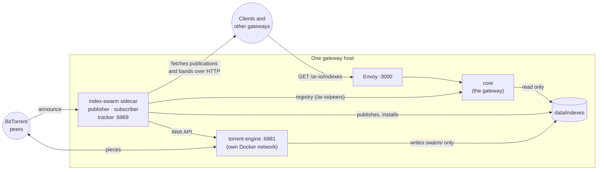
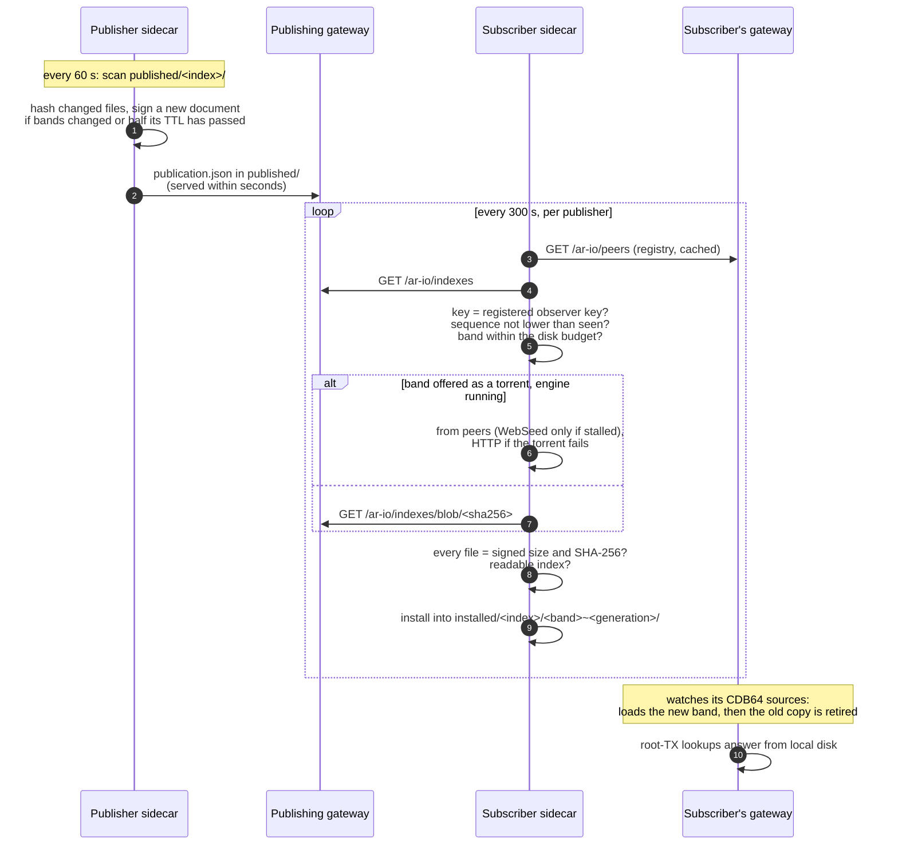
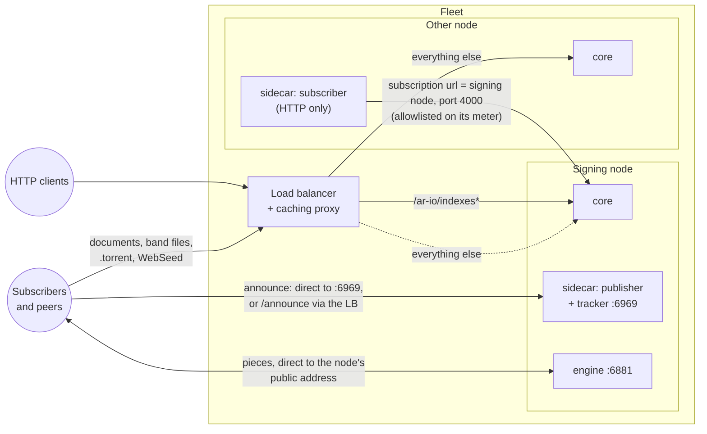
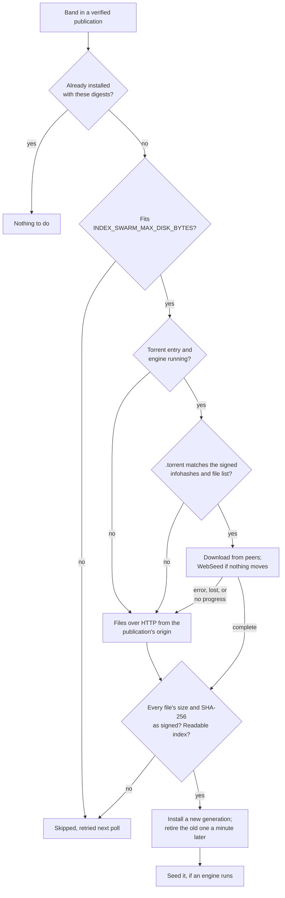

# Index Swarm Sidecar

The index-swarm sidecar publishes the index artifacts this gateway offers and
subscribes to those published by other gateways, so index bands can be
installed and retired under a running node without a restart.

It is **off by default**. A gateway that never enables the `index-swarm`
compose profile behaves exactly as it did.

## Status

Publishing and subscribing work over HTTP: a publisher signs and serves its
bands, a subscriber verifies, downloads and installs them, and the gateway
beside it loads them without a restart. Every subscriber fetches from the
publisher's metered HTTP routes, unless a torrent engine is configured: then
bands also move peer to peer. A publisher seeds a torrent of every band, a
subscriber fetches from peers first and falls back to HTTP, and every
subscriber seeds what it installed. See [Torrent engine](#torrent-engine).

## Quick start

Two scripts do the setup and the checking, from the gateway's directory
(where `.env` and `docker-compose.yaml` are). They need only Docker: they run
in the core image. Both are covered in
[setup and status scripts](#setup-and-status-scripts); the manual steps they
replace are under [doing it by hand](#doing-it-by-hand).

### Subscribe to another gateway's index

1. Run a gateway release that ships `tools/index-swarm-setup` (the sidecar
   runs the same image, `CORE_IMAGE_TAG`).
2. Set it up and start it. Today the network's publisher is turbo-gateway.com,
   whose registered gateway wallet is
   `34LYvMptiDvBP5sqfh1oAd6Q4qFsy4PWaZ1HTFmML7h5`:
   ```bash
   ./tools/index-swarm-setup --subscribe 34LYvMptiDvBP5sqfh1oAd6Q4qFsy4PWaZ1HTFmML7h5 --torrent --restart
   ```
   To subscribe to another publisher, pass its gateway wallet instead; any
   gateway that publishes shows it as `publisher` in its `/ar-io/indexes`.
   This subscribes to the publisher's root-TX index, points the gateway at
   the installed bands (and puts them right after the local database in the
   lookup order), generates the torrent engine's password, and restarts what
   needs it, by name. Leave out `--torrent` to move bands over HTTP only.
   Run with `--dry-run` first to see the changes; `.env` is backed up before
   it is written.
3. With `--torrent`, open port 6881, TCP and UDP, to the internet if you
   can. Peers connect in on it. For a subscriber it is recommended, not
   required: behind NAT it still downloads from peers and seeds to the ones
   it connects to (see the note under
   [publishing from a fleet](#publishing-torrents-from-a-fleet-behind-a-load-balancer)).
   The engine doesn't use UPnP, so behind a home router forward the port by
   hand. 6881 and the tracker's 6969 are published on the host whenever the
   sidecar and engine run, so no other program may hold them; move them with
   `INDEX_SWARM_ENGINE_PORT` and `INDEX_SWARM_TRACKER_PORT`.
4. Check it:
   ```bash
   ./tools/index-swarm-status
   ```
   Bands arrive newest heights first; a first pull of a full index (about
   20 GB) takes minutes to hours. Each line says `ok`, `WARN` or `FAIL`, and
   every problem comes with the fix. When it says `All good`, the gateway is
   answering root-TX lookups from the installed bands.

That is all: new bands from the publisher install, and replace the ones they
supersede, by themselves; the gateway loads each within 30 seconds, without a
restart.

### Publish this gateway's index

1. The gateway must be **registered** and reachable at its registry URL: the
   routes that serve bands live in the gateway, not the sidecar.
2. Its observer key must be the registered one: set
   `INDEX_SWARM_OBSERVER_KEYPAIR_FILE` to the keypair file's host path, or
   `OBSERVER_PRIVATE_KEY` (not both), and `AR_IO_WALLET` to the gateway's
   wallet. Publications are signed over a fixed `ar-io-index-publication/v1`
   prefix, so no Solana transaction or HTTPSIG signature can pass for one;
   but a wallet asked to sign an arbitrary message starting with that prefix
   would produce one, so don't use the observer key in a wallet that signs
   messages for dApps.
3. Bands are built by the `index-export` service from this gateway's own
   index, once a day (see [producing bands](#producing-bands)). Publishing is
   for gateways that unbundle: one that indexes no data items has nothing to
   offer.
4. Set it up, dry-run the first build, and start it:
   ```bash
   ./tools/index-swarm-setup --publish --start-height 1950000 --torrent --public-host <this node's public IP>
   docker compose --profile index-export run --rm -T index-export --once --dry-run > plan.json
   ./tools/index-swarm-setup --publish --restart
   ```
   `--restart` recreates the gateway when its index settings in `.env`
   differ from what it runs, which applies every pending change to its
   settings; on a live gateway, start the services by name instead, with
   the gateway's compose `-f` files and `up -d --no-deps index-swarm index-export`.
   `--public-host` is where peers reach this node's engine and its tracker.
   The first scan hashes every file once (minutes for tens of GB; disk-bound).
5. With `--torrent`, open 6881 (TCP and UDP) and 6969 (TCP) to the internet.
6. Check it with `./tools/index-swarm-status`, and from outside:
   `curl -s https://<your gateway>/ar-io/indexes | jq '{sequence, publisher, bands: [.indexes[].bands[].id]}'`.
7. Behind nginx, read [running behind nginx](#running-behind-nginx) before
   anyone subscribes, especially with a cache or more than one node; a fleet
   behind a load balancer also needs
   [publishing torrents from a fleet](#publishing-torrents-from-a-fleet-behind-a-load-balancer).

A gateway can do both: pass `--subscribe` and `--publish` together.

### Setup and status scripts

**`tools/index-swarm-setup`** edits `.env` and nothing else, unless given
`--restart`.

| Flag | Effect |
|---|---|
| `--subscribe <wallet>` | Adds the publisher to `INDEX_SWARM_SUBSCRIBE` (repeatable; existing entries are kept). Sets `INDEX_SWARM_MAX_DISK_BYTES` to 50 GiB if unset (about twice the full index published today, since a band being replaced stays installed until its successor is). Puts `data/indexes/installed/root-tx-index` first in `CDB64_ROOT_TX_INDEX_SOURCES`, keeping what was there (or, if unset, the shipped default), and moves `cdb` right after `db` in `ROOT_TX_LOOKUP_ORDER` (unset: `db,cdb,gateways,graphql`) |
| `--publish` | Adds `root-tx-index` to `INDEX_SWARM_PUBLISH`. Refuses, writing nothing, without a registered key or `AR_IO_WALLET`. With `--torrent` and a public host, sets `INDEX_SWARM_TRACKERS` to this node's tracker |
| `--torrent` | Generates `INDEX_SWARM_ENGINE_AUTH` (`swarm:` and 48 random hex characters; never printed) if unset. That alone turns the engine on: `INDEX_SWARM_ENGINE_URL` defaults to the compose engine |
| `--public-host <addr>`, `--engine-port <n>` | `INDEX_SWARM_ENGINE_PUBLIC_HOST`, `INDEX_SWARM_ENGINE_PORT`. Work on their own too, to move an engine that already runs (with `--restart`, the engine is recreated on the new port) |
| `--max-disk-gib <n>` | `INDEX_SWARM_MAX_DISK_BYTES`. Works on its own too, to change an existing subscriber's budget |
| `--no-gateway` | Leaves the two gateway keys alone |
| `--dry-run` | Shows the changes and writes nothing |
| `--restart` | Then recreates what needs it: the gateway only when its two keys differ from what it runs with, then the sidecar (and the engine, with torrents), by service name, with the compose files the running gateway was started with |
| `--env-file <path>` | A file other than `.env`, relative to the gateway's directory |

It is idempotent: a second run changes only what is missing, so it is also
how to add a publisher or turn torrents on later. It never replaces a value
it cannot parse or a password it did not write; it stops and says what to
fix. Before writing, it copies `.env` to `.env.bak-index-swarm-<time>`
(owner-readable only, as it holds secrets). It warns when an explicit
`ROOT_TX_LOOKUP_ORDER` keeps `hyperbeam` (a dead endpoint unless the `hb`
profile runs), but does not remove it.

**`tools/index-swarm-status`** is read-only. It runs inside the sidecar, so it
sees exactly what the sidecar sees, and checks:

- the sidecar is up, and the gateway's release is new enough;
- per publisher: the sequence accepted and its age, any `signature_failed`,
  `replayed` or `verify_failed` (security-relevant) and failed downloads;
- installed bands and their size; that the gateway reads the installed
  directory and has every band loaded; that root-TX lookups reach the
  bands;
- the disk budget: a warning when bands were skipped because they would
  exceed `INDEX_SWARM_MAX_DISK_BYTES` (new bands then stop arriving), and when
  installed bands fill more than 80% of it;
- publishing: the document served, its expiry, and how many bands seed;
- the torrent engine: that it answers, whether any peer has connected in
  (the engine's own reachability, so a closed port shows), and the day's
  upload against the budget.

It exits 1 when a check fails, so it can run from cron or a health script.

### Doing it by hand

What the setup script writes, for an operator who would rather edit `.env`
directly:

```bash
INDEX_SWARM_SUBSCRIBE='[{"publisher":"<publisher gateway wallet>","name":"root-tx-index"}]'
INDEX_SWARM_MAX_DISK_BYTES=53687091200   # 50 GiB; about twice what the publisher offers
CDB64_ROOT_TX_INDEX_SOURCES=data/indexes/installed/root-tx-index,<previous sources>
ROOT_TX_LOOKUP_ORDER=db,cdb,gateways,graphql
INDEX_SWARM_ENGINE_AUTH=swarm:<openssl rand -hex 24>   # only for BitTorrent
```

See [pointing the gateway at installed bands](#pointing-the-gateway-at-installed-bands)
for `<previous sources>`, and [lookup order](#lookup-order) for why `cdb` goes
right after `db`. Then, by name, with the same `-f` files the gateway was
started with (a bare `up` also starts every default service):

```bash
docker compose up -d --no-deps core
docker compose --profile index-swarm --profile index-swarm-torrent \
  up -d --no-deps index-swarm-engine-init index-swarm-engine index-swarm
```

Without BitTorrent, leave out the `index-swarm-torrent` profile and the two
engine services.

## What it is, and what it is not

| | |
|---|---|
| Shares with the gateway | One directory, `data/indexes`. The sidecar writes; the gateway reads through its [collection source](cdb64-guide.md#collection-directory). |
| Talks to | Its own gateway (`/ar-io/peers` for registry records, `/ar-io/info`) and other gateways' `/ar-io/indexes`, over HTTP. |
| Never touches | The gateway's databases, its process, or the chain: it makes no RPC calls. It signs with the observer key, read only, and never writes key material. |
| If it dies | Nothing degrades. Bands already installed keep serving; the gateway does not depend on the sidecar being up. |

### On one node



The sidecar and the engine are optional and each in its own compose profile.
Without the engine everything moves over HTTP and there is no tracker or peer
port; without the sidecar the gateway serves nothing under `/ar-io/indexes`
and loads only the CDB64 sources it is given. The engine is on a network of
its own, so the only thing it can reach on the node is the sidecar.

### How a band moves



## Running it

```bash
docker compose --profile index-swarm up -d index-swarm
```

Name the service explicitly. The sidecar deliberately declares no
`depends_on`, so this cannot start or recreate the core, observer or any other
service, and it works whether or not the gateway is running.

To stop it:

```bash
docker compose --profile index-swarm stop index-swarm
```

### It runs the core image

The sidecar is compiled into the same `dist/` tree as the gateway and needs no
dependency the gateway does not already have, so it runs
`ghcr.io/ar-io/ar-io-core` with a different entrypoint rather than an image of
its own. Pulling a second image would cost roughly a gigabyte of duplicate
layers per operator for code already present. `CORE_IMAGE_TAG` therefore pins
both, which also keeps them from drifting apart.

## Configuration

Every setting is read once at startup, so a malformed value fails immediately
with a message naming the offending entry rather than hours later on the first
poll. See [envs.md](envs.md) for the full table.

```bash
# Publish the indexes this gateway builds.
INDEX_SWARM_PUBLISH='[{"name":"root-tx-index","kind":"cdb64-root-tx"}]'

# Subscribe to a publisher, by its registered gateway wallet.
INDEX_SWARM_SUBSCRIBE='[{"publisher":"<gateway wallet>","name":"root-tx-index"}]'
```

The signing identity is the gateway's registered observer key
(`OBSERVER_PRIVATE_KEY`, or the keypair file named by
`INDEX_SWARM_OBSERVER_KEYPAIR_FILE`, which is mounted into the sidecar on its
own, never the whole wallets directory), whose address is the
`observerAddress` on the gateway's registry record. A subscriber verifies a
publication against that record, so a publisher running on the auto-generated
fallback key has nothing anyone can verify against and will refuse to publish.

### Producing bands

The publisher offers whatever band directories are under
`data/indexes/published/<index>/`; it does not build them. The `index-export`
service (compose profile `index-export`, the core image) does, from this
gateway's own index, so every publisher builds bands the same way.

**What it builds.** For the root-TX index, three kinds of band, named
`<kind>-h<from>-<to|tip>-<publisher>-<digest>`:

| Kind | Range | When |
|---|---|---|
| `h` (history) | Fixed and closed | Cut at the first run, at multiples of `INDEX_EXPORT_RECENT_MAX_BLOCKS` from `INDEX_EXPORT_START_HEIGHT`; never rebuilt |
| `r` (recent) | `[R_lo, R_hi]` | Folded weekly: its own entries plus the sources' rows above it, so rows the index has since expired (ClickHouse TTL) are kept. At `INDEX_EXPORT_RECENT_MAX_BLOCKS` it is frozen and a new `r` starts above it |
| `d` (delta) | From 512 blocks below the top of the highest `h` or `r` to the tip | Rebuilt daily at `INDEX_EXPORT_RUN_AT_UTC`; published only when its content changed |

A fold publishes the new `r` (superseding only `r`s) before the new `d`
(superseding only `d`s), and on a fold day the `d` keeps its old start, moving
up over the new `r` the next day. A subscriber keeps a superseded band until
its own successor installs, so whichever of the two installs first, every
height stays covered. Each new band also names the ids its predecessors
replaced, so a subscriber that missed one still keeps its old band.

**Where records come from.** `INDEX_EXPORT_SOURCES` (see
[envs](envs.md)): by default this gateway's ClickHouse, or its SQLite
without one. Several sources merge under one rule: the later root wins, an
overlay (a bundler's own offsets, as coverage-named CSV files) wins within
its coverage, and two sources disagreeing on an item's offsets are left out
(or fall back to the earlier entry) rather than signed. Where a peer
indexer's database isn't reachable, it can run `index-band-export` into
coverage-named files that this service reads as a peer (`"rank": 0`). Offsets are placed
only where proven; an item whose `root_parent_offset` is ambiguous keeps its
root without them. `ar-io-node index-band-export` shows what one source gives
(see [the CLI](cli.md#index-band-export)).

**Before publishing**, each band is read back and a sample of its entries is
header-checked against `INDEX_EXPORT_HEADER_CHECK_URL`: 150 entries, plus up
to 50 whose offsets were repaired and 200 the overlay changed. That reads
root transactions over the network, so point it at a gateway that holds
them, not at a gateway that would have to fetch them. Then:

| Outcome | What happens |
|---|---|
| Published | Renamed into place; the sidecar offers it at its next scan |
| Unchanged | Nothing written |
| Skipped | A `d` under 1,000 entries (normal for a small publisher just after a fold), or nothing new. Not an error. An `h` or `r` publishes whatever its size, or its heights would stay uncovered |
| Couldn't check | A source down, the check gateway unable to serve (under 80% read, none wrong, after retrying each read twice), too little disk, or an optional source down during a fold that freezes its band. Retried after 15 minutes, doubling to 2 hours, until the next daily run |
| Rejected | A wrong header, conflicts over 1% of the band, a band with no offsets to check, a failed read-back, or bands in `published/` it didn't build (bootstrap). Not retried: `index-swarm-status` shows it as a FAIL for an operator |

Nothing already published is withdrawn because a run failed. A rejected
fold isn't rebuilt every day either: folds wait until an operator runs one
with `--once`.

**Running it.** It needs a core image that includes it (Release 85 or
later); set `INDEX_EXPORT_IMAGE_TAG` if core runs an older one. Use your
compose `-f` files throughout, as for core.

```bash
# Once, without publishing: the plan, rows, time and peak disk per band
# (and in total), and the header check's result. -T keeps the logs on
# stderr, out of the JSON report.
docker compose --profile index-export run --rm -T index-export --once --dry-run > plan.json
# The same at a fixed height, keeping the bands to compare (under
# data/indexes, so on the bands' filesystem).
docker compose --profile index-export run --rm -T index-export \
  --once --to 2010000 --keep data/indexes/export/compare > compare.json
# The service. Its first run is about 5 minutes after it starts, then daily.
docker compose --profile index-export up -d --no-deps index-export
```

A long `--once` (a bootstrap of several bands can take hours) is best run
in `tmux` or `screen`. A `--once` run counts as an operator's: it retries a
fold that was rejected.

- One run at a time: a run holds `data/indexes/export/lock`, touched every
  30 s and broken when 5 minutes stale (a killed run). A `--once` beside the
  running service exits with `locked`.
- It works under `data/indexes/export/` (scratch, `state.json`, the lock;
  dry runs under `export/dry-run/`), on the same filesystem as `published/`.
  Before each band it checks for room: three times the band it folds (the
  old band stays through the grace beside the scratch and the new one),
  plus a margin of 5% of the filesystem, at least 10 GiB, that it never
  eats into, since the gateway's own data may share that disk.
- `state.json` holds adoptions, the last fold, a pending retry and the
  last run; the bands themselves are read from `published/` (and the last
  fold from the recent band's own manifest), so losing it costs the
  adoptions and the status history.
- `/healthz` (port `INDEX_EXPORT_METRICS_PORT`, 9102, in `--once` runs too)
  reports that the loop is alive, never whether runs succeed, so autoheal
  can't restart-loop a failing export. Run outcomes are in its metrics and
  in `./tools/index-swarm-status`. For alerting:
  `time() - index_export_last_success_timestamp_seconds{index="root-tx-index",kind="d"} > 2 * 86400 or absent(index_export_last_success_timestamp_seconds{index="root-tx-index",kind="d"})`,
  and the same with `index="parquet-l1"` where L1 bands are built (it
  fires through a bootstrap, until the first tip band)
  (the gauge is set again from `state.json` after a restart);
  `index_export_run_in_progress` with `index_export_run_started_timestamp_seconds`
  shows a run that is taking long.
- Bounds: 6 GB of memory, a 4 GB heap, read-only, low-priority ClickHouse
  queries of 2 threads, and an I/O weight where the kernel's I/O scheduler
  honours one (check `BlkioWeight` in `docker inspect`).
- The container runs as root, so the band directories it writes under
  `published/` are root's: removing one by hand takes `sudo`.

**Taking over existing bands.** The service refuses to bootstrap while
`published/` holds bands it didn't build and hasn't adopted: new bands
would overlap them. A publisher with bands built another way hands them over
first, with the service stopped (adopting takes the lock):

```bash
docker compose --profile index-export run --rm -T index-export \
  --adopt <band-id> --as h|r|d [--top <highest height it covers>]
```

Adopt every band: the recent one as `r` (folded like the service's own;
under `INDEX_EXPORT_RECENT_MAX_BLOCKS` in span), older ones as `h`, and a
daily delta as `d`, so the service's first `d` supersedes it. `--top` is
required for a band open at the tip, since bands store no heights; err low,
since the fold reads the sources from just below it. Stop whatever else
built the bands before adopting, or it will replace them under new ids.

**Known limits.** Rows indexed late at heights already frozen into a band
(backfills) are not exported. An item under two roots at one height keeps
whichever sorts first.

#### By hand

A band is a
[partitioned CDB64 index](cdb64-format.md#partitioned-cdb64-index-format),
for example from the local database:

```bash
./tools/export-sqlite-to-cdb64 --partitioned \
  --output-dir data/indexes/published/root-tx-index/band-tip.tmp
mv data/indexes/published/root-tx-index/band-tip.tmp \
  data/indexes/published/root-tx-index/band-tip
```

Build under a `.tmp` name and rename into place: directories ending in
`.tmp`, or in `.tmp.<pid>` as the partitioned writers name their own build
directories, are skipped, so a band is never described half-written.

`ar-io-node index-band-build` does this in one step from CSV records: it
deduplicates (the highest height wins), names the band so its id is unique to
the publisher and changes with its content, checks a sample of its headers
against their root transactions, and only then renames it into place, never
over an existing band. `ar-io-node index-band-verify` runs the same check on
any band. See [the `ar-io-node` CLI](cli.md).

#### Band metadata

Two optional fields in a band's `manifest.json` `metadata` change how
subscribers treat it. Add them before renaming the band into place, since a
manifest edit is a new band as far as digests go:

```bash
m=data/indexes/published/root-tx-index/band-tip.tmp/manifest.json
jq '.metadata = ((.metadata // {}) + {heightRange: [1950000, null]})' "$m" > "$m.new" && mv "$m.new" "$m"
```

| Field | Effect |
|---|---|
| `heightRange: [from, to]` | The block heights the band covers; `to` is `null` for a band that follows the tip. Subscribers install bands **newest heights first** by this range, which under a publisher's meter decides how soon a subscription starts answering lookups (most lookups are for recent data). A band without it installs last. `export-sqlite-to-cdb64` does not write it |
| `supersedes: "<band id>"` (or a list of ids) | This band replaces the named ones. The publisher stops offering them in the same scan that describes this band, and deletes their directories after `INDEX_SWARM_SUPERSEDE_GRACE_SECONDS`; subscribers retire them the same way |

A band must carry all of its partitions as local files. A `manifest.json`
naming any partition by URL or Arweave ID (as the shipped remote indexes in
`resources/` do) is refused by the publisher, and by every subscriber: its
gateway would otherwise fetch a location the publisher chose, unchecked by
any digest.

To replace a band, prefer a fresh id per build (`band-tip-20260923T1200`,
say) with `supersedes` naming the previous one, so the publisher withdraws
and removes it for you; without `supersedes`, delete the previous one
yourself after the next scan. When the new band names the old one in
`supersedes`, subscribers keep serving the old band until the new one has
installed, however long its download takes, then retire the old after
`INDEX_SWARM_SUPERSEDE_GRACE_SECONDS`. Without `supersedes`, a subscriber
retires a band as soon as the publisher stops offering it. So set `supersedes` when you
first publish the new band: publishing it without and adding `supersedes`
later edits its manifest, which changes the band (subscribers then fetch only
the changed file, but it is still a new version of the band).
A `supersedes` naming an id this publisher does not hold (a file name
instead of a band id, say) retires nothing; the publisher warns once, when it
first describes the new band. While a retired band's grace runs, its
directory stays but it is no longer described or offered.
Swapping under the same id also works, but a directory cannot be renamed over
a non-empty one, so there is a moment when the band is absent; a scan that
lands in it withdraws the band until the next scan, and subscribers retire it
in the meantime.

### L1 bands (`parquet-l1`)

A second kind of index, `parquet-l1`, carries the Arweave base layer (L1:
blocks, transactions, tags, owners) in Parquet, one height range per band,
so a new gateway can import its L1 index instead of indexing the chain block
by block, and apps can query it in place with DuckDB or Polars. A band is a
directory of `band.json` (its heights, and per table the rows and a digest
of them, independent of the Parquet bytes) and five Parquet files:
`blocks`, `block_transactions`, `transactions`, `tags` (plaintext names and
values) and `wallets`. The columns are a superset of the Parquet exporter's,
less `indexed_at` (when a gateway indexed a row, which no two publishers
share). `signature` is null unless the publisher keeps signatures. From
layout `l1-3` a band also carries three [lookup files](#lookup-files-layout-l1-3),
derived from its tables, so one transaction, wallet or tag value can be found
without scanning it.

Published as `{"name":"parquet-l1","kind":"parquet-l1"}` in
`INDEX_SWARM_PUBLISH`. A subscriber checks each file against the signed
digests, then its footer and schema against the layout and the row counts in
`band.json`, before installing it under `installed/parquet-l1/`. The file
set it expects is the one the layout named in `band.json` declares, and a
gateway that doesn't know that layout refuses the band, naming it, and keeps
the copy it has. The gateway itself reads nothing there: an importer does,
checking the rows against the chain as it goes. The sidecar loads DuckDB only
to check these bands.

#### Lookup files (layout `l1-3`)

Parquet has no index, so finding one transaction by id means scanning every
band's `id` column: measured in a browser over all 24 bands of the chain,
3.9 GB. A lookup file is a small Parquet file sorted by a key, in row groups
of 16,384 rows. Parquet keeps each row group's min and max, and in a sorted
file those ranges don't overlap, so a reader holding a key reads the footer
and then the one or two row groups that can hold it.

| File | One row per | Columns | Sorted by |
|---|---|---|---|
| `lookup_tx_id.parquet` | transaction | `id8`, `height` | `id8, height` |
| `lookup_wallet.parquet` | transaction an address signed (`role` 0), and one it received (`role` 1, non-empty `target`) | `addr8`, `role`, `height`, `data_size` | `addr8, height, role, data_size` |
| `lookup_tag.parquet` | distinct (name, value) tag pair, every one | `name8`, `val8`, `name`, `value`, `txs` (distinct transactions), `first_height`, `last_height` | `name8, val8, name, value` |

The keys are unsigned 64-bit integers, because readers prune on integer
statistics and not on binary ones (keyed by the raw tag bytes, a lookup read
its whole file). Two encodings, which any client reproduces:

- `prefix64(bytes)`: the first 8 bytes, big-endian, zero-padded on the right
  when shorter. For ids and addresses, already uniform hashes. In DuckDB:
  `('0x' || rpad(left(hex(x), 16), 16, '0'))::UBIGINT`.
- `sha256_64(bytes)`: `prefix64` of the SHA-256. For tag names and values.
  In DuckDB: `('0x' || left(sha256(x), 16))::UBIGINT`.

| Encoding | Input | Output |
|---|---|---|
| `prefix64` | id `O048e9pT5nX1CPrMjGC1y1dWdtd3AChFX27hoRsVIdA` (its 32 bytes) | `0x3b4e3c7bda53e675` = 4273419599062754933 |
| `prefix64` | the single byte `0xab` | `0xab00000000000000` |
| `sha256_64` | `App-Name` (UTF-8) | `0xbf6cc2a967f23a82` = 13793613791578176130 |
| `sha256_64` | `ArDrive-App` | `0xa2c30101e8045f65` = 11728218962302099301 |

A key is a pointer, not an answer: two values may share one. So a read
takes two steps, the lookup for the heights, then the table at those heights
for the row, which a height filter confines to the row groups that hold
them:

```sql
-- a transaction by id (:id is its 32 bytes)
SELECT t.* FROM read_parquet('…/*/transactions.parquet') t
WHERE t.height IN (
    SELECT height FROM read_parquet('…/*/lookup_tx_id.parquet')
    WHERE id8 = ('0x' || rpad(left(hex(:id), 16), 16, '0'))::UBIGINT)
  AND t.id = :id;

-- a wallet's transactions sent, bytes stored, first and last block: no table read
SELECT count(*) AS sent, sum(data_size) AS bytes_stored,
       min(height) AS first_height, max(height) AS last_height
FROM read_parquet('…/*/lookup_wallet.parquet')
WHERE addr8 = ('0x' || rpad(left(hex(:address), 16), 16, '0'))::UBIGINT AND role = 0;

-- the most used App-Name values, exact
SELECT CAST(value AS VARCHAR) AS app, sum(txs) AS txs
FROM read_parquet('…/*/lookup_tag.parquet')
WHERE name8 = ('0x' || left(sha256('App-Name'::BLOB), 16))::UBIGINT
  AND name = 'App-Name'::BLOB
GROUP BY app ORDER BY txs DESC LIMIT 15;
```

Measured on one 100,000-height band (1.9M to 2.0M) over HTTP, in the 256 KiB
pieces a verifying client reads, with the same answers either way:

| Lookup | Scanning the tables | With the lookup files |
|---|---|---|
| A transaction's height | 88.1 MB | 0.8 MB |
| A wallet's transactions and bytes stored (4 transactions) | 8.1 MB | 0.8 MB |
| The same for a bundler (1,267,740 transactions) | | 3.7 MB |
| The most used App-Name values, by distinct transactions | 113 MB | 1.0 MB |

The files cost storage in proportion to a band's transactions and distinct
tag pairs: 59 MB on that 413 MB band (14%), and 254 MB on the busiest,
1.1M to 1.2M (1.35 GB, 10.4 million transactions, 3.5 million tag pairs;
19%). Deriving them for that band took 180 seconds and 2.2 GB of memory.

`wallet.data_size` and `tag.txs` are answers rather than pointers, kept so a
wallet's bytes stored and a tag's count need no table read. They carry the
same trust as the tables: signed through each file's digest in the
publication, and recomputable from the tables by anyone (`index-l1-verify
--bands-dir` does).

Lookups are derived, so they are not part of a band's id: the id is a
digest of the tables' rows. `band.json` describes each lookup with its rows
and a row digest, as it does tables, so two publishers can compare them
without exchanging files.

#### Querying bands in place, without importing

Importing is for a gateway, whose serving path reads SQLite. Anything that
only wants to **ask questions** of L1 — analytics, research, a dashboard,
a one-off lookup — can query the Parquet directly and skip the import
entirely. That matters because the two costs are nowhere near each other:
the whole chain is 12.8 GB to download and about 120 GB and many hours to
import.

```bash
duckdb -c "
  SELECT CAST(tag_value AS VARCHAR) AS app, COUNT(*) AS n
  FROM read_parquet('data/indexes/installed/parquet-l1/*/tags.parquet')
  WHERE CAST(tag_name AS VARCHAR) = 'App-Name'
  GROUP BY app ORDER BY n DESC LIMIT 10"
```

Measured over all 23 bands of the whole chain (2 CPUs, 2026-10-05): that
aggregate over 305,575,346 tag rows takes **18 seconds**, and joining
80,320,699 transactions to their blocks for a per-year count takes the
same. The files glob across bands, so a query spans the chain or one
height range by naming fewer of them.

Two properties of the band format make this work, and both are
deliberate:

- **Tags are plaintext.** `core.db` stores SHA-1 hashes into `tag_names`
  and `tag_values`, so the same question against SQLite needs two joins
  and the dictionaries. In a band, `tag_name = 'App-Name'` is a string
  comparison.
- **Parquet is columnar.** The query above reads two columns and skips
  the rest of the file, which is why 12.8 GB answers in seconds.

**Where it does not substitute for importing.** It is good at scans and
aggregates over a height range. Point lookups go through the
[lookup files](#lookup-files-layout-l1-3) of an `l1-3` band, two steps where
SQLite seeks a B-tree once; a band of an older layout has none, and finding
one transaction there scans every band's `id` column. It serves no HTTP
route, no GraphQL and no trust headers. It is a dataset, not a gateway.

#### Producing L1 bands

`index-export` builds them from this gateway's `core.db` (read-only) when
`INDEX_EXPORT_KINDS` includes `parquet-l1`, in the same run as root-TX bands
and under the same lock, into `published/parquet-l1/`. List
`{"name":"parquet-l1","kind":"parquet-l1"}` in `INDEX_SWARM_PUBLISH` as well:
the sidecar is what retires a superseded tip band, so without it
`published/parquet-l1/` keeps every one. It needs a `core.db` that holds
every block from height 0; a gateway that started above it (`START_HEIGHT`)
can't build them, and its runs say so (`incomplete`, not retried).

- **Ranges.** Bands cover two nested fixed grids, the same for every
  publisher, so two publishers of the same chain cut it at the same heights.
  L1 is append-only — a finalised height's rows never change — so a band
  over a completed range is written once and never rebuilt:

  | Role | Covers | Built | Size |
  |---|---|---|---|
  | `h` | a whole 100,000-height range | once the range is below the top; supersedes the `d` bands inside it | ~700 MB |
  | `d` | a whole 5,000-height sub-range | once the sub-range is below the top; never rebuilt | ~35 MB |
  | tip | the one incomplete sub-range | each run the top has moved; supersedes the tips before it | ≤35 MB |

  Only the tip is ever rebuilt, so a subscriber re-downloads at most ~35 MB
  a day rather than a whole range. The top is one below the stable top, so
  the block above every band's last is there to anchor it.
- **Columns the chain doesn't fix are normalised.** A band is meant to be
  a function of the chain: two honest publishers of the same chain should
  write byte-identical rows, so comparing their digests per range checks
  each other's index. Comparing turbo-gateway.com and vilenarios.com across
  the whole chain in October 2026 found every chain-committed column in
  agreement, and three columns that a gateway fills in for itself
  disagreeing. A band now writes one canonical value for each, whatever
  `core.db` holds:

  | Column | Written as | Why |
  |---|---|---|
  | `blocks.tx_root` below the 2.0 fork (422,250) | null | Not committed by a pre-fork block hash and impossible to recompute, so a gateway keeps whatever its header source gave it. 346 blocks differed, always 32 bytes against nothing; raw nodes disagree the same way (56,769 is empty on two and set on a third). |
  | `transactions.data_root` on format 1 | null | A format-1 header carries none (a node returns `""`); some gateways hold one computed from the data. 352 differed. Format 2 signs its `data_root`, so it is kept. |
  | `transactions.content_type`, `content_encoding` | the first `Content-Type` / `Content-Encoding` tag by position, names compared without case; null if none | Derived from the band's own tags. ar-io-node took the *last* matching tag until r70 (commit `40d5548e`, 2026-02-14) and the first since, so a stored value depends on the release that indexed the row: 86 transactions with two Content-Type tags differed though their tags were identical. |

  Nothing is lost for verification: no check reads a pre-fork `tx_root`,
  and `tx_root` recomputation derives a format-1 transaction's root from its
  data, never from the stored column.

  These are layout `l1-2`'s rules (`band.json`'s `schema`), and `l1-3`
  keeps them, adding the lookup files. A reader accepts `l1-1`, `l1-2` and
  `l1-3`, so a subscriber keeps importing from a publisher that hasn't
  upgraded. An import never erases a pre-fork `tx_root` or a format-1
  `data_root` the gateway already holds for the same block or transaction;
  it keeps them across the range it rewrites. An import interrupted part
  way can lose those kept values (it commits in chunks), and they come back
  null, which is the canonical value anyway.

  **Upgrading a publisher rebuilds every band once.** The rules reach
  format-1 transactions and multi-tag rows at any height, so an `l1-1` band
  can't be judged without rebuilding it (about nine hours for the whole
  chain on vilenarios.com). A rebuilt band whose rows didn't change has the
  same id as before, since the id comes from the rows: its files are left
  alone, so subscribers download nothing, and the service records it as
  confirmed under `l1-2` (`layoutConfirmed` in `state.json`) so it isn't
  rebuilt again. Only ranges whose rows changed get new ids.

- **Lookups.** Every band built is `l1-3`: the exporter writes the tables,
  derives the lookup files from them under the same DuckDB limits, and
  writes `band.json` last. A published band whose tables are current but
  which has no lookups (an `l1-2` band, or an `l1-1` band confirmed identical
  under `l1-2`) is not rebuilt: each run derives its lookups from its own
  tables and adds them in place, keeping its id, before replacing its
  `band.json` with one naming them. No file already in the band is touched,
  and a reader that goes by `band.json` sees the old band or the new one.
  This needs no `core.db` and no chain checks, so it runs whatever happened
  to the builds and outside their time budget; it reports each band under
  `l1Derived` and counts it as `index_export_runs_total{kind="derive"}`. A
  subscriber already holding the band fetches only the new files.

  **Upgrade order.** A sidecar that doesn't know `l1-3` can't read an `l1-3`
  band: as a subscriber it refuses it (naming the layout) and keeps its copy,
  and as a publisher it can't describe it, so the band goes unpublished.
  Upgrade subscribers first, then a publisher's `index-swarm` with or before
  its `index-export`. The gateway itself reads no `parquet-l1` band and needs
  nothing.
- **Checks before publishing.** Every block links to the one before it and
  is linked to by the one above, each `hash_list_merkle` follows from the
  previous block, each block's `tx_root` is recomputed from its transactions
  where the index holds them all, each transaction is at the height and
  position its block lists it at, each owner's address is the SHA-256 of
  its key, and, where the index keeps signatures
  (`WRITE_TRANSACTION_DB_SIGNATURES`, off by default), each transaction's id
  is the SHA-256 of its signature. Only transactions a block lists are written, with their own
  tags: a row a fork left in `core.db` is counted (`strayTransactions`),
  never published. A range that fails is rejected, naming the heights, and
  nothing is written.

  **What these checks do not cover:** the order transactions sit in within a
  block (`block_transaction_index`). Arweave sorts a block's transactions by
  `(format, id)` before building `tx_root`, so recomputing it proves the set
  — ids, formats, sizes and data roots — at every height, and the order at
  none. Comparing two publishers' `block_transactions` digests does cover
  it, which is how two reversed blocks (184,686 and 188,324) were found on
  vilenarios.com in October 2026; against a raw node's `/block/height/<h>`
  it is cheap to settle one block, and that is the check to run when the
  digests for a range disagree.
- **Refused reads.** The gateway writes to `core.db` while the export reads
  it, so during a WAL checkpoint SQLite can refuse a read, reporting it as a
  write to a read-only database. That costs the whole band, so it is built
  again (twice, 15 s then 30 s later) before the run gives up on it. A chain
  check is never retried: it would fail the same way.
- **Gaps.** A whole band is never rebuilt, so it waits (`incomplete`) while
  the index lacks a transaction a block lists, or an owner's key. A tip band
  publishes and counts them (`missingTransactions`, `missingWallets`); it is
  rebuilt anyway.
- **Rejections wait for an operator.** A rejected band stops the L1 part
  (bands are imported in height order) and is not rebuilt by scheduled runs
  (`held`), which would only fail the same way: repair the named blocks in
  `core.db`, then run `--once`. A band published wrongly can't be replaced
  under its range by the service; remove it from `published/parquet-l1/`
  (`sudo`) and run `--once`.
- **Time.** A bootstrap of the whole chain takes hours. Measured on
  vilenarios.com (2026-10-03, 2.01M heights): 23 bands and 12.8 GB in about
  9 hours. A band costs from 40 seconds in the sparse early chain to about
  45 minutes and 1.35 GB through the busiest stretch, settling lower again
  nearer the tip. A run starts no new whole band after 4 hours; the rest
  are listed as `l1Deferred`, and the next run starts 15 minutes later.
- **Disk.** Before each band, room for the band and its scratch: eight
  times the largest band published, at least 10 GiB, beyond the same
  margin as root-TX bands. Scratch is about six times the band; DuckDB's
  spill is capped at 16 GB and kept in the band's staging.
- **Load on the gateway.** Reads are short, by key or index, in windows of
  200 heights, so the gateway's WAL checkpoints aren't held back; a
  bootstrap still reads all of `core.db` once, so schedule it off-peak.
  The container's I/O weight only applies under an I/O scheduler that
  honours one.

Each index keeps its own outcome, retry and last run in `state.json` and in
the metrics (`index` label), so a failing L1 band neither retries nor marks
root-TX bands, or the reverse.

```bash
INDEX_EXPORT_KINDS=root-tx-index,parquet-l1
# The plan and rows of what would be built, without publishing (a
# bootstrap's plan builds every band: cap it with --to):
docker compose --profile index-export run --rm -T index-export --once --dry-run --to 600000 > plan.json
```

**Taking L1 bands.** They are large (tens of GB for the whole chain) and a
gateway doesn't serve from them, so a subscription takes them only when it
names them: `"name": ["root-tx-index", "parquet-l1"]`. A subscription with
no `name` takes the publisher's other indexes, as before. They share the
subscriber's disk budget (`INDEX_SWARM_MAX_DISK_GIB`) with root-TX bands. An
index taken off `name` has its bands retired, as when a publisher drops it.

### Publishing torrents

With a torrent engine (`INDEX_SWARM_ENGINE_AUTH` set), the publisher also offers every band as
a torrent: it builds one when the band is first described or changes,
writes it to `published/.torrents/<v1 infohash>.torrent`, adds a `torrent`
entry (both infohashes, a magnet link, and the `.torrent` URL,
`/ar-io/indexes/torrents/<v1 infohash>.torrent`) to the band in the
publication, and has the engine seed it. Addressed by infohash, a band
rebuilt under the same id gets a new URL, so a subscriber holding the
previous document is never handed the new torrent. The torrent is built
from the band's directory and offered only if the bytes it read match the
digests the band was described with; a rebuild caught in between is
offered over HTTP until the next scan. Without an engine there are no
torrent entries, since a torrent nobody seeds only makes subscribers wait
before falling back to HTTP.

The engine seeds from `published/.seed/<v1 infohash>/`, a hard link per file
to its blob, not from the band directory. A band rebuilt in place under the
same id changes the bytes behind its names; seeding the directory would hand
peers pieces that fail their hashes until the next scan. The links pin the
bytes that were hashed, as they do for the blob route.

Torrents are deterministic. The name is derived from the band's file names,
sizes and digests, not its id, and nothing publisher-specific goes in: no creation
date, no WebSeed and no private flag. So two publishers holding the same
bytes share one infohash and one swarm, and with the same
`INDEX_SWARM_TRACKERS` their `.torrent` files are byte-identical. Subscribers add the publisher's WebSeed
(`/ar-io/indexes/webseed/`) themselves, and only when peers are not
delivering, because engines otherwise pull about half of a band from it even
with a seeder available, and it is the metered tier.

Every torrent is hybrid (v1 and BEP 52 v2) with 256 KiB pieces. The piece
size is chosen for readers that are not BitTorrent clients. BEP 52 hashes
each file into a SHA-256 Merkle tree over 16 KiB blocks; the info dictionary,
which the signed `infohashV2` covers, holds each file's `pieces root`, and
the torrent's `piece layers` hold that tree's layer at piece size. A client
that wants a byte range of a band file, such as DuckDB reading a Parquet
footer and a few column chunks in a browser, fetches the `.torrent`, checks
it against the signed infohash, rebuilds the file's root from its layer, and
then checks each piece it fetches over HTTP against the layer, without
downloading the rest of the file. Smaller pieces mean less to fetch around
each range and a bigger layer (32 bytes a piece, 128 KiB per GiB); 256 KiB is
also Arweave's chunk size. A file's `pieces root` does not depend on the
piece length, so changing it gives every torrent new infohashes but leaves
the roots, and the band, as they were. Publishers that agree on the bytes
agree on the torrent only while they agree on the piece length, which is why
it is fixed rather than a setting.

When the piece length changes between releases, the publisher rebuilds each
band's torrent once on its next scan, offers it under the new infohashes and
stops seeding the old one. Band ids and files are unchanged, so a subscriber
keeps what it has installed, fetches the new `.torrent` and seeds that
instead. Subscribers accept any power-of-two piece length from 16 KiB to
64 MiB, so publishers and subscribers can upgrade in either order.

`INDEX_SWARM_TRACKERS` sets the announce list; point it at this node's own
tracker (below) by the address peers reach it on. Subscribers pass on to
their engine only trackers on public hosts, so a name such as `core` or a
private address is dropped there. The engine also runs DHT and peer exchange,
so peers can find one another without the tracker.

### The tracker

A publisher runs a closed tracker in its sidecar, on
`INDEX_SWARM_TRACKER_PORT` (default 6969), and its torrents announce to it.
It answers only for the bands the publisher offers at that moment, under
both of each hybrid torrent's infohashes, and refuses every other torrent
with `unregistered torrent`. Its port is public, so it is bounded: at most
2,000 peers per torrent and 50,000 in all (past that a new peer is still
answered, but not recorded), 4 ports per address, a random sample of 50 in
each response, 10 announces a minute per address for each torrent (an IPv6
/64 counts as one address), and a connection cap. That is why it is not qBittorrent's embedded
tracker: that one tracks any infohash anyone announces, which on a published
port would make the gateway a free tracker for any swarm on the internet,
with its address in them. The engine's init pins the embedded tracker off.

The tracker always lists this node's own engine for its bands, at
`INDEX_SWARM_ENGINE_PUBLIC_HOST` (or the tracker URL's host) and
`INDEX_SWARM_ENGINE_PORT`, whether or not the engine's own announce reaches
it. That announce often doesn't: on a host with an INPUT firewall, a
container's request to its host's own public address is short-circuited
inside Docker and refused, while announces from real peers arrive through
the public interface as usual. For the same reason the engine can find its
own public address among its peers and try to connect to itself; the
firewall refuses that too, and it does no harm.

The tracker keeps its peers in memory. After a restart they are back within
one announce interval (300 s); meanwhile peers still find one another through
DHT, and a subscriber whose download stalls turns on the WebSeed. It is served
straight from the sidecar and sees each peer's real address, so put nothing
that rewrites source addresses in front of it.

Every scan reconciles the engine with the publication: bands offered are
seeded (a status check when they already are), bands no longer offered are
removed from the engine, and their `.torrent` files and seed directories are
deleted. An engine that is down delays seeding to the next scan and stops
nothing else.

### Publishing torrents from a fleet behind a load balancer

A large gateway is often several nodes behind an HTTP load balancer with a
caching proxy, and only one of them holds the observer key and signs. The
swarm needs a few things that an HTTP proxy does not give by itself:

1. **One node publishes and seeds.** The signing node, the one
   `/ar-io/indexes*` is pinned to, runs the engine and the tracker. The other
   nodes need neither.
2. **The engine's peer port reaches that node directly.** BitTorrent is not
   HTTP, so the load balancer cannot carry it: publish
   `INDEX_SWARM_ENGINE_PORT` (TCP and UDP) on the node's own public address,
   make sure the internet reaches it there (a Docker-published port bypasses
   the host's INPUT firewall; see [running the engine](#running-the-engine)
   for how to restrict it), and set
   `INDEX_SWARM_ENGINE_PUBLIC_HOST` to that address. Without it the tracker lists this node's engine under the host of
   its tracker URL, which for a fleet is the load balancer.
3. **The tracker, one of two ways.**
   - Directly: publish `INDEX_SWARM_TRACKER_PORT` on the same public address
     and announce to `http://<that address>:6969/announce`.
   - Through the load balancer: route `/announce` to the signing node's
     tracker port, uncached, with `proxy_set_header X-Forwarded-For
     $proxy_add_x_forwarded_for;`, and list the proxies' addresses in
     `INDEX_SWARM_TRACKER_TRUSTED_PROXIES`. Otherwise every peer appears at
     the proxy's address, the per-address caps throttle them together, and
     the tracker hands out an address nobody can connect to.
4. **The `.torrent` and WebSeed routes** sit under `/ar-io/indexes`, so a pin
   and cache rule for that prefix covers them. The WebSeed is metered like
   the blob route and marked `private` when metered, so a shared cache does
   not replay paid bytes; the `.torrent` route is unmetered and cacheable
   (see [running behind nginx](#running-behind-nginx)).
   **Metering needs no extra configuration.** The rate limiter and x402
   apply to the byte routes (files by name, by digest, and the WebSeed) as
   they do to data; the document and `.torrent` files are free; peer
   transfer and tracker announces never touch the gateway, and the upload
   budget below bounds them. With the prefix pinned, all metering happens on
   the one node, so per-address limits stay consistent even when the nodes'
   limiters are not shared.
5. **Bound what seeding costs.** Seeding is free to peers but not to the
   publisher: every byte is its upload, and a peer can fetch the bands again
   and again. Two limits bound it, with defaults for any node:
   `INDEX_SWARM_UPLOAD_LIMIT_BYTES_PER_SEC` caps the rate (10 MB/s) and
   `INDEX_SWARM_UPLOAD_DAILY_LIMIT_BYTES` caps the day (100 GB, then 1 KiB/s
   until the next UTC day). Raise both for a large publisher. The engine's
   memory also grows with the bytes it seeds (see
   [Running the engine](#running-the-engine)).

**The other nodes and the index.** If another node answers root-TX lookups
from its own disk, it needs the bands installed too. Subscribe it over HTTP to
the fleet's own publication, pointed at the publishing node directly with
the entry's `url`:

```bash
INDEX_SWARM_SUBSCRIBE='[{"publisher":"<fleet wallet>","name":"root-tx-index","url":"http://<publishing node>:4000"}]'
```

`url` changes only where the document and files are fetched from; the
signature is still checked against the registered observer key, so an
internal address is safe. That node is then a client of the publisher's
meter: list its address in `RATE_LIMITER_IPS_AND_CIDRS_ALLOWLIST` on the
publishing node (allowlisted clients skip rate limits and x402; this needs
the rate limiter enabled). It needs no torrent engine: between two nodes in
one network, HTTP is simpler, and a swarm there would also need
`INDEX_SWARM_ENGINE_BLOCK_PRIVATE=false` and an allowed LAN tracker.



Subscribers behind NAT still work: they reach the publisher's engine, and a
reachable subscriber can be reached back. Only two peers that are both
unreachable cannot exchange pieces with each other, and they still have the
publisher and the WebSeed.

### Publishing cadence

The publisher rescans every `INDEX_SWARM_PUBLISH_SCAN_INTERVAL_SECONDS`
(default 60) but writes a new document only when the band set or a file
digest has changed, or when the current document is halfway through its TTL.
That second condition matters: subscribers alarm once `expiresAt` passes, so
a publisher whose bands are simply quiet would otherwise go stale and read as
dead. Set `INDEX_SWARM_PUBLISH_TTL_SECONDS` to roughly twice the interval at
which bands are expected to change.

Only bands whose files changed are re-hashed. The description is keyed on
each file's name, size and mtime and persisted, so a restart does not re-read
tens of gigabytes on its next scan.

### Subscribing

A subscriber is configured with a publisher's **wallet**, never a hostname.
The gateway registry turns that into the two facts it needs: where to fetch
from, and which key a signature must carry. That is what makes the trust model
work, because an operator never types a URL that could later point somewhere
else. `url` on a subscription overrides only where the bytes come from; the
key that must have signed still comes from the registry, so pointing a
subscription at a mirror cannot change whose documents are accepted.

The sidecar reads the registry through its own gateway rather than the
chain. The gateway already refreshes the whole registry hourly for its peer
selection and serves each peer's wallet, observer key, stake and status at
`/ar-io/peers`; the sidecar reuses that read
(`INDEX_SWARM_REGISTRY_CACHE_TTL_SECONDS`, default 300), so it adds no load on
the Solana RPC provider and needs no RPC settings. The view is at most an hour
old, and it lists the gateways the gateway itself would use: not its own
wallet, and by default not gateways that are leaving.

Each publisher is polled independently: a slow one, or one pulled at a
meter's pace for hours, holds up only itself.

Every poll re-reconciles, whether or not the publisher's document has changed.
The sequence guards against rollback and nothing else: it records what has been
*seen*, not what has been successfully installed, so a band that failed to
download or was skipped by the disk budget is retried on the next poll rather
than waiting for the publisher to publish again. Reconciling costs a state
comparison when everything is already in place.

What a subscriber refuses, and why:

| Refused | Because |
|---|---|
| A document signed by a key the registry does not name for that wallet | A signature that verifies against some other key proves only that somebody signed something |
| A document naming a different publisher than the wallet it came from | Otherwise a relayed document could be attributed to the wrong gateway |
| A sequence lower than one already seen, even if that newer document failed to install | A cache or mirror replaying an older document must not roll the node back to a stale band set |
| Bytes that do not match the digests the document names | The signature covers the digests; the digests cover the bytes |
| A band that passes its digests but is not a readable index | Digests prove the bytes are the ones named, not that they are servable |
| A band that would exceed `INDEX_SWARM_MAX_DISK_BYTES` | The volume the gateway serves from is not worth filling for an index |
| A publisher not in `INDEX_SWARM_TRUSTED_PUBLISHERS`, when that list is set | Counted as `unreachable`, with a warning naming the publisher |
| A band with no HTTP location | Counted as `unreachable`, even with a torrent entry: HTTP is the fallback every download relies on |

Per band, on each poll:



An expired document is installed anyway, with a warning: expiry is a signal
that the publisher has gone quiet, not that its bands have gone bad.

`INDEX_SWARM_TRUSTED_PUBLISHERS`, a comma-separated list of wallets, narrows
the registry check and never replaces it: a publisher on the list still has
to sign with its registered key.

A band's files are fetched from the publication's own origin, or from an
origin listed in `INDEX_SWARM_ALLOWED_FILE_ORIGINS` (for a publisher that
serves bands from a mirror or CDN). A band naming any other server is skipped.
The document is signed, but a URL in it is still a request to wherever it
points, and the sidecar runs on the gateway's network beside ClickHouse,
redis and the observer. For the same reason, neither the document fetch nor
any file download follows a redirect. Every request carries
`User-Agent: ar-io-index-swarm/<release> (<gateway wallet>)`, so a publisher
can tell subscribers apart even when several share one IP.

Two limits to know. The publication's own origin is the URL in the
publisher's registry record, and it is fetched as given, so subscribe only to
publishers whose registered URL you would let your gateway call. And removing
a publisher from `INDEX_SWARM_SUBSCRIBE` retires the bands it installed: no
longer subscribing means no longer trusting it for what the gateway serves.

#### Over the swarm

With a torrent engine, a band the publication offers as a torrent
is fetched through the engine:

1. The `.torrent` is fetched from the publisher under the same rules as a
   band file (the publication's origin or `INDEX_SWARM_ALLOWED_FILE_ORIGINS`,
   no redirects, a bounded size) and checked against the infohashes the
   publication signed. A mismatch is refused before the engine ever sees it
   (`verify_failed`, transport `torrent`), and the band is fetched over HTTP.
2. Its file list is checked against the band's signed files: exactly those
   names and sizes, plus the pad files BEP 47 allows, and nothing else, no
   symlinks and no subdirectories, with a sane piece length. The infohash
   pins the info dictionary, not that it describes the band.
3. Only the signed part reaches the engine. The infohash covers the info
   dictionary and nothing else, so the trackers and WebSeeds around it are
   the publisher's to choose, and the engine would request them from inside
   this node's network. The sidecar keeps the info dictionary and piece
   layers byte for byte and only trackers on public hosts, drops every
   WebSeed, and checks the infohashes again. The checked torrent is kept in
   `torrents/<infohash>.torrent`.
4. The engine downloads into `swarm/<infohash>/`, handed to its user
   (`INDEX_SWARM_ENGINE_UID`) since the sidecar runs as root, with peers only.
5. If nothing has moved for `INDEX_SWARM_WEBSEED_AFTER_SECONDS`, the
   publisher's WebSeed is turned on. Peers come first because the WebSeed is
   the publisher's metered tier.
6. On completion the engine lets go of the torrent, and each signed file is
   copied out of `swarm/` into the band's incoming directory, hashed as it
   is copied, then validated and installed exactly as over HTTP. Only a
   regular file of the signed size is read, and never through a link, and
   the engine's own directory is never installed: a file it still held open
   or linked could otherwise change after it was checked.
7. The installed band is seeded from its generation directory, so every
   subscriber is also a seeder.

If the engine already holds the torrent, because this node publishes the
same bytes or seeds them from another installed copy, the band is installed
from that copy without the engine being touched.

Peers are not metered, so a band the swarm can bring still starts after the
publisher's HTTP meter has answered `402` or `429`; if it then falls back to
HTTP, it waits for the next poll like any other band.

At most four torrent downloads run at once; a band past that waits for a
later poll rather than going to HTTP. A download in progress is kept in
`state.json`: a restart picks it up where the engine left it. A band the
publisher withdraws has its download dropped on the next poll. An engine error, the engine losing the torrent, or
`INDEX_SWARM_TORRENT_TIMEOUT_SECONDS` without progress abandons the torrent
and its partial files and fetches the band over HTTP in the same poll
(`transport_fallback`). A poll watches its unfinished torrents for up to a
minute in all, not per band, and then moves on; the next poll picks them up
where they left off. A band rebuilt under the same id drops the download of
its old version.

A band that came over HTTP instead (the engine was down or still starting,
or the torrent was abandoned) is seeded too: once the engine answers, its
`.torrent` is fetched and checked the same way. Housekeeping seeds exactly
the live copies that have a kept torrent, re-adds any a restarted engine
lost, and lets go of a retired copy before its files are deleted. At startup
the sidecar waits up to two minutes for the engine, so a fresh start does
not send the first poll to HTTP just because the engine was a few seconds
behind. Download directories and kept torrents that nothing uses any more are
deleted.

### Pointing the gateway at installed bands

The subscriber installs into `data/indexes/installed/<index>/`. The gateway
loads a band only if that directory is one of its CDB64 sources, so add it,
**first**, to `CDB64_ROOT_TX_INDEX_SOURCES` on the gateway, keeping whatever
was there after it:

```bash
CDB64_ROOT_TX_INDEX_SOURCES=data/indexes/installed/root-tx-index,<previous sources>
```

First, because sources are searched in the order given and a fresh band from
a publisher should answer before an older shipped snapshot. If this variable
was unset, `<previous sources>` is the shipped default, three Arweave-hosted
indexes that stop at height 1,820,000 and carry no offsets:

```text
resources/cdb64-root-tx-index-non-ao-non-redstone-with-content-type-to-height-1820000,resources/cdb64-root-tx-index-non-ao-non-redstone-without-content-type-to-height-1820000,resources/cdb64-root-tx-index-ao-to-height-1820000
```

Write it out to keep searching them, or leave it off: each lookup against
them fetches from Arweave, which is slow, and a subscribed set that covers
the whole chain makes them redundant.

### Lookup order

`ROOT_TX_LOOKUP_ORDER` decides which root-TX sources are asked, and in what
order, until one gives a usable answer. Its default,
`db,gateways,graphql,hyperbeam,cdb`, asks every network source before the
installed bands, so a subscriber gets little from them. Put `cdb` right after
`db`:

```bash
ROOT_TX_LOOKUP_ORDER=db,cdb,gateways,graphql
```

An installed band answers from local disk: about 2 ms on SSD, tens of ms on
a busy spinning disk, against hundreds of ms for peers or GraphQL, and with
offsets the answer is verifiable. The same applies to a remote source that
answers well, such as `turbo`: once the bands are installed, `cdb` ahead of
it is local and verifiable, and `turbo` then only sees what the bands lack.
Drop `hyperbeam` unless the `hb` profile is running, or every lookup that
reaches it waits on a dead endpoint. Changing the order needs a gateway
restart.

The directory need not exist when the gateway starts. A local source that is
missing and not named like a `.cdb` file is treated as a directory nobody has
created yet and checked for every 30 seconds, so the order in which the
gateway and the sidecar first start does not matter. This needs
`CDB64_ROOT_TX_INDEX_WATCH` left at its default of `true`, which is also what
lets bands come and go without a restart. Changing the sources variable does
need a gateway restart.

Installed bands also answer `GET /ar-io/offsets/:id`, the public endpoint
peers and clients use to locate an item without a retrieval. It asks the
local index first, then CDB64 sources on local disk only: remote sources,
and the remote partitions of the shipped indexes, are never fetched for it.
Its answers are signed, and an answer from a band carries no `dataSize` or
`contentType`, so a consumer verifies the item before serving it. This needs
`cdb` in `ROOT_TX_LOOKUP_ORDER` (it is in the default) and, like lookups,
answers from bands once the gateway has loaded them.

### What the gateway serves

The gateway's side is five read-only routes under `/ar-io/indexes`: the
signed publication document, each published file by name, each by its
SHA-256, a band's `.torrent` by its v1 infohash, and the WebSeed route torrent clients fetch
`<torrent name>/<file>` from. The WebSeed is metered and cached like the blob
route: its address is derived from each file's name, size and digest (see
[Torrent Name](glossary.md#torrent-name)), so it cannot change
meaning.
They serve **only what the publication lists**.
A request is looked up in a map built from the signed document rather than
joined onto a path, so anything else in the directory, such as a band still
being written or the sidecar's own state, is unreachable however it is asked
for. See [openapi.yaml](openapi.yaml) for the headers each returns, and
[index-publication.md](index-publication.md) for the protocol from a
consumer's side: the document schema, how to verify it, and how to read one
entry without the sidecar.

While a valid publication exists, `/ar-io/info` carries an `indexes` block
naming what is published and where the document lives, which is how another
gateway discovers publishers without fetching every gateway's document. The
routes and that block read one shared view of the publication, so an index is
advertised exactly when it is servable, and both drop it together if the
document goes bad. Once it has a view, the gateway rechecks the document file every five seconds off the request path, so later requests are not held up by a slow disk; only the first request after a start waits for the file. A new document is served once a recheck has read it, normally within a few seconds, longer if the disk is slow.

The byte routes are rate limited and priced like data egress (see
[x402-and-rate-limiting.md](x402-and-rate-limiting.md)); the publication
document is not, so a client that has run out of tokens can still learn what
it could fetch. The gateway mounts `data/indexes` read only: it serves
`published/`, loads `installed/`, and never writes to either.

## Querying a dataset over HTTP

A `parquet-l1` band is Parquet, and the byte routes serve ranges, so a client
can query a published dataset where it sits: no band files to download, no
import into a database, and no gateway of its own. Any engine that reads
Parquet over HTTP range requests works. The examples below use DuckDB, which
needs its `httpfs` and `json` extensions, and installs them itself on first
use.

**The signed document is the catalog.** There is no directory listing, so a
client cannot glob over HTTP: it reads `/ar-io/indexes`, picks the dataset by
`name`, and builds the file URLs from the band ids. That is the right shape,
because the document is signed and the bands' digests are inside the
signature.

```bash
# the band file URLs for a dataset, from the signed document
curl -s https://<gateway>/ar-io/indexes \
  | jq -r '.indexes[] | select(.name=="parquet-l1") | .bands[].id' \
  | sed 's|^|https://<gateway>/ar-io/indexes/parquet-l1/|; s|$|/transactions.parquet|'
```

```sql
INSTALL httpfs; LOAD httpfs;
SELECT count(*)
FROM read_parquet([
  'https://<gateway>/ar-io/indexes/parquet-l1/<band-id>/transactions.parquet',
  ...
])
WHERE height BETWEEN 1500000 AND 1500099;
```

Only the Parquet footer and the row groups a predicate selects cross the
network. Measured on 2026-10-07 against a 24-band dataset covering heights
0 to 2,016,168, whose `transactions.parquet` files total 5.51 GB on the
server: a 100-block window across all 24 bands answered in 0.1 s, and
`min(height)`, `max(height)` and `count(*)` across the whole dataset in
0.6 s, over HTTPS, with nothing written to disk. The second figure reads
footer statistics rather than scanning columns, so it is a metadata result
and not a scan rate.

**A ranged read is still signed.** `Repr-Digest` is co-signable, and it
commits to the whole file rather than the returned range, so a client doing
predicate pushdown holds a signature over the digest of the file it is
reading bytes from. A client that wants to check it reads `signature-input`,
`signature` and `repr-digest` from any `206`.

Three things to know before pointing a pipeline at this:

- **A cache in front breaks it.** This depends entirely on range requests
  working end to end, which is the one thing a proxy with a cache zone
  silently takes away. See [running behind nginx](#running-behind-nginx).
- **The byte routes are metered.** The rate limiter and x402 apply as they do
  to data, so an analytical client is a paying or allowlisted client. The
  document itself is free.
- **Only a publisher serves these routes.** They resolve against this
  gateway's own publication, so a subscriber that has installed the same
  bands answers `404`: it shares them over BitTorrent, not over HTTP. Query a
  publisher, or install the bands and read them from disk.

Reading installed bands from disk needs no HTTP at all, and is the right
choice for repeated heavy queries:

```sql
SELECT * FROM read_parquet('data/indexes/installed/parquet-l1/*/transactions.parquet')
WHERE height BETWEEN 1000000 AND 1000100;
```

To load a dataset into the gateway's own SQLite instead, see
[`cli.md`](cli.md) (`index-l1-import`, which needs the gateway stopped).

## Running behind nginx

Most gateways sit behind nginx, and many cache. The routes are built to be
correct through a cache without special configuration, but a publisher should
know what its proxy does to them.

What the gateway sends:

| Response | `Cache-Control` | Why |
|---|---|---|
| The document, `200`/`304` | `public, max-age=60` | A subscriber tolerates a document a minute old: the sequence cannot go backwards and `expiresAt` bounds it |
| A blob (by digest), `200`/`206`/`304` | `private, max-age=31536000, immutable` when metered, else `public, ...` | The address is the digest, so the bytes can never change |
| A file by name, `200`/`206`/`304` | `private, no-cache` when metered, else `public, no-cache` | A name is not an address; a rebuild under the same name must be revalidated (the `ETag` is the digest, so an unchanged file costs a `304`) |
| A WebSeed file, `200`/`206`/`304` | As a blob | Its address (torrent name and file name) is derived from the digests, so it cannot change meaning |
| A `.torrent`, `200` | `public, max-age=86400`, never metered | Addressed by infohash; only the tracker list, outside the infohash, can change under one address |
| **Every error** (400, 402, 404, 416, 429, 503) | `no-store` | So a cache never keeps a refusal or a gap and replays it. nginx honours an upstream `Cache-Control` ahead of its own `proxy_cache_valid` rules |

Things to decide or check:

- **Forward the client IP.** The meter keys on `X-Forwarded-For`; the stock
  config in [linux-setup.md](linux-setup.md) already sets it. Without it,
  every subscriber shares the proxy's allowance.
- **Metered bytes are private.** "Metered" means `ENABLE_RATE_LIMITER=true`
  or x402 is enabled (`ENABLE_X_402_USDC_DATA_EGRESS`). A shared cache serves what it holds without
  reaching the gateway, and a `304` is free, so a cached copy of a paid file
  would reach anyone who asked the cache: no tokens spent, no `402` issued.
  A metering gateway therefore marks its byte responses `private`, which a
  shared cache such as nginx does not store; still leave `/ar-io/indexes`
  uncached, so a proxy configured to ignore `Cache-Control` cannot bypass the
  meter either. An operator who deliberately wants a CDN or edge cache to
  spread egress runs the byte routes without metering, and gets `public`
  responses that are safe to cache: blobs are content-addressed.
- **Stale-on-error serving.** A `proxy_cache_use_stale` rule can serve an
  expired document when the gateway errors. Subscribers cope: an older
  sequence is refused as a replay, and the next poll gets the current one.
  But it hides a publisher outage from outside, so prefer no cache for the
  document.
- **Large files, and why a cache in front breaks ranges.** A `root-tx-index`
  band file is 7–30 MB, but a `parquet-l1` band is a different scale: its
  `transactions.parquet` alone reaches 541 MB, and a whole band 1.35 GB.
  **Turn the cache off for the prefix, not just the buffering:**

  ```nginx
  location ^~ /ar-io/indexes {
      proxy_pass http://127.0.0.1:3000;
      proxy_cache off;              # the fix: see below
      proxy_buffering off;          # stream, do not stage a 1.35 GB body
      proxy_max_temp_file_size 0;
      proxy_read_timeout 300s;
  }
  ```

  `proxy_buffering off` on its own is not enough, and no response header can
  substitute for this. When a location has a cache zone, nginx strips the
  client's `Range` from the upstream request and fetches the whole object so
  it can store it, which happens before it has seen any `Cache-Control`. A
  `proxy_cache_bypass` keyed on `$upstream_http_cache_control` cannot help
  either: that variable is empty when the bypass is evaluated.

  **What the client then sees depends on whether the response was
  cacheable**, so the symptom differs between gateways:

  | The gateway's `Cache-Control` for a file by name | Through a cache zone |
  |---|---|
  | `public, no-cache` (not metering) | nginx stores it and answers from cache, so the client does get a `206` |
  | `private, no-cache` (metering) | nothing can be stored, so nginx has no cached object to answer a range from and returns `200` with the whole body, on **every** request |

  Measured on 2026-10-07, both against a controlled 5 MB upstream and against
  a real 541 MB band file. A cacheable upstream answered a 100-byte range
  with `206` and 100 bytes. An uncacheable one answered `200` with all
  5,000,000 bytes, twice, never caching. On a metered gateway the same
  request returned `200` and all 541,753,181 bytes, after which the route
  answered `402` because the transfer had consumed the allowance.

  **A cache zone is wrong even on the branch that returns `206`.** The whole
  file still crosses from the gateway on the first range request, so the
  latency and the egress are paid either way, and band files of up to 1.35 GB
  still fill a zone sized for small objects. On a metering gateway it is
  worse than wrong: it makes
  [querying a dataset over HTTP](#querying-a-dataset-over-http) impossible
  and breaks BitTorrent WebSeeds (BEP-19), which fetch pieces by range.

  Note the prefix has **no trailing slash**. nginx answers a request for a
  `proxy_pass` location whose prefix ends in `/` with a `301` to the slashed
  form, and the document at `/ar-io/indexes` is what every subscriber polls.
  HTTPSig signs `@path`, so a redirect moves the signed path.
- **More than one node.** Only the node holding the observer key signs. If
  a load balancer spreads `/ar-io/indexes*` across nodes that don't publish,
  subscribers get `404`s from those nodes; if two nodes publish with the
  same key, their sequences diverge and subscribers refuse the lower one.
  Send the whole prefix to the signing node. `/ar-io/info` is different:
  it describes the node that answered (its release, limits and prices), so
  leave it on each node. A node without a publication of its own omits the
  `indexes` block, so a crawler would see it on some requests and not
  others. Set `INDEXES_ADVERTISE_FROM_URL` on every node that does not sign,
  to the signing node's gateway (the same upstream as the `location` below):
  the node fetches the document every minute and advertises the same
  `indexes` block, as long as the document names its `AR_IO_WALLET` as
  publisher and its signature verifies. It drops the block when the signing
  node answers `404` or an invalid document, and after five minutes of
  failed fetches.

A worked example, from turbo-gateway (a two-node fleet with caching nginx on
each node; gw1 publishes):

```nginx
# Longer prefix than any /ar-io/ block, so it wins. Uncached, so the meter
# sees every request; unbuffered, for 7-30 MB files.
location ^~ /ar-io/indexes {
    proxy_pass http://<signing node's gateway>;   # e.g. :3000 (envoy) or :4000 (core)
    proxy_set_header Host $host;
    proxy_set_header X-Real-IP $remote_addr;
    proxy_set_header X-Forwarded-For $proxy_add_x_forwarded_for;
    proxy_http_version 1.1;
    proxy_cache off;
    proxy_buffering off;
}
```

## Torrent engine

The swarm runs through a torrent engine in a separate container, in its own
compose profile, `index-swarm-torrent`, which the sidecar drives over its
Web API. Without it, and without `INDEX_SWARM_ENGINE_AUTH`, everything moves
over HTTP as before.

### Running the engine

```bash
# .env
INDEX_SWARM_ENGINE_AUTH=swarm:<a long random password>
```

That is all the sidecar needs: with a password set, `INDEX_SWARM_ENGINE_URL`
defaults to the compose engine. Set the URL only for an engine run some
other way. `./tools/index-swarm-setup --torrent` writes the password for you
(see [setup and status scripts](#setup-and-status-scripts)).

```bash
docker compose --profile index-swarm --profile index-swarm-torrent \
  up -d index-swarm index-swarm-engine
```

Name the services, as for the sidecar alone: a bare
`docker compose --profile index-swarm up` also starts every default service.
Recreate `index-swarm` too when turning the engine on, so it reads
`INDEX_SWARM_ENGINE_AUTH` and joins the engine's network.
Starting the engine runs `index-swarm-engine-init` first, a one-shot
container that writes the settings below into the engine's configuration and
exits. The engine waits for it, so without `INDEX_SWARM_ENGINE_AUTH` the init
fails with a message saying so and the engine never starts; qBittorrent would
otherwise invent a password on every start that the sidecar could not know.

What the init manages, on every engine start (everything else in the file,
including an operator's own tuning, is left alone):

| Setting | Value | Why |
|---|---|---|
| DHT, peer exchange | on | Peers find one another even while a publisher's tracker is restarting |
| Local service discovery, UPnP | off | Local broadcasts and router port mapping help nobody on a hosted server |
| Embedded tracker | off | It is an open tracker; the sidecar runs a closed one |
| Torrent queueing | off | qBittorrent keeps only a few torrents active by default; a gateway seeds every band it holds |
| Share-ratio and seeding-time limits | none | A limit reached would stop a seeded band; the upload budget bounds the cost instead. A torrent stopped anyway, by hand, is added again on the next scan or poll |
| Save path | `swarm/`, no temp path | The only directory the engine can write data to |
| Automatic torrent management | off | It would move a seeded band out of `published/` |
| Upload limit | `INDEX_SWARM_UPLOAD_LIMIT_BYTES_PER_SEC` | Peer upload is otherwise unbounded |
| Web UI user and password | from `INDEX_SWARM_ENGINE_AUTH` | Stored as qBittorrent's own PBKDF2 hash; kept when unchanged |
| Subnet allowlist | off | It would exempt a whole Docker network from the password |
| IP filter, peers and trackers | private ranges, unless `INDEX_SWARM_ENGINE_BLOCK_PRIVATE=false` | See above |
| Loopback without a password | off | A request that reached the engine's loopback from a host another gateway chose must not be let in. The healthcheck needs only an answer |

The engine sees the index directories at the same paths the sidecar does,
because the sidecar hands it paths. It can write only `swarm/` and its own
configuration; `published/` and `installed/` are mounted read only.

It runs on its own Docker network (`INDEX_SWARM_ENGINE_NETWORK_NAME`),
shared only with the sidecar. The trackers, peers and WebSeeds it talks to
are chosen by other gateways, so it must not be able to reach the gateway,
the observer, ClickHouse or anything else on `ar-io-network`. Two more
layers keep it off this node's network:

- The sidecar hands the engine only trackers on public hosts, in canonical
  form, and no WebSeed but the publisher's own. The one exception is a
  tracker the operator lists in `INDEX_SWARM_ALLOWED_TRACKERS`, which is
  useful only with `INDEX_SWARM_ENGINE_BLOCK_PRIVATE=false`.
- The engine's IP filter refuses private, loopback, link-local and
  carrier-grade NAT addresses for peers, trackers and WebSeeds, which also
  covers a public name that resolves to a private address, a tracker that
  redirects, and peers learned from DHT or peer exchange (DHT's own traffic
  is left to libtorrent, which ignores private nodes already). The init
  writes the filter on every engine start. Set
  `INDEX_SWARM_ENGINE_BLOCK_PRIVATE=false` only when the swarm runs on a
  private network, between gateways on one LAN, and list that network's
  tracker in `INDEX_SWARM_ALLOWED_TRACKERS`.

Only the peer port, `INDEX_SWARM_ENGINE_PORT` (default 6881, TCP and UDP), is
published; peers must be able to reach it from the internet. Ports
Docker publishes, this one and the tracker's, are forwarded before the
host's INPUT chain sees them, so a host firewall (nixos-fw, ufw) neither
blocks nor protects them. To restrict them, filter where Docker forwards:
with Docker's default iptables backend, in the `DOCKER-USER` chain; with
its nftables backend (`"firewall-backend": "nftables"`), which has no
`DOCKER-USER`, in a chain of your own table on the `forward` hook, at a
priority before Docker's. The Web API
is not published at all. It stays on the engine's network, reached at
`index-swarm-engine:8080` (see "Reach it at its own port" below).

`index_swarm_engine_available` can read 0 for a moment after both start
together, because the sidecar's first check may land before the engine is
listening; the next check flips it.

Notes from running it:

- **Memory.** libtorrent 2 maps the files it seeds, and mapped pages count as
  resident memory: an engine seeding 22 GiB showed about 100 MiB of its own
  memory and up to 830 MiB of mapped file pages. They are shared and
  reclaimable, but they count against a container memory limit, so size any
  limit for them, or alert on anonymous memory rather than RSS.
- **Reach it at its own port.** qBittorrent answers 401 to every request,
  the login included, when the `Host` header names a different port or host
  than it listens on, which is what publishing its API port under another
  number does. The sidecar reports that case by name.
- **Failed logins are not retried**, because qBittorrent bans an address
  after five. Check `INDEX_SWARM_ENGINE_AUTH` if the engine refuses the
  sidecar.

### Why qBittorrent

qBittorrent-nox 5.2.3 (libtorrent 2.0.13) is the only one of the three
engines tested (with Transmission and rqbit) that verifies both halves of a
hybrid torrent, seeds from a read-only mount and changes WebSeeds at
runtime. The comparison is in
[ADR 006](madr/006-qbittorrent-torrent-engine.md).

## Volume layout

```text
data/indexes/
  published/
    publication.json  # the signed document; the gateway serves it
    <index>/<band>/   # bands this node offers
    blobs/            # the same files by SHA-256, as hard links
    .torrents/<v1 infohash>.torrent  # with an engine: each band's torrent, by infohash
    .seed/<v1 infohash>/         # with an engine: what it seeds, links to blobs/
  incoming/
    <publisher>/<index>/<band>/  # downloads in progress, per publisher; never read by the gateway
  installed/
    <index>/<band>~<generation>/ # bands in use; the gateway loads these
  swarm/<infohash>/   # with an engine: torrent downloads; the engine's only writable directory
  torrents/<infohash>.torrent    # with an engine: checked torrents kept for seeding
  state.json          # hashes, sequences seen and bands installed
  export/             # index-export: scratch (.band-build-*), state.json and lock
```

Each copy of a band installs into its own directory, named by the band id
and a short digest of its files. A replacement is loaded by the gateway
before the copy it replaces is retired: the old copy is recorded, in the same
state write as the install, as due for retirement no sooner than a minute
later, and the next housekeeping retires it. So lookups to a band never miss
while it is rebuilt, and a crash in between can't orphan the old copy. A
directory under `installed/` that no record points at (after lost state, say)
is retired once it has sat untouched for ten minutes. A copy already on disk whose files verify (after lost state,
for example) is adopted rather than downloaded again. A band id belongs to
the publisher whose copy is live: another publisher offering different bytes
under the same id is skipped and counted as `band_conflict`, rather than the
two replacing each other on every poll.

`state.json` is re-derivable. If it is unreadable the sidecar renames it to
`state.json.corrupt`, starts empty and carries on, because a sidecar that
refuses to start fixes nothing. The exception is a file written by a newer sidecar, after a
downgrade: it refuses to start, since rewriting that file would drop what it
does not understand. Run the newer version, or move the file aside.

## Health and metrics

Served on `INDEX_SWARM_METRICS_PORT` (default 9101), bound inside the
container. Nothing reaches the host unless the operator maps the port.

| Path | Meaning |
|---|---|
| `/healthz` | 200 while running, 503 during shutdown. The container healthcheck acts on this, and so does autoheal when `RUN_AUTOHEAL=true`. It deliberately does not track poll progress: a legitimate multi-gigabyte first pull keeps one publisher's poll running longer than any threshold would allow, and autoheal restarting it would lose nothing but waste the transfer. Alarm on `index_subscription_manifest_age_seconds` instead. |
| `/metrics` | Prometheus exposition. Sidecar and process series only. The shipped `prometheus.yml` scrapes it as the `index-swarm` job (and index-export's, on 9102, as `index-export`). |

Metrics worth a dashboard:

| Metric | Read it as |
|---|---|
| `index_swarm_up` | 1 while running; 0 during shutdown |
| `index_swarm_configured_total{role}` | Zero on both roles means idle by configuration, not broken |
| `index_swarm_core_compatible{result}` | Exactly one of `compatible`, `too_old`, `unknown` is 1. `too_old` means the gateway cannot load bands, so the subscriber is waiting for an upgrade; `unknown` means the gateway could not be reached, which is not the same thing |
| `index_swarm_build_info{version,node_version}` | Which build is deployed |
| `index_publish_total{index,result}` | `published` when a new document was written, `unchanged` when none was needed, `failed` on error |
| `index_publish_manifest_age_seconds` | Age of this node's document. Past the TTL, subscribers see this publisher as stale |
| `index_publish_sequence`, `index_publish_bands{index}` | What is currently offered |
| `index_publish_describe_duration_seconds{index}` | Time spent hashing a band. A steady stream means bands are churning |
| `index_subscription_total{publisher,index,transport,result}` | Outcomes: one per poll for the document (`index` empty), plus one per band that was fetched. `installed` is healthy. `unchanged` means nothing was installed that poll, which is healthy on its own but also appears beside `download_failed` or `verify_failed`; see below for the rest |
| `index_subscription_manifest_age_seconds{publisher}` | Age of the newest document from each publisher, computed at scrape time. **The alarm that matters**: climbing past the publisher's TTL means it has gone quiet, whether it still answers with an old document or does not answer at all |
| `index_subscription_sequence{publisher}` | The latest sequence seen, whether or not its bands have installed |
| `index_swarm_installed_bands{index}` | What is installed |
| `index_subscription_bytes_total{transport}` | Bytes actually fetched, by `http` or `torrent`. Files already on disk are not fetched again and not counted. The share by `torrent` is how much the swarm is carrying |
| `index_swarm_upload_today_bytes`, `index_swarm_upload_throttled` | Seeding today against the daily budget; 1 means the budget is spent and seeding is throttled until the next UTC day |
| `index_swarm_engine_available` | 1 while the torrent engine answers. Absent when none is configured, which is HTTP only by choice |
| `index_publish_seeding_bands{index}` | Bands handed to the engine on the last scan. Below `index_publish_bands` means some are offered over HTTP only |
| `index_swarm_tracker_announces_total{result}`, `index_swarm_tracker_peers` | The closed tracker: `ok`, `unregistered` (an infohash this node does not publish; refused), `malformed`, `rate_limited` (an address announcing one torrent too often). The peer gauge counts each peer once per torrent it is in, although a hybrid torrent is announced under two hashes |
| `index_swarm_tracker_seeders`, `index_swarm_tracker_seeding_hosts` | Who shares. Seeders are the tracked peers holding the whole band (announcing `left=0`), counted per band like the peer gauge; the rest are still downloading. Seeding hosts are the distinct addresses seeding at least one band, an IPv6 /64 counted once and this node's own engine left out: roughly how many other gateways share the index. Both are as the peers report it, and peers found only through DHT or peer exchange are not seen. Like the peer gauge, they count only bands still offered and peers that announced within two intervals and a minute |

On the gateway, at `/ar-io/__gateway_metrics`:

| Metric | Read it as |
|---|---|
| `indexes_requests_total{route,status}` | Requests to the index routes (`publication`, `file`, `blob`, `torrent`, `webseed`) by status. On a publisher, `402` and `429` are the meter at work |
| `indexes_bytes_served_total{route}` | Bytes served by the index routes |
| `root_tx_lookup_total{source="cdb64",status}` | How often installed bands answered a lookup, on a subscriber |

The subscription results that need attention:

| `result` | Meaning | Action |
|---|---|---|
| `signature_failed` | A document did not verify against the registered key | Security-relevant; should be zero. Check the publisher's registry record and who answers at its URL |
| `replayed` | A document older than one already seen | Security-relevant if sustained; a cache in front of the publisher can cause one-offs |
| `verify_failed` | Downloaded bytes did not match their signed digests; or the document itself was malformed; or a band matched its digests but was not a readable index (its downloaded files are then deleted, not resumed) | Retried every poll. Sustained means a bad mirror, disk or publisher |
| `download_failed` | A fetch failed: a stall (no bytes for `INDEX_SWARM_DOWNLOAD_STALL_TIMEOUT_SECONDS`; pacing for `INDEX_SWARM_DOWNLOAD_RATE_LIMIT_BYTES_PER_SEC` is not counted), a connection error, or a status such as `402`/`429` from the publisher's meter. The log line carries the status | Retried every poll. Files that completed are kept and not fetched again, and a partial file resumes, so each poll only fetches what is still missing. After a `402` or `429`, no new file of any band from that publisher starts until the next poll (`INDEX_SWARM_POLL_INTERVAL_SECONDS`), and bands are fetched newest heights first, so a meter's allowance goes to the most useful band. The log line carries `completeFiles` / `totalFiles`. Sustained `402`/`429` means the subscriber should be allowlisted or pay |
| `skipped_disk_budget` | The band would exceed `INDEX_SWARM_MAX_DISK_BYTES` | Raise the budget or subscribe to less |
| `band_conflict` | Another subscribed publisher's copy of this band id is live, with different bytes | Subscribe to one of them for that index (use `name`), or ask the publishers to use distinct band ids |
| `sequence_jump` | A document more than 1,000,000 sequences ahead of the last one seen | Security-relevant: should be zero. Nothing is installed from it |
| `unknown_kind` | A band of a kind this build does not implement | Upgrade the sidecar, or ignore |
| `transport_fallback` (transport `torrent`) | A torrent was not used: the engine was down, errored or lost it, or it timed out | The band is fetched over HTTP in the same poll. Sustained means an engine problem or no peers |
| `unreachable`, `error` | The publisher or the registry could not be read; or the publisher is not in `INDEX_SWARM_TRUSTED_PUBLISHERS`; or a band offers no HTTP location | Bands already installed keep serving |

## Operational notes

- **Logs are capped** at `INDEX_SWARM_LOG_MAX_SIZE` × `INDEX_SWARM_LOG_MAX_FILE`
  (50 MB × 3 by default). Docker's json-file driver is unbounded by default,
  which on a long-lived gateway quietly fills the disk holding
  `/var/lib/docker`.
- **Outside compose**, override the healthcheck. The image's own
  `HEALTHCHECK` probes the gateway's port, so a sidecar started with plain
  `docker run` reports unhealthy while working; pass
  `--health-cmd` with the `/healthz` check from `docker-compose.yaml`.
- **`init: true`** is set, so signals reach the process and exited children are
  reaped. Without it a wedged process needs a kill, which is how a band install
  gets left half-written.
- **`stop_grace_period` is 30s.** On a stop signal the sidecar aborts
  downloads in progress (they resume on the next start), starts nothing new,
  and waits for an install or a publish already under way to finish.
- **Disk.** It depends entirely on what is published. The root-tx set
  Turbo's fleet builds is about 20 GB; the three older snapshots shipped as
  the gateway's defaults are 122, 150 and 245 GB. `incoming/` keeps the files
  of every band still downloading, on the same filesystem so the install is a
  rename, and a band that failed keeps its files there so the next poll
  resumes rather than starts over. `INDEX_SWARM_MAX_DISK_BYTES` counts
  installed bands (retired ones too, until swept), `incoming/`, and every
  torrent download at its full size from the moment it starts (a band that
  may come over the swarm needs its size twice, for the copy out of
  `swarm/`). The copy a band replaces is left out, so a replacement needs
  room for itself, not for both. Set the budget before subscribing to
  anything that carries historical bands. The budget is a ceiling, not a
  reservation: nothing checks the filesystem's free space, so keep at least
  the budget free where `data/indexes` lives. That directory must be one
  filesystem (installs are renames, and a publisher seeds from hard links);
  to move it, move all of it and set `INDEX_SWARM_DATA_PATH`, which the
  gateway mounts too.
- **Validating a band reads it once.** Before a band installs, every
  partition is walked end to end and every record and table pointer checked,
  so a crafted file can't reach the gateway's reader. It is sequential and
  bounded to one 1 MiB buffer per file, about 750 MiB/s from cache, so
  roughly a minute for a 7 GB band on a spinning disk.
- **Disk reads on every poll.** A file already in `incoming/` is re-hashed
  from local disk to confirm it before being skipped. That is far cheaper
  than fetching it, but on a spinning disk holding multi-gigabyte bands it is
  real I/O while a large first pull is in progress.
- **Anonymous volume.** Running the core image inherits its `VOLUME /app/data`
  declaration, so each container creates an anonymous volume holding nothing
  but the mount point for `data/indexes`. Harmless, but it accumulates across
  recreates; `docker compose down -v` clears them.

## Turning it off

Stopping the sidecar changes nothing the gateway serves: installed bands stay
loaded and published bands stay served, from the last document written.
Subscribers see that document age and, once it expires, alarm. To remove the
feature entirely:

1. `docker compose --profile index-swarm stop index-swarm`, then
   `docker compose --profile index-swarm rm -f index-swarm`. With the engine,
   also `docker compose --profile index-swarm-torrent stop index-swarm-engine`
   and remove it and `index-swarm-engine-init` the same way; then
   `data/indexes/swarm/`, `data/indexes/torrents/` and
   `data/index-swarm-engine/` can be deleted. Remove
   `INDEX_SWARM_ENGINE_AUTH` from `.env` too: while it is set, the sidecar
   expects the compose engine and warns that it is not answering (bands
   still move over HTTP).
2. On a subscriber, restore the previous `CDB64_ROOT_TX_INDEX_SOURCES` and
   restart the gateway, then delete `data/indexes/installed/`. In that order,
   so the gateway is no longer holding the files open when they go.
3. On a publisher, delete `data/indexes/published/publication.json`. The
   gateway stops serving the routes and drops the `indexes` block from
   `/ar-io/info` on its next request, without a restart. The band
   directories can then go too.

`state.json` can be deleted with everything else. Kept, it holds the
sequences already seen, which is what stops a re-enabled subscriber from
accepting a replayed older document.

## Troubleshooting

**A range request on a band file returns `200` and the whole file** — a proxy
in front has a cache zone for the prefix, and this gateway's byte responses
are `private` because it meters them, so nothing can be cached and nginx has
no stored object to answer a range from. This fails quietly, because a `200`
carrying more bytes than were asked for looks like a success to anything that
does not check the status, and it breaks WebSeeds, media seeking and
[querying over HTTP](#querying-a-dataset-over-http) alike. A gateway that does
not meter sends `public` instead and will appear to work, while still pulling
each whole file once and filling the cache with it. Confirm by comparing the
layers, innermost first:

```bash
BAND=.../transactions.parquet      # a band file from /ar-io/indexes
for u in http://localhost:4000 http://localhost:3000 https://<gateway>; do
  echo "$u: $(curl -s -o /dev/null -w '%{http_code} %{size_download}' -r 0-99 "$u/ar-io/indexes/$BAND")"
done
```

Core and envoy answer `206 100`. A layer that answers `200` with the full
size is the one to fix, with `proxy_cache off` for the prefix (see
[running behind nginx](#running-behind-nginx)). Check **every** server block
that serves the gateway: a TLS listener and an internal cache listener often
live in different files, and fixing one leaves the other broken. Note also
that `nginx -s reload` retires old workers gracefully, so a request made
immediately after a reload can still be answered by the old configuration;
re-test a few seconds later before concluding the change did not work.

**`402` on a band file right after a full-file transfer** — the byte routes
are metered like data, so one accidental whole-file download can consume an
address's allowance and the next range request is refused. Not a
configuration fault; allowlist the client in
`RATE_LIMITER_IPS_AND_CIDRS_ALLOWLIST`, or wait for the limit to refill.

**`index-swarm idle: nothing configured`** — neither `INDEX_SWARM_PUBLISH` nor
`INDEX_SWARM_SUBSCRIBE` is set. This is the default and is not an error.

**`Gateway is too old to load installed index bands; not installing until it
is upgraded`** — the gateway predates the collection source, so anything
installed would sit on disk unread. The subscriber skips its polls until the
gateway reports `INDEX_SWARM_MIN_CORE_RELEASE` or later, and notices an
upgrade by itself. Publishing is not gated, but a publisher's gateway needs
the same release too: the routes that serve bands are in the gateway, so on an
older one the sidecar reports `published` while every request gets a `404`.

**`Could not determine the gateway release`** — the gateway was unreachable at
`INDEX_SWARM_CORE_URL` or reported a release the sidecar could not parse. Seen
once at startup this is normal, since the gateway usually takes longer to
start; the check repeats before each poll until the gateway answers. The
subscriber installs meanwhile, because the cost of being wrong is disk.

**`Set OBSERVER_KEYPAIR_PATH or OBSERVER_PRIVATE_KEY, not both`** — the
sidecar was given both an observer private key and a keypair file. Compose
passes the gateway's `OBSERVER_PRIVATE_KEY` through, and derives the
sidecar's `OBSERVER_KEYPAIR_PATH` from `INDEX_SWARM_OBSERVER_KEYPAIR_FILE`, so
this means both of those are set in `.env`. Keep one.

**`index-swarm publisher requires a registry-bound observer key`** — publishing
is configured but no observer key is set, so nothing it signed could be
verified by anyone. Set `OBSERVER_PRIVATE_KEY`, or
`INDEX_SWARM_OBSERVER_KEYPAIR_FILE` to the keypair file's host path; the
gateway's `OBSERVER_KEYPAIR_PATH` alone does not reach the sidecar.

**`The gateway's /ar-io/peers carries no registry fields`** — the gateway
predates the registry fields on its peer list, so the sidecar cannot resolve
publishers. Upgrade the gateway.

**Publisher not resolvable** (`unreachable`) — the sidecar resolves
publishers from its gateway's peer list, which excludes the gateway's own
wallet and, unless `SKIP_LEAVING_GATEWAYS=false`, gateways that are leaving.
A newly registered publisher appears after the gateway's next hourly
refresh.
