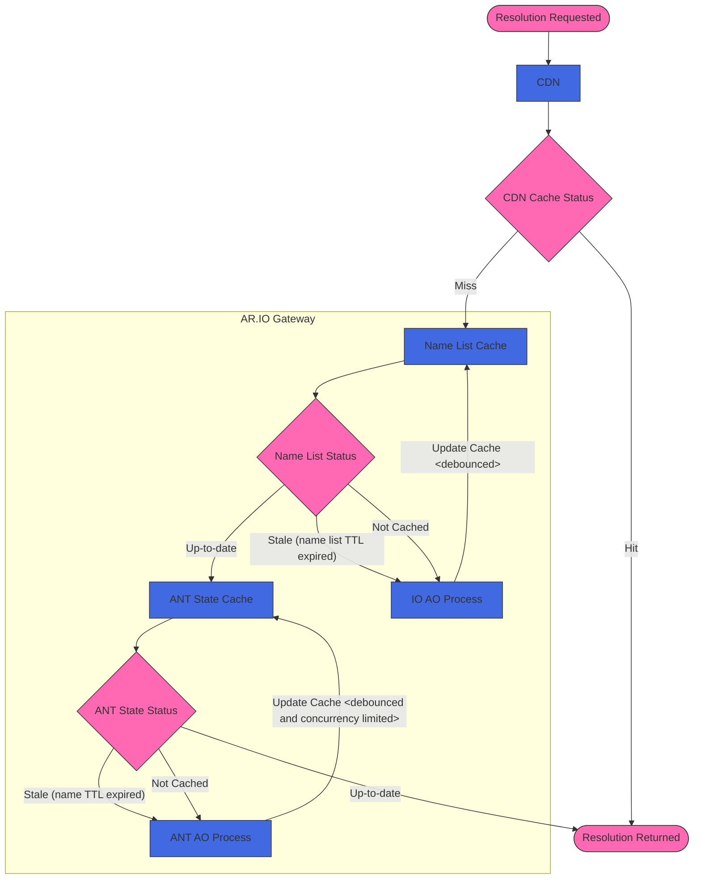

# ArNS Cache Timing

- Status: proposed
- Deciders: [Ariel], [Dylan], [Karl]
- Date: 2024-12-09
- Authors: [David]

## Context and Problem Statement

ArNS resolution requires multiple AO process interactions. During resolution,
caches are used to reduce response latency and AO CU load. Due to the high CPU
cost of dry-run evaluations to compute state in CU, it's important to not
overload them. However, there is an intrinsic trade-off between reducing
response latency (and AO CU load) and the freshness of ArNS responses. In order
to allow gateway operators to optimize this trade-off we need to define the
levels of caching involved and make them configurable. The purpose of this ADR
is to list the levels of caching and related timeouts involved.

## Decision Outcome

### Resolution Flow

### Configurable Timeouts

- **Name list TTL** - The maximum interval between name list cache refreshes
  for names already in the cached name list. Suggested default: 1 hour.
- **Name list miss debounce interval** - The minimum amount of time between
  name list cache refreshes triggered by names not found in the cache.
  Suggested default: 10 seconds.
- **Name list hit debounce interval** - The maximum amount of time between
  name list cache refreshes triggered by names found in the cache. Suggested
  default: 1 hour.
- **ANT state TTL** - The maximum interval between individual ANT state cache
  refreshes when the ANT state is already cached. Suggested default: 1 hour.
- **ANT state miss debounce interval** - The minimum amount of time between ANT
  state cache refreshes triggered by missing ANT state. Suggested default: 10
  seconds.
- **ANT state hit debounce interval** - The maximum amount of time between ANT
  state cache refreshes triggered by names found in the ANT state cache.
  Suggested default: 5 minutes.
- **ANT state concurrency limit** - The maximum number of parallel in-flight
  ANT state requests to the CU. Suggested default: 10.

[Ariel]: https://github.com/arielmelendez
[David]: https://github.com/djwhitt
[Dylan]: https://github.com/dtfiedler
[Karl]: https://github.com/karlprieb
