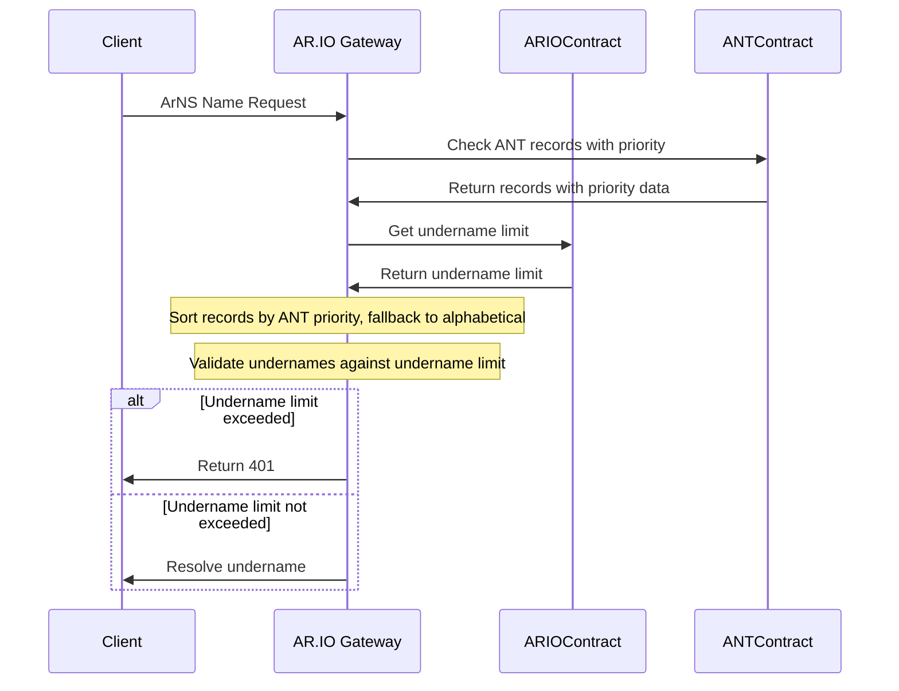

# ArNS Undername Limit Enforcement

- Status: proposed
- Deciders: [Ariel], [Dylan], [Atticus], [Phil], [David]
- Date: 2025-01-14
- Authors: [Dylan]

## Context and Problem Statement

ArNS names have a supported undername limit, defined by the ARIO network contract. Increasing this limit requires payment in $ARIO tokens to compensate gateway operators for the additional computational resources needed to serve undername and promote responsible usage of ArNS. AR.IO gateways must enforce this limit when resolving ArNS names to ensure operators are fairly rewarded for their services through fees paid by increasing a names undername limit and providing a consistent experience across the network.

## Decision Outcome

### Priority Resolution Flow

The following sequence diagram is used to demonstrate how AR.IO gateways resolve ArNS names and enforce undername limits.



## Decision Drivers

- Honor ANT priority ordering when available
- Consistent enforcement of undername limits across AR.IO gateways
- Simple fallback mechanism if ANT does not return or contain priority data

## Considered Options

### Option 1: Alphabetical Sorting

AR.IO nodes sort undernames alphabetically.

### Option 2: ANTs Priority & Alphabetical Fallback

ANTs store additional information in their state, indicating the priority of each name. The ar-io-node would respect this priority when resolving undernames. If the ANT does not return priority data, the ar-io-node would sort undernames alphabetically.

### Option 3: ANT Handler for Priority

ANTs provide a global `sortOrder` and `sortKey` field to determine how names are sorted on existing records keys.

## Decision

We will implement Option 2: ANT Priority with Alphabetical Fallback

This provides the best balance of honoring ANT priorities while maintaining system availability when the ANT contract is unreachable or outdated.

Example ANT records state with priority data:

```json
{
  "@": {
    "transactionId": "0x123",
    "ttlSeconds": 1000000,
    "priority": 0
  },
  "undername1": {
    "transactionId": "0x123",
    "ttlSeconds": 1000000,
    "priority": 1
  },
  "undername2": {
    "transactionId": "0x123",
    "ttlSeconds": 1000000,
    "priority": 2
  }
}
```

### Positive Consequences

- Honors ANT priority ordering when available
- Provides consistent enforcement across nodes
- Simple fallback mechanism when ANT does not contain priority data

### Negative Consequences

- Requires the ar-io-node to fetch full ANT records and sort them by priority order
- Additional complexity in priority resolution logic
- Need to handle priority changes and ANT modifications in caching layers
- Additional work for controlling ANT priority in ANT contract (e.g. arns.app)

## Links

- [ANT Contract Documentation](https://ar.io/ant)
- [ARIO Whitepaper](https://whitepaper.ar.io)

[Ariel]: https://github.com/arielmelendez
[David]: https://github.com/djwhitt
[Dylan]: https://github.com/dtfiedler
[Atticus]: https://github.com/atticusofsparta
[Phil]: https://github.com/vilenarios
