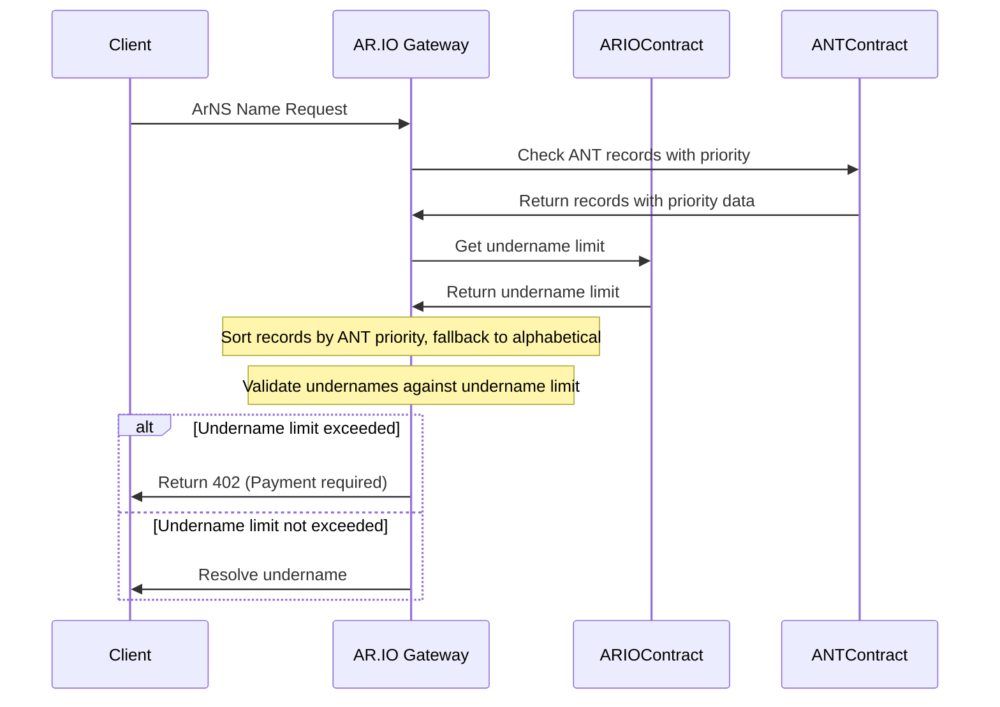

# ArNS Undername Limit Enforcement

- Status: proposed
- Deciders: [Ariel], [Dylan], [Atticus], [Phil], [David]
- Date: 2025-01-14
- Authors: [Dylan]

## Context and Problem Statement

ArNS names have a supported undername limit, defined by the ARIO network contract. Increasing this limit requires payment in $ARIO tokens to compensate gateway operators for the additional computational resources needed to serve undername and promote responsible usage of ArNS. AR.IO gateways must enforce this limit when resolving ArNS names to ensure operators are fairly rewarded for their services through fees paid by increasing a name's undername limit and providing a consistent experience across the network.

Currently, the `getRecords` API on ANTs return **a table of records** allowing for efficient undername lookups. Lua does not guarantee the order of keys in a table, making it difficult to know what undernames to enforce. Sorting needs to either 1. be done by the ANT and provided as an array of records, or 2. be done by the [ar-io-node] using additional information provided by the ANT. Additionally, caching within the ar-io-node needs to properly handle these priority order changes.

## Decision Outcome

### Priority Resolution Flow

The following sequence diagram is used to demonstrate how AR.IO gateways resolve ArNS names and enforce undername limits.



## Decision Drivers

- Honor ANT priority ordering when available
- Consistent enforcement of undername limits across AR.IO gateways
- Simple fallback mechanism if ANT does not return or contain priority data
- Respects existing ANT records object type (minimal changes to [ar-io-node] & [ar-io-sdk])

## Considered Options

### Option 1: ANTs provide sorted array of records

Lua does not guarantee the order of keys in a table. This raises some issues with the existing `getRecords` API that returns a table of records on an ANT. To circumvent this, we could modify the return type of `getRecords` or introduce a new API to a sorted array of records, based on the ANT priority. This would require a change to the [ar-io-sdk] and [ar-io-node] to leverage this updated API.

ANT process with updated logic:

```lua
Records = (
  '@': {
    transactionId: '0x123',
    ttlSeconds: 900
  }
)
function getRecords(name: string)
  return {
    -- order of keys is not guaranteed in lua table
    ["@"] = { transactionId = "0x123", ttlSeconds = 1000000, priority = 0 },
    ["undername1"] = { transactionId = "0x123", ttlSeconds = 1000000, priority = 1 },
    ["undername2"] = { transactionId = "0x123", ttlSeconds = 1000000, priority = 2 }
  }
end

--- new logic to sort records based on some sort attributes
function getSortedRecords(name: string):
  local sortedRecords = {}
  -- ANT decides how to sort records
  for key, value in pairs(Records) do
    table.insert(sortedRecords, {
      record = key,
      transactionId = value.transactionId,
      ttlSeconds = value.ttlSeconds,
    })
  end
  -- apply sort based on some attribute of the ANT (e.g. alphabetical)
  table.sort(sortedRecords, function(a, b)
    -- '@' record should always be first
    if a.record == "@" then return true end
    if b.record == "@" then return false end
    return a.record > b.record
  end)
  return sortedRecords
end
```

This array of sorted records would then be what the [ar-io-node] receives and enforces against the undername limit.

### Option 2: ANTS provide priority data in records

ANTs store additional information in the state for each record, indicating the priority a name. The [ar-io-node] would respect this priority when resolving undernames. If the ANT does not return priority attribute for a, the [ar-io-node] would sort undernames alphabetically.

Example (in the [ar-io-node]):

```typescript
const records = getRecords(name);
const sortedRecords = Object.entries(records).sort(([a], [b]) => {
  if ('priority' in a && 'priority' in b) {
    return a.priority - b.priority;
  }
  return a.localeCompare(b);
});

// enforce undername limit against sorted records, using the priority field, fallback to alphabetical
```

### Option 3: ANT provides sort attributes via separate API

ANTs provide a global `sortOrder` and `sortKey` field to determine how names are sorted on existing records keys.

Example:

ANT process:

```lua
UndernamePriorityAttributes = {
  sortOrder = 'desc',
  sortKey = "name"
}

function getRecords(name: string)
  return {
    -- order of keys is not guaranteed in lua table
    ["@"] = { transactionId = "0x123", ttlSeconds = 1000000, priority = 0 },
    ["undername1"] = { transactionId = "0x123", ttlSeconds = 1000000, priority = 1 },
    ["undername2"] = { transactionId = "0x123", ttlSeconds = 1000000, priority = 2 }
  }
end
```

Gateway enforcement:

```typescript
const records = ant.getRecords(name);
const { sortOrder, sortKey } = ant.getPriorityAttributes();
const sortedRecords = Object.entries(records).sort(([a], [b]) => {
  if (sortOrder in a && sortOrder in b) {
    if (sortOrder === 'desc') {
      return a[sortKey] - b[sortKey];
    } else {
      return b[sortKey] - a[sortKey];
    }
  }
  return a.localeCompare(b);
});

// enforce undername limit against sorted records, using the priority field, fallback to alphabetical
```

## Pros and Cons of Options

### Option 1: ANTs provide sorted array of records

- `+` Sort order is controlled entirely by ANTs
- `+` Minimal changes to gateways (use new API)
- `-` Additional changes in ar-io-sdk to support non updated ANTs
- `-` Managing priority order when updating records (handling collisions)

### Option 2: ANTs provide priority data in records

- `+` Extends existing ANT records object type
- `+` Minimal changes to [ar-io-node] & [ar-io-sdk] (easy to make backwards compatible since object response type is unchanged)
- `+` Allows to implement Option #1 at a later time, if desired
- `-` Managing priority order when updating records (handling collisions)
- `-` Gateways must fetch full ANT records and sort them by priority order
- `-` Gateways must compute the sorted array of records

### Option 3: ANT provides sort attributes via separate API

- `+` Same pros as above as Option #2
- `-` Same cons as #2
- `-` Additional api calls to get sort attributes

## Decision

We will implement Option #2: **Additional priority attribute in ANT records**

Ultimately, we could choose to implement Option #1 and Option #2. Both require additional changes to the ANT contract, and the [ar-io-node]. Option #1 however, requires changes suggested in Option #2 AND additional modifications to return the new object type.

Option #2 requires the least amount of changes, while satisfying the requirements for enforcing undername limits.

Example ANT records state with priority data:

```json
{
  "@": {
    "transactionId": "0x123",
    "ttlSeconds": 1000000,
    "priority": 0
  },
  "undername1": {
    "transactionId": "0x123",
    "ttlSeconds": 1000000,
    "priority": 1
  },
  "undername2": {
    "transactionId": "0x123",
    "ttlSeconds": 1000000,
    "priority": 2
  }
}
```

The [ar-io-node] will sort the records by priority, and fallback to alphabetical sorting when the priority attribute is not present and enforce the undername limit against the sorted records. If ANTs provide invalid priority order (conflicting records with same priority), **the [ar-io-node] will return a 400 error to notify the ANT owner of invalid priority order.**

Gateways will leverage existing caching logic defined in [./002-arns-cache-timing.md]. As such, the [ar-io-node] will cache the records (including priority order) for the provided TTLs. If the ANT contract is updated, the [ar-io-node] will fetch the updated records after the provided TTL and subsequently enforce any changes in priority order against the updated records.

Next steps:

- Update [ANT source code] to set priority order when updating/appending records
- Modify [ar-io-sdk] `getRecords()` API return type to return include `priority` as `number | undefined`
- Update [ar-io-node] to use updated `getRecords()` API, applying sorting logic mentioned above and enforcing undername limits
- Update arns.app to allow owners to upgrade ANTs to latest source code; add interface for managing priority order of ANTs

## Links

- [ANT Contract Documentation](https://ar.io/ant)
- [ARIO Whitepaper](https://whitepaper.ar.io)
- [ARIO SDK](https://github.com/ar-io/ar-io-sdk)
- [ANT Source Code]

[Ariel]: https://github.com/arielmelendez
[David]: https://github.com/djwhitt
[Dylan]: https://github.com/dtfiedler
[Atticus]: https://github.com/atticusofsparta
[Phil]: https://github.com/vilenarios
[ar-io-sdk]: https://github.com/ar-io/ar-io-sdk?tab=readme-ov-file#getrecords
[ar-io-node]: https://github.com/ar-io/ar-io-node/blob/fbbd4112d7024311f775969569ccfd9857bff9fe/src/resolution/composite-arns-resolver.ts#L127-L135
[./002-arns-cache-timing.md]: ./002-arns-cache-timing.md
[ANT Source Code]: https://github.com/search?q=ar-io-ant-process&type=repositories
