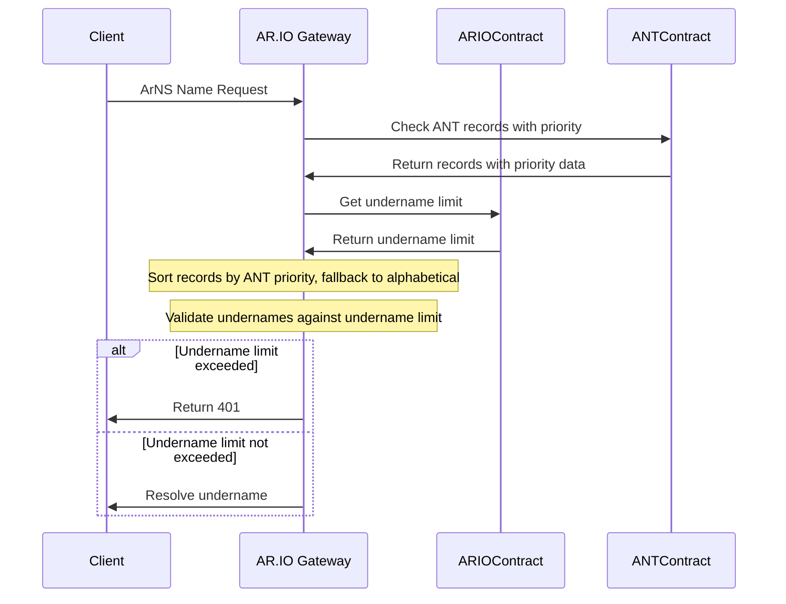

# ArNS Undername Limit Enforcement

- Status: proposed
- Deciders: [Ariel], [Dylan], [Atticus], [Phil], [David]
- Date: 2025-01-14
- Authors: [Dylan]

## Context and Problem Statement

ArNS names have a supported undername limit, defined by the ARIO network contract. Increasing this limit requires payment in $ARIO tokens to compensate gateway operators for the additional computational resources needed to serve undername and promote responsible usage of ArNS. AR.IO gateways must enforce this limit when resolving ArNS names to ensure operators are fairly rewarded for their services through fees paid by increasing a names undername limit and providing a consistent experience across the network.

Currently, the `getRecords` API on ANTs return **a table of records** for efficient record lookup. Lua does not guarantee the order of keys in a table, which can cause issues when enforcing undername limits. This creates a need to sort the records by priority order either by modifying or extending the API to return a sorted array of records, or by applying an attribute to the existing records to sort them.

## Decision Outcome

### Priority Resolution Flow

The following sequence diagram is used to demonstrate how AR.IO gateways resolve ArNS names and enforce undername limits.



## Decision Drivers

- Honor ANT priority ordering when available
- Consistent enforcement of undername limits across AR.IO gateways
- Simple fallback mechanism if ANT does not return or contain priority data
- Respects existing ANT records object type (minimal changes to ar-io-node & ar-io-sdk)

## Considered Options

### Option 1: Modify/update API on ANT to return sorted array of records

Lua does not guarantee the order of keys in a table. This raises some issues with the existing `getRecords` API that returns a table of records on an ANT. To circumvent this, we could modify the return type of `getRecords` or introduce a new API to a sorted array of records, based on the ANT priority. This would require a change to the ar-io-sdk and ar-io-node to leverage this updated API.

Current `getRecords` API on ANT:

```lua
function getRecords(name: string)
  return {
    -- order of keys is not guaranteed in lua table
    ["@"] = { transactionId = "0x123", ttlSeconds = 1000000, priority = 0 },
    ["undername1"] = { transactionId = "0x123", ttlSeconds = 1000000, priority = 1 },
    ["undername2"] = { transactionId = "0x123", ttlSeconds = 1000000, priority = 2 }
  }
end
```

Proposed `getSortedRecords` API on ANT:

```lua
function getSortedRecords(name: string):
  local sortedRecords = {}
  -- ANT decides how to sort records
  for key, value in pairs(records) do
    table.insert(sortedRecords, {
      record = key,
      transactionId = value.transactionId,
      ttlSeconds = value.ttlSeconds,
    })
  end
  -- apply sort based on some attribute of the ANT
  table.sort(sortedRecords, function(a, b)
    -- '@' record should always be first
    if a.record == "@" then return true end
    if b.record == "@" then return false end
    return a.record > b.record
  end)
  return sortedRecords
end
```

This array of sorted records would then be what the ar-io-node receives and enforces against the undername limit.

### Option 2: Alphabetical Sorting with existing ANT records

AR.IO nodes sort undernames alphabetically using the existing ANT records.

Example (in the ar-io-node):

```typescript
const records = getRecords(name);
const sortedRecords = Object.entries(records).sort(([a], [b]) =>
  a.localeCompare(b),
);

// enforce undername limit against sorted records
```

### Option 3: ANTs Priority & Alphabetical Fallback with existing ANT records

ANTs store additional information in their state, indicating the priority of each name. The ar-io-node would respect this priority when resolving undernames. If the ANT does not return priority data, the ar-io-node would sort undernames alphabetically.

Example (in the ar-io-node):

```typescript
const records = getRecords(name);
const sortedRecords = Object.entries(records).sort(([a], [b]) => {
  if ('priority' in a && 'priority' in b) {
    return a.priority - b.priority;
  }
  return a.localeCompare(b);
});

// enforce undername limit against sorted records, using the priority field, fallback to
```

### Option 4: ANT Handler for Priority with existing ANT records

ANTs provide a global `sortOrder` and `sortKey` field to determine how names are sorted on existing records keys.

Example:

```lua
UndernamePriorityAttributes = {
  sortOrder = 'desc',
  sortKey = "name"
}

function getRecords(name: string)
  return {
    -- order of keys is not guaranteed in lua table
    ["@"] = { transactionId = "0x123", ttlSeconds = 1000000, priority = 0 },
    ["undername1"] = { transactionId = "0x123", ttlSeconds = 1000000, priority = 1 },
    ["undername2"] = { transactionId = "0x123", ttlSeconds = 1000000, priority = 2 }
  }
end
```

```typescript
const records = ant.getRecords(name);
const { sortOrder, sortKey } = ant.getPriorityAttributes();
const sortedRecords = Object.entries(records).sort(([a], [b]) => {
  if (sortOrder in a && sortOrder in b) {
    if (sortOrder === 'desc') {
      return a[sortKey] - b[sortKey];
    } else {
      return b[sortKey] - a[sortKey];
    }
  }
  return a.localeCompare(b);
});
```

## Decision

We will implement Option 4: **ANT Handler for Priority with existing ANT records**

This provides the best balance of honoring ANT priorities while maintaining system availability when the ANT contract is unreachable or outdated. It also respects the existing ANT records object type and limits the amount of changes needed to the ar-io-node and ar-io-sdk.

Example ANT records state with priority data:

```json
{
  "@": {
    "transactionId": "0x123",
    "ttlSeconds": 1000000,
    "priority": 0
  },
  "undername1": {
    "transactionId": "0x123",
    "ttlSeconds": 1000000,
    "priority": 1
  },
  "undername2": {
    "transactionId": "0x123",
    "ttlSeconds": 1000000,
    "priority": 2
  }
}
```

### Positive Consequences

- Honors ANT priority ordering when available
- Provides consistent enforcement across nodes
- Simple fallback mechanism when ANT does not contain priority data

### Negative Consequences

- Requires the ar-io-node to fetch full ANT records and sort them by priority order
- Additional complexity in priority resolution logic
- Need to handle priority changes and ANT modifications in caching layers
- Additional work for controlling ANT priority in ANT contract (e.g. arns.app)

// TODO - other pro/cons

## Links

- [ANT Contract Documentation](https://ar.io/ant)
- [ARIO Whitepaper](https://whitepaper.ar.io)

[Ariel]: https://github.com/arielmelendez
[David]: https://github.com/djwhitt
[Dylan]: https://github.com/dtfiedler
[Atticus]: https://github.com/atticusofsparta
[Phil]: https://github.com/vilenarios
