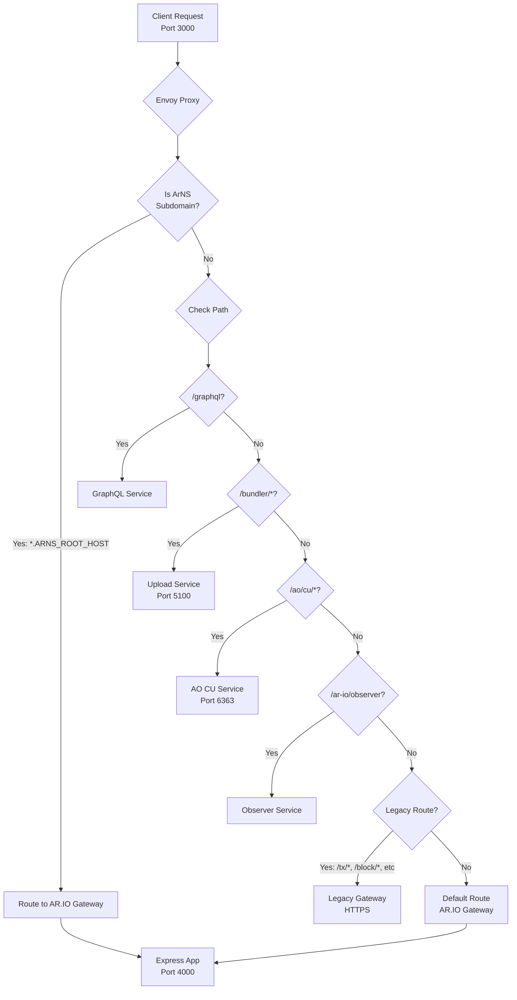
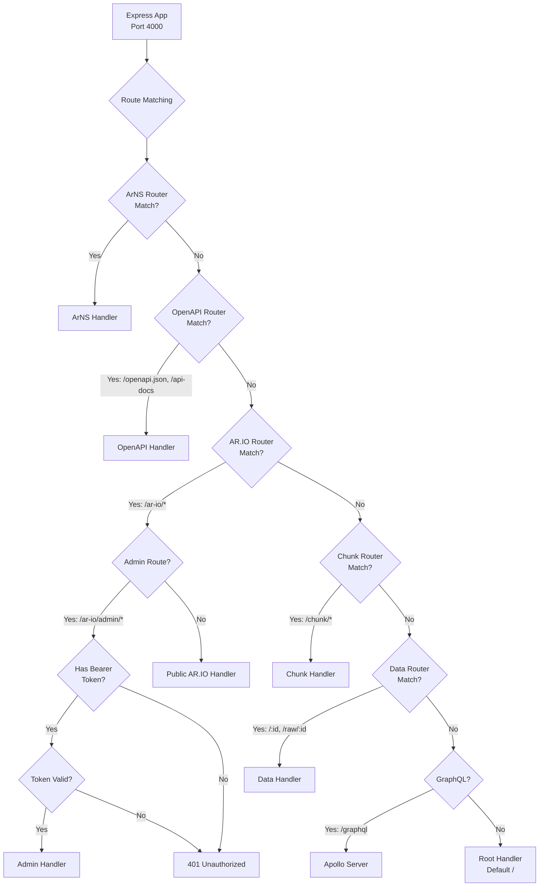
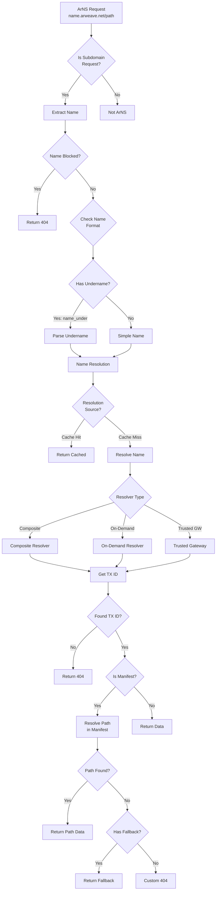
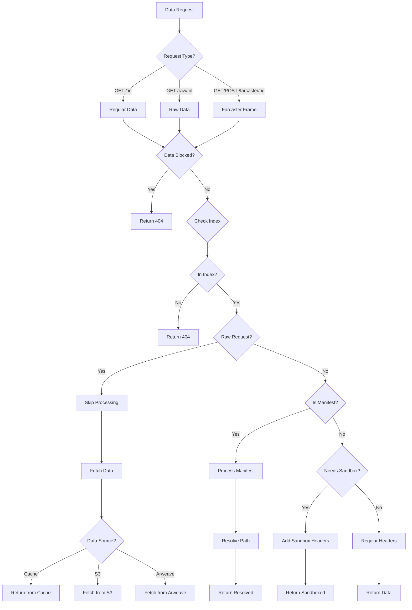
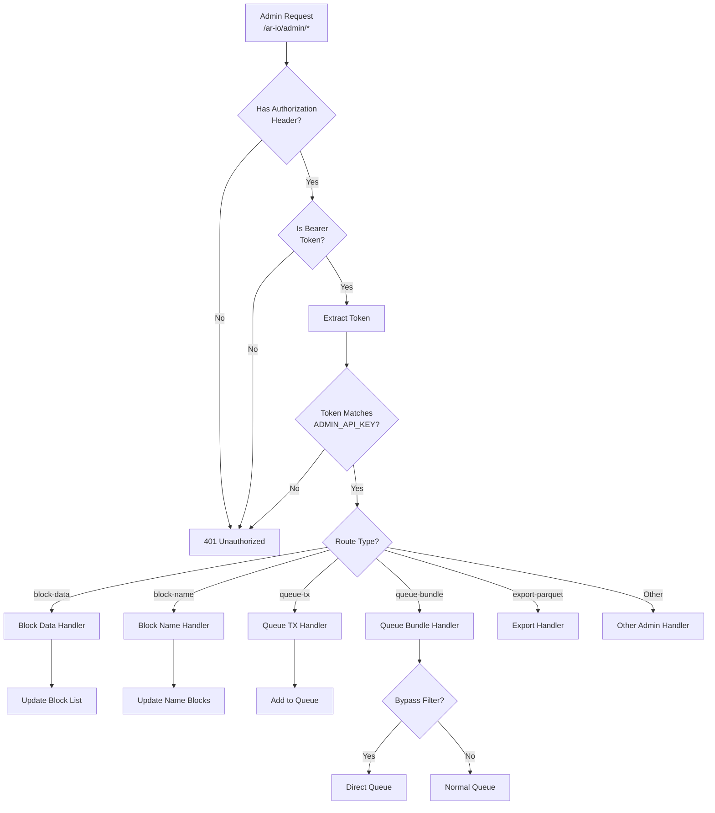
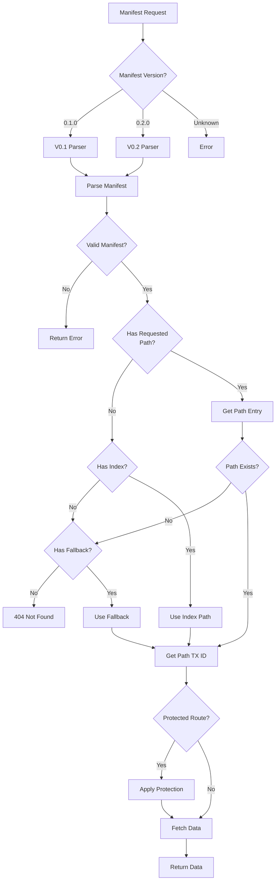
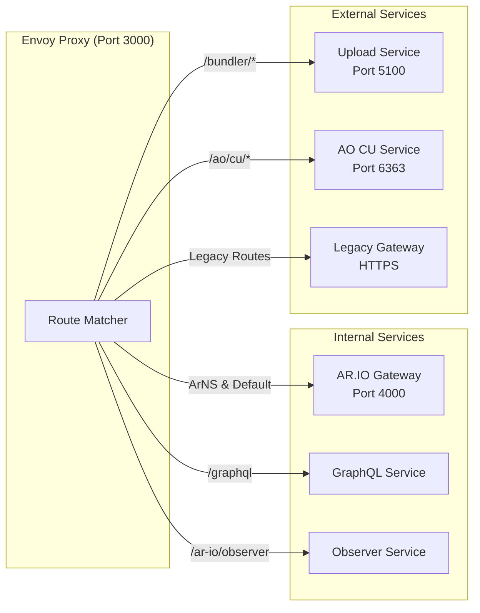
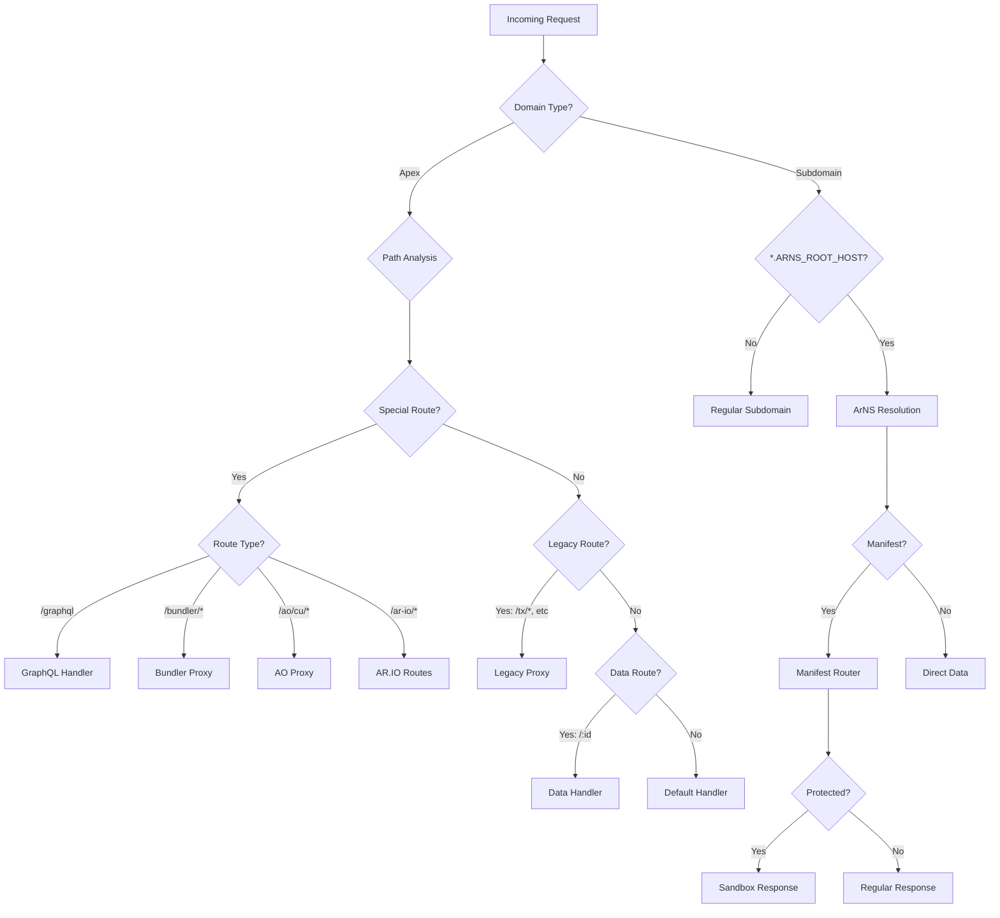
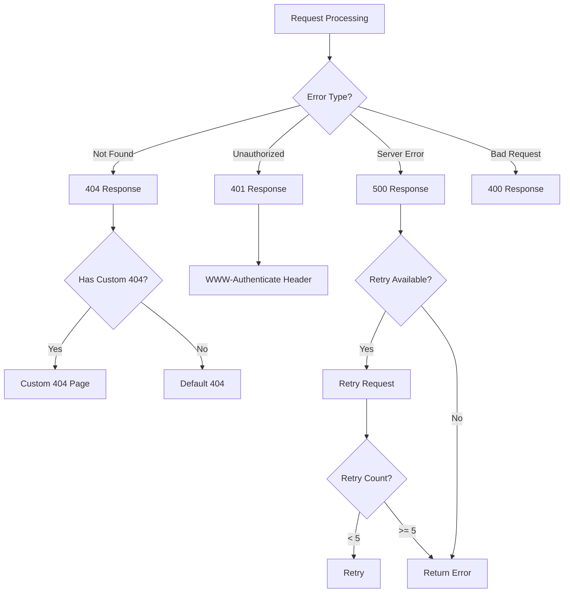

# AR.IO Node Routing Flow - Mermaid Diagrams

This document provides Mermaid flowcharts illustrating the routing logic of the AR.IO Node with proper decision nodes and control flow.

## High-Level Request Routing Flow

## Express Application Routing Flow

## ArNS Resolution Flow

## Data Request Flow

## Admin Authentication Flow

## Manifest Processing Flow

## Service Communication Overview

## Routing Decision Tree

## Error Handling Flow

## Notes

- Decision nodes (diamonds) represent conditional logic
- Process nodes (rectangles) represent actions or handlers
- The flows show the actual control logic implemented in the AR.IO Node
- Protected routes include special handling for sandboxing and security
- Custom 404s can be configured for ArNS names (current) and will support ANTs (future)
- All admin routes require Bearer token authentication
- The system supports multiple resolver types for flexibility and performance